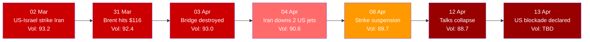

---
{"dg-publish":true,"permalink":"/finalized-work/world-reports/world-intelligence-report-april-2026/","title":"World Intelligence Report — April 2026","tags":["world-monitor","osint","geopolitics","intelligence","iran-war","nuclear-threat","energy-crisis","cyber-warfare","japan-monetary","ireland-protests","nato","strait-of-hormuz","pope-leo","uk-politics","russia","ukraine","venezuela","civil-unrest"],"created":"2026-04-13T22:03:59.455+01:00","updated":"2026-04-13T22:36:01.040+01:00","dg-note-properties":{"title":"World Intelligence Report — April 2026","description":"Fourth report in the World Intelligence Report series. Covers the US-Iran war from peak escalation through collapsed 21-hour Islamabad peace talks to a declared US naval blockade, the Safa nuclear warning and 450kg of enriched uranium, Ireland's 72-hour fuel system seizure confirming the Betz civil war framework with Defence Forces deployment and the Amber Book media suppression mechanism, three simultaneous Russian cyber operations against UK infrastructure (APT28, NoName057(16), Unit 21), Japan's BoJ monetary earthquake threatening global carry trade positions, Pope Leo XIV's escalating moral confrontation with Trump, and continuing storylines tracking Venezuela, Ukraine, shadow fleet, Anthropic, and Starmer's arc from closest ally to not getting dragged into the war.","date":"2026-04-13","updated":"2026-04-13","tags":["world-monitor","osint","geopolitics","intelligence","iran-war","nuclear-threat","energy-crisis","cyber-warfare","japan-monetary","ireland-protests","nato","strait-of-hormuz","pope-leo","uk-politics","russia","ukraine","venezuela","civil-unrest"],"aliases":["April 2026 Intelligence Report","World Monitor Consolidation"]}}
---

# World Intelligence Report — April 2026

**Compiled by:** Eden Eldith & Claude (Anthropic)
**Coverage Period:** 14 March 2026 — 13 April 2026
**Last Updated:** @130420262235

---
>[!info] This report documents events with sources. The author has no political affiliation and advocates no unlawful action. 

## Executive Summary

The month following our [[Finalized work/World-Reports/World_Intelligence_Report_March_2026\|March 2026 Intelligence Report]] has witnessed the US-Iran conflict reach its most destructive phase before a fragile ceasefire emerged from marathon talks in Islamabad — a trajectory that shattered critical infrastructure across the Middle East, pushed nuclear escalation to its closest approach since the Cuban Missile Crisis, and sent economic shockwaves from Dublin fuel depots to the Bank of Japan's trading floor.

1. **US-Iran War: Attrition, Failed Talks, and Hormuz Blockade** — US-Israeli forces destroyed key Iranian infrastructure including the country's largest bridge, a university campus (34 killed), and pharmaceutical facilities, while Iran downed two US warplanes over the Strait of Hormuz and closed the waterway to commercial traffic. US aircraft losses exceeded $1.1 billion across multiple platform types. A two-week ceasefire led to 21-hour peace talks in Islamabad — which collapsed without agreement on 12 April. Trump responded by declaring a US naval blockade of Iranian ports effective 13 April; Iran's IRGC warned any approaching military vessel would be "dealt with severely." [^1] [^2] [^48]

2. **Nuclear Brinkmanship: The Safa Warning** — UN diplomat Mohamad Safa resigned his 12-year posting to publicly warn that the United Nations was preparing for possible nuclear weapon use in Iran. US bunker-buster strikes had already hit Natanz; Iran retaliated against Israel's Dimona facility. France confirmed Iran possesses 450 kg of highly enriched uranium — enough for several nuclear weapons. [^3] [^4]

3. **The Energy Shockwave: From Hormuz to Dublin** — Brent crude hit $116/barrel as the Strait of Hormuz closure choked global oil flows. [^5] Ireland's fuel protests blockaded the country's sole refinery at Whitegate, leaving approximately 500 fuel stations dry and forcing €250 million in March and €505 million in April in emergency spending (€755 million total). [^6] UK fuel prices surpassed 2022 records, with diesel reaching £2/litre.

4. **Cyber Warfare: Russia Arms Iran** — Russia provided Iran with cyber support and spy satellite imagery to coordinate attacks, while Russian-aligned hacktivists disrupted UK organisations and infrastructure. The NCSC issued multiple warnings about router hijacking and persistent malware targeting critical systems. [^7]

5. **Japan's Monetary Earthquake** — The Bank of Japan's policy rate reached 0.75% — the highest since 1995 — with markets anticipating 1.0% by late April. The yen carry trade, estimated at $350–500 billion in notional exposure, faces accelerating unwinding that threatens cross-asset contagion from Tokyo to São Paulo. [^8]

**Global Volatility Index: 88.7/100 (CRITICAL)** — Down from the all-time peak of 93.2 recorded on 2 March but remaining in critical territory throughout the coverage period, with military signals dominating at 594–897 per cycle. [^9]

### Escalation Arc — March to April 2026

---

## Part I: The Iran War — Escalation, Attrition, and Fragile Ceasefire

The Iran storyline has undergone the most dramatic transformation of any thread in this report series. In [[Finalized work/World-Reports/World_Intelligence_Report_January_2026\|January]], the Islamic Republic faced a genuine popular revolution — 280+ protest sites, the IRGC defeated in street battles, Mashhad fallen, prediction markets pricing regime collapse at 56%. By [[Finalized work/World-Reports/World_Intelligence_Report_February_2026\|February]], the regime had crushed the uprising with 6,159 killed and 50,000 arrested, then pivoted to diplomacy — the first US-Iran talks in years held in Oman, with Trump declaring a deal could resolve "within a month." [[Finalized work/World-Reports/World_Intelligence_Report_March_2026\|March]] delivered the cruelest turn: a diplomatic breakthrough was announced — Iran agreeing to never stockpile enriched uranium, peace "within reach" — and strikes launched within 24 hours. Khamenei was assassinated on day one. His family was killed alongside him. By mid-March, over 1,300 civilians were dead and the Strait of Hormuz was mined. This report covers the month that followed: attrition, a fragile ceasefire, 21 hours of peace talks that collapsed, and a US naval blockade declared the day this report goes to press.

### The March Offensive

The US-Israeli military campaign against Iran, launched on 2 March 2026, represented the most significant Western military operation in the Middle East since the 2003 invasion of Iraq. [^1] Within 24 hours of the initial strikes, Iran conducted retaliatory attacks on Qatar, the UAE, and Kuwait, while the UK agreed to provide military base access for US operations — a decision that drew RAF Akrotiri in Cyprus into the conflict when the base sustained a drone strike. [^10] [^11]

| Metric | Value |
|--------|-------|
| Iranian deaths (HRANA, by 7 Apr) | 3,636 (1,701 civilians, 1,221 military, 714 unclassified) |
| Shajareh Tayyebeh school strike, Minab (28 Feb) | ~180 killed, vast majority children |
| University bombing casualties (6 Apr) | 34 killed |
| Iranian naval vessels destroyed | 9 |
| US service members killed | 13 |
| US service members wounded | 365 |

*Note: The Iranian civilian toll from the school strike alone exceeds total US military deaths by a factor of 13. This disparity is driving the war crimes narrative in the Global South and straining NATO unity.* [^56]

By mid-March, the campaign had expanded to include strikes on Iran's nuclear facilities. US bunker-buster munitions hit the Natanz enrichment plant on 21 March, with the IAEA confirming structural damage but no radiological release. [^3] The targeting of civilian infrastructure — including the Shajareh Tayyebeh school strike and a university bombing on 6 April that killed 34 — drew war crimes allegations and international condemnation. [^12] [^13]

### The Minab School Strike — 28 February

On the first day of strikes, US missiles hit the Shajareh Tayyebeh elementary school in Minab. The school had begun closing procedures after airstrikes on Iran started without warning at 10:00 am, but parents could not reach the building in time. [^57]

According to testimony given to Middle East Eye by two Red Crescent medics and a victim's parent, the initial strike was followed by a second "double-tap" strike — a tactic documented in Russian strikes on Syria and Ukraine, and in Israeli strikes on Gaza, designed to kill first responders alongside initial victims. After the first strike, the school's principal moved a group of students to a prayer room and called parents, asking them to collect their children. The second strike hit the prayer room, killing most who had taken shelter. [^57]

One parent recounted receiving a call from the school informing him his daughter had survived the first strike. Before he could arrive, the school was hit again. She was killed. [^57]

Approximately 180 people died — the vast majority of them children. Many bodies remain unidentified. These are some of those identified: [^57]

| | | | | |
|-|-|-|-|-|
| Reza Habashian | Zahra Bahrami | Niyayesh Salehi | Helma Ghsamy | Nazanin Zahra Behroozi |
| Samira Malahi | Arina Arabkish | Zahra Soleimani | Mahna Bahrami | Fatemeh Derazehi |
| Masoumeh Nazari | Amirhossein Jafari | Zahra Sharafi | Khadijeh Darvidhi | Asra Zakeri |
| Fadia Shahmiri | Sanar Salari | Zeinab Makizadeh | Zoha Pasand | Zahra Ansarifar |
| Liana Mohammadi | Fatemezahra Karimi | Aliakbar Keriani | Baran Ghasemy | Fatemeh Rahdar |
| Asma Zakeri | Setayesh Alihosseini | Salma Zakeri | Atena Chamali | Farimah Fakhari |
| Hannaneh Zakerikhah | Hanieh Ahmadi | Raha Zareie | Masiha Salari | Ali Zareie Gholam |
| Parsa Mokhtari | Makan Nasiri | Amirmohammad Boostani | Amir Mohammadi | Danial Faghirdoost |
| Zeinab Bahrami | Reyhane Zakeri | Atena AhmadZadeh | Setayesh Alihossein | Hami Sadeghi |
| Mohammadhesam Raisi | Hossein Rahsepar | Mohammad Abadizadeh | Sina Zakeri | Aliasghar Zareie |
| Alireza Zareie | Mohammadsadegh Gholami | Saleh Abbasi | Mohammad Loghmani | Hani Paritaghinejhad |
| Sobhan Ahmadi | Mohammadreza Shahsavari | Amirali Jadavi | Moien Zeinali | Mohammad Raofinia |
| Aliasghar Foroozafar | Araz Ahmadizade | Soheil Chamalipour | Mohammad Jamali | Alireza Shahrjoo |
| Reza Barani | Sepehr Karimi | Ali Salari | Ehsan Saleminia | Sorena Hosseinpour |
| Amin Ahmadzade | Homayoon Zeinali | Heidar Salehi | Mohammad Shahdoosti | Amirali Boostani |
| Reza Ranjbar | Amirmohammad Bagheri | Javad Sartakzade | Mohammadmahdi Jangichi | Sobhan Shahdadi |
| Benyamin Jangjoo | Mohammadkian Bahrami | Amirghasem Zaiee | Mahdi Salari | Amirali Kamali |
| Arsha Mirani | Hamed Paritaghinejhad | Arash Golazin | Maryam Bazarak | Saman Karamzade |
| Mohammadali Keriani | Amir Mohammadi | Arya Bahadori | Parham Ranjbari | Mohammadsadra Zareiepour |
| Mahdi Delavari | Mohammadtaha | Mohammadtaha | Amirmohammad | Athare Zareiee |

.jpg)

> *Names verified manually against memorial image. Source: Cornwall Green Party / Middle East Eye testimony. Final four names partially legible in source.* [^57]

In the immediate aftermath, Israeli, US, and Iranian monarchist opposition sources spread claims that the strike resulted from an Iranian missile misfiring or a deliberate "false flag" operation by the Iranian regime. Trump stated, without evidence, that he believed the strike was "done by Iran." Despite overwhelming evidence, the United States has not acknowledged responsibility for this attack. [^57]

### Infrastructure Destruction

The systematic destruction of Iranian infrastructure escalated through April. On 2 April, US-Israeli forces destroyed Iran's largest bridge, with survivors recounting the strike in accounts published by multiple outlets. [^14] [^15] Pharmaceutical and steel facilities in Isfahan were targeted on 1 April, while Israeli forces simultaneously bombed Lebanon's bridges to interdict Hezbollah supply lines. [^2]

>[!quote]
> Trump warned Tehran that there would be "more to follow" after the bridge strike, signalling no intention to limit the campaign to military targets. [^14]

Iran's internet blackout — described as the longest since the Arab Spring — accompanied these strikes, severing the population's ability to document or communicate the scale of destruction. [^16]

### Iran's Retaliation

Iran's response, while outmatched in conventional terms, inflicted significant costs. On 4 April, Iranian air defences downed two US warplanes over the Strait of Hormuz, with Tehran subsequently offering rewards for the capture of the missing US pilot. [^2] Iran-backed forces closed the Bab el-Mandeb Strait, compounding the Hormuz closure and effectively severing two of the world's most critical maritime chokepoints. [^17]

Kuwait's accidental shootdown of three US fighter planes in the fog of the initial March strikes underscored the operational chaos of a multi-front conflict. [^1]

Iran also attempted two ballistic missile strikes on Diego Garcia, the US-UK military base in the Indian Ocean — one missile broke apart in flight, the other was intercepted. [^3]

### The Cost of Attrition — US Aircraft Losses

The material cost of operations became a storyline in its own right. Data compiled from DoD and manufacturer sources reveals losses exceeding $1.1 billion in the conservative estimate: [^18]

| Aircraft | Qty Lost | Unit Cost (USD) | Total |
|----------|----------|----------------|-------|
| MQ-9 Reaper | 24 | $16,000,000 | $384,000,000 |
| E-3 Sentry AWACS | 1–2 | $270,000,000 | $270,000,000–$540,000,000 |
| MC-130J Commando II | 2 | $114,200,000 | $228,400,000 |
| F-35A Lightning II | 1 (damaged) | $82,500,000 | — |
| CH-47F Chinook | 1 | $51,222,222 | $51,222,222 |
| KC-135 Stratotanker | 1–5 | $39,600,000 | $39,600,000–$198,000,000 |
| F-15E Strike Eagle | 4 | $31,100,000 | $124,400,000 |
| A-10 Thunderbolt II | 1 | $18,800,000 | $18,800,000 |

| Estimate | Total Cost (USD) |
|---|---|
| Destroyed-only (low) + death gratuity | $1,118,333,403 |
| Destroyed-only (high) + death gratuity | $1,388,446,669 |
| Full attrition (low) + death gratuity | $1,359,795,638 |
| Full attrition (high) + death gratuity | $1,629,908,904 |

Sources: USAF fact sheets, Boeing, General Atomics, ABC News, DLA fuel pricing. [^18] [^19]

>[!warning]
> The loss of up to two E-3 Sentry AWACS platforms represents a direct degradation of US battlespace awareness over the Gulf. The E-3 provides airborne command and control — threat detection, strike coordination, and situational awareness across the entire theatre. The US Air Force operates approximately 31 E-3s in a fleet already scheduled for retirement. Each loss degrades the ability to coordinate multi-front air operations and manage the battlespace in real time. Twenty-four MQ-9 Reapers can be replaced from production lines. An AWACS cannot.

### The Ceasefire — and Its Unravelling

The White House confirmed a two-week ceasefire on 8 April, mediated by Pakistan, under which Iran would reopen the Strait of Hormuz in exchange for a suspension of US strikes. [^20] In practice, the strait remained effectively closed — Iran limited the number of transiting ships and charged tolls exceeding $1 million per vessel. [^48]

The ceasefire set the stage for face-to-face negotiations in Islamabad. Vice President JD Vance, Trump's special envoy Steve Witkoff, and Jared Kushner led the US delegation; Iran's Foreign Minister Abbas Araghchi and Parliament Speaker Mohammad Bagher Ghalibaf led for Tehran. [^49] The talks lasted 21 hours — and collapsed without agreement on 12 April. [^50]

The sticking points were structural, not procedural. Washington demanded an end to all uranium enrichment, the dismantling of major enrichment facilities, and the surrender of Iran's highly enriched uranium stockpile. Tehran countered with a 10-point plan demanding Iranian control over the Strait of Hormuz, a complete end to hostilities including attacks on its proxies (Hezbollah in Lebanon), and compensation for war damage. [^51] [^52] Each side blamed the other for the failure. Iranian Foreign Ministry spokesman Esmail Baghaei stated that talks ended "with gaps between the sides on several major issues." [^49]

>[!danger]
> **Blockade Declared (13 April):** Trump announced that the US Navy would begin blocking all maritime traffic entering and leaving Iranian ports through the Strait of Hormuz. CENTCOM confirmed enforcement would begin at 10:00 ET on 13 April. Iran's IRGC responded that any military vessel approaching the strait would be considered in violation of the ceasefire and "will be dealt with severely." [^53]

The ceasefire's scope itself was contested. Israel and the United States asserted that Lebanon was excluded from the agreement — contradicting both the Pakistani mediators and Iran. Israel's continued bombing of Lebanon during the ceasefire period drew condemnation and raised questions about whether the agreement could survive its contradictions. [^24] [^50]

With eight days remaining before the ceasefire's expiration and a naval blockade now in effect, Pakistan's Foreign Minister Ishaq Dar urged both sides to maintain the ceasefire despite the failed talks. [^50] Starmer warned there was "a lot of work to do" to make any agreement permanent, while the UK led NATO discussions on sanctions against Iran. [^22] [^23] [^54]

### The Moral Counter-Narrative — Pope Leo XIV

While governments debated ceasefire terms and blockade enforcement, the most sustained moral opposition to the war came from the Vatican. Pope Leo XIV — the first American pontiff — escalated his condemnation of the conflict across the entire coverage period, culminating in a direct confrontation with Trump on 13 April.

The arc began during the strikes themselves. On 11 March, Leo called for prayer "for peace in Iran... especially for the many civilian victims, including many innocent children." [^72] On 13 March, he posed a question that landed like an indictment: "Do those Christians who bear serious responsibility in armed conflicts have the humility and courage to make a serious examination of conscience and to go to confession?" [^72]

By Palm Sunday (29 March), the language had sharpened into explicit theological rebuke — directed at Hegseth and Trump, both of whom had invoked God and scripture to justify the strikes:

>[!quote] Pope Leo XIV — Palm Sunday, 29 March 2026 [^72]
> "This is our God: Jesus, King of Peace, who rejects war, whom no one can use to justify war. He does not listen to the prayers of those who wage war, but rejects them, saying: 'Even though you make many prayers, I will not listen: your hands are full of blood.'" (Is 1:15)

On Easter (5 April): "Let those who have weapons lay them down! Let those who have the power to unleash wars choose peace! Not a peace imposed by force, but through dialogue!" [^72]

On 7 April, Trump threatened that "a whole civilization will die tonight" if the Strait of Hormuz remained closed. Leo called the threat against the Iranian people "truly unacceptable." [^73]

On 10 April — the day the Islamabad talks began — Leo posted to X: "God does not bless any conflict. Anyone who is a disciple of Christ, the Prince of Peace, is never on the side of those who once wielded the sword and today drop bombs." The post received 241,014 likes and 8.85 million views — making it the most-engaged papal statement of the coverage period. [^72]

On 11 April, at a peace vigil in St Peter's Basilica, Leo delivered the statement that would trigger the confrontation:

>[!quote] Pope Leo XIV — St Peter's Basilica peace vigil, 11 April 2026 [^72]
> "Enough of the idolatry of self and money! Enough of the display of power! Enough of war! True strength is shown in serving life."

He described the war as driven by "a delusion of omnipotence that surrounds us and is becoming increasingly unpredictable and aggressive" and called for "a Kingdom in which there is no sword, no drone, no vengeance, no trivialization of evil, no unjust profit, but only dignity, understanding and forgiveness." The post drew 100,830 likes and 3 million views. [^72]

On 13 April — today — Trump responded on Truth Social: "Pope Leo is WEAK on Crime, and terrible for Foreign Policy." He added: "I don't want a Pope who thinks it's terrible that America attacked Venezuela" and claimed "If I wasn't in the White House, Leo wouldn't be in the Vatican." [^73]

Leo, aboard the papal flight to Algeria, responded: "I will continue to speak out loudly against war, looking to promote peace, promoting dialogue and multilateral relationships among the states to look for just solutions to problems." He added: "Too many people are suffering in the world today. Too many innocent people are being killed." [^73]

The feud places the first American pope in direct opposition to the American president over a war the president started — a fracture without modern precedent in the relationship between the Vatican and the White House. The engagement data from the @Pontifex account confirms the global resonance: Leo's war-related posts consistently outperform all other content by factors of 5–20x, with the 10 April "God does not bless any conflict" post reaching nearly 9 million people. The moral authority the Pope commands has no military divisions, but it has an audience.

---

## Part II: Nuclear Brinkmanship — The Safa Warning

### A Diplomat's Resignation

On 29 March 2026, Mohamad Safa — Permanent Representative of the Patriotic Vision Organization to the United Nations for 12 years — resigned his diplomatic post specifically to issue a public warning about nuclear escalation. [^3]

>[!danger]
> "I don't think people understand the gravity of the situation as the UN is preparing for possible nuclear weapon use in Iran. [...] Tehran is a city of nearly 10,000,000 people." — Mohamad Safa [^3]

>[!quote]
> "I gave up my diplomatic career to leak this information. I suspended my duties so as not to be part of or a witness to this crime against humanity, in an attempt to prevent a nuclear winter before it is too late." — Mohamad Safa [^3]

Safa reported receiving death threats following his public statement and claimed senior UN officials were "serving a powerful lobby, not the body." [^3]

### Nuclear Facility Strikes

The nuclear dimension of the conflict had already materialised before Safa's warning:

| Date | Event | Status |
|------|-------|--------|
| 21 Mar | US bunker-buster strikes on Natanz nuclear facility | IAEA confirmed damage, no radiological release |
| Late Mar | Iran strikes Dimona (Israel's Negev Nuclear Research Center) | 78 injured |
| Late Mar | Iran ballistic missile strikes on Diego Garcia | 2 attempts — one broke apart, one intercepted |
| Late Mar | Alauddin Boroujerdi calls for NPT withdrawal | Iranian National Security Commission |

### Enrichment Status

France's assessment that Iran possesses 450 kg of highly enriched uranium — sufficient for several nuclear weapons — placed the conflict's nuclear threshold in concrete terms. [^3] Russia's warning to the IAEA about the danger from strikes near the Bushehr nuclear power plant, and Washington's refusal to guarantee Bushehr's safety, established a pattern of deliberate ambiguity about nuclear facility protection. [^3]

>[!warning]
> Eden's intelligence correction upgraded the nuclear threat assessment from "Elevated but not imminent" to "CRITICAL — NUCLEAR CONTINGENCY PLANNING REPORTED," noting active preparation being documented by a credentialed insider with direct UN access. [^3]

---

## Part III: The Energy Shockwave

### Oil and the Strait of Hormuz

The closure of the Strait of Hormuz — through which approximately 20% of global oil transits — sent Brent crude to $116/barrel by 31 March. [^25] [^26] The concurrent closure of the Bab el-Mandeb Strait by Iran-backed forces created a two-chokepoint crisis without modern precedent. Qatar's LNG exports froze entirely. [^16]

| Indicator | Reading | Trend |
|-----------|---------|-------|
| Brent Crude | $116/barrel (31 Mar) | ↑ |
| UK Fuel Prices | Past 2022 records | ↑ |
| UK Diesel | £2/litre (12 Apr) | ↑ |
| Food Inflation (UK, March) | Spiking | ↑ |
| Exxon Q1 Earnings | +$2.9B bump | ↑ |
| Energy Stocks Q1 | +38% | ↑ |

JPMorgan flagged the oil shock as a new inflation driver, while the IMF warned the Iran War would leave "lasting scars" on the global economy. [^27] [^28] Europe faced what OilPrice characterised as its third energy crisis in four years, with the continent "failing the same energy test" repeatedly. [^29]

### UK Energy Crisis

The UK's energy vulnerability crystallised rapidly. Fuel prices surged past 2022 records, with analysts warning of 9% inflation. [^30] The government convened an energy summit that echoed the language of the 2008 financial crisis. [^31] Food inflation spiked in March as energy costs transmitted through supply chains. [^32]

The UK's strategic position was further complicated by its dependence on imported jet fuel — shortages threatened both the civilian economy and military readiness at the moment when additional troops were being deployed to the Middle East. [^33]

### Ireland: 72 Hours from Protest to System Seizure

Ireland's fuel protests became the most significant civil unrest event in the Republic in decades — and the first empirical test of academic predictions about how civil war dynamics manifest in modern Western democracies. [^58]

**Timeline:**

| Date | Event |
|------|-------|
| 7 Apr | Blockades begin: M50 (Dublin), O'Connell Street, M7 bypasses, Galway docks |
| 8 Apr | Escalation to critical infrastructure: Galway, Limerick, Cork fuel depots. Taoiseach calls refinery blockade "an act of national sabotage" |
| 9 Apr | Whitegate oil refinery blockaded — Ireland's ONLY refinery. Irish Defence Forces deployed to assist An Garda Síochána. Emergency group convened |
| 10 Apr | ~500 fuel stations dry; 50% of national supply behind barricade lines. Protest representatives refused entry to Department of Agriculture meeting |
| 11 Apr | Garda Public Order Units clear Whitegate using pepper spray. Defence Forces vehicles present. O'Connell Street cleared overnight; steel barriers erected |
| 12 Apr | Government announces €505M emergency package. Sinn Féin tables no-confidence motion. Protesters call package "insulting." ~600 stations remain dry |

### The Structural Trigger

Ireland's exposure to the Hormuz oil shock is extreme because of two factors. **Taxation:** fuel tax accounts for approximately 59% of petrol prices and 52% of diesel prices. **Single-point infrastructure:** Ireland operates one oil refinery — Whitegate, run by Irving Oil — with total import dependency and no domestic energy buffer. Global price shocks transmit directly to consumers with nothing absorbing the impact. [^58]

When protesters blockaded Whitegate, a Dutch-flagged tanker, the Thun Gemini, carrying six million litres of fuel, could not offload at Galway Port because storage tanks were full — but distribution trucks could not access the port to empty them. The closed loop illustrated how quickly a modern supply chain seizes when a single node fails. [^35] [^58]

>[!quote]
> ICMSA President's statement: Any farmer in Ireland is now financially better off NOT operating — not milking cows, not spreading fertiliser, not producing milk or beef — than actually operating. [^58]

A protest slogan, this is not — it is an arithmetic fact about input costs versus revenue, and it applies across the agricultural sector.

### Grassroots Coordination

Coordination was decentralised. A Facebook page, "People of Ireland Against Fuel Prices" (56,000 followers), posted times and locations and ran paid Meta ads directing supporters to WhatsApp groups. The Cork WhatsApp group maxed out at 1,025 members. Admins actively removed users posting misinformation and ejected people attempting to redirect discussion toward immigration. A farmer directly told anti-immigration agitator Philip Dwyer that the protests were "about fuel." [^59]

At Galway Port, protesters built log fortifications in response to riot police deployment; approximately 100 gathered carrying Irish tricolours and Erin go Brách flags after the initial clearance. Elsewhere, protesters sleeping in tractors and lorries were given food and drink by passers-by, with Irish folk music and communal singing sustaining morale at occupation sites. At the same Galway Port blockade, protesters granted "diplomatic immunity" specifically to Guinness delivery trucks — allowing them through while stopping all other traffic. [^60]

### The Legitimacy Collapse Cycle

The Irish government's response followed a sequence described in civil war literature as the legitimacy collapse cycle: the ruling class treats an uprising as an information problem rather than a legitimacy problem, which accelerates the legitimacy collapse it claims to be preventing. [^61]

**Refusal to engage.** The government restricted engagement to "officially recognised representative bodies" — the IRHA, IFA, and ICMSA — not the people on the roads. When four protest representatives arrived at the Department of Agriculture for the 10 April meeting, they were refused entry. Their names were not on the list. Protest leader Christopher Duffy stated afterward: "Absolutely not. Nothing has changed." The Taoiseach declared that "unelected and self-appointed people can't determine who gets oil in this country." Every opposition party — Sinn Féin, Independent Ireland, People Before Profit, Labour, Social Democrats, Aontú — called for the government to engage directly. [^62] [^63]

**External blame.** Justice Minister Jim O'Callaghan stated protesters were being "manipulated" by "outside actors," specifically naming Tommy Robinson. The Journal accessed organising WhatsApp groups and documented grassroots coordination as dominant, with far-right actors receiving mixed reception and immigration-pivoting users being actively removed by group admins. [^59]

**Criminalisation.** "National sabotage." "Despicable attack on society." Legal consequences. Licence and insurance threats. Defence Forces deployment. The language of counterterrorism applied to farmers whose input costs exceed their revenue. [^64]

**Internal fracture.** Fianna Fáil backbenchers described themselves as "f***ed off and f***ed over" at the handling. The Taoiseach postponed a three-day trade mission to Canada. [^38]

### The Enforcement Phase

On the night of 11–12 April, the state moved to enforcement. Garda Public Order Units cleared the Whitegate refinery blockade using pepper spray and megaphones, with Defence Forces vehicles present. Fuel tankers regained access. Overnight, Public Order Units cleared O'Connell Street in Dublin; steel barriers were erected on surrounding roads to prevent re-entry. The Foynes Port blockade ended. The Galway docks bridge was secured. Garda Commissioner Justin Kelly confirmed arrests at Whitegate and stated further operations would follow. [^65]

John Dallon, the Co Kildare farmer refused entry to the 10 April ministerial meeting, described the overnight Garda operation on O'Connell Street as "pure militant style" and said he was "in shock" at the approach. [^66]

### Government Package: €505 Million — and Rejection

| Package | Amount | Date |
|---------|--------|------|
| March emergency measures | €250M | Mar 2026 |
| April emergency package | €505M | 12 Apr 2026 |
| **Total** | **€755M** | |

The April package included excise cuts of 10 cents on petrol and diesel (extended to end of July), a 2.4 cent reduction on green diesel, a delayed carbon tax increase (deferred to October 2026), and direct payments to hauliers, bus operators, farmers, agricultural contractors, and fisheries. The government wrote to European Commission President von der Leyen seeking derogations from EU minimum fuel tax rules. [^36]

Protesters had demanded diesel capped at €1.75 per litre. The announced measures leave it at approximately €2 per litre. Dallon called the 2.4 cent green diesel reduction "an insult" and predicted people would return to the streets. Duffy stated groups would continue targeting "major infrastructure." [^66]

Sinn Féin tabled a motion of no confidence in the Government, backed by the Social Democrats, People Before Profit, Independent Ireland, Aontú, and Labour. Social Democrats leader Holly Cairns: "The Social Democrats have no confidence in this government's ability to manage this crisis." Independent Ireland called the handling "tone-deaf, condescending and, at times, inflammatory rather than conciliatory." The motion is unlikely to pass without defections from coalition-supporting independents, but signals parliamentary fracture. [^38] [^39]

>[!quote]
> Irish Times political editor Pat Leahy: "A window on to a possible future for Ireland — specifically, how things look if you don't have the benefit of €30 billion of corporation tax from US multinationals gushing into the exchequer every year." [^37]

Fuels for Ireland CEO Kevin McPartlan warned it could take up to ten days before normal supply is restored. Approximately 600 filling stations remain dry — concentrated on the west coast and south. [^67]

### The Betz Framework — Predictions Tested Against a Live Event

The academic literature on Western civil war has produced specific, falsifiable predictions about how civil unrest would manifest. David Betz — Professor of War in the Modern World at King's College London's Department of War Studies, former government counterinsurgency advisor — published "Civil War Comes to the West" in Military Strategy Magazine (2024) and its sequel (2025), alongside the peer-reviewed "The Future of War Is Civil War" in Social Sciences (2023). On 25 March 2026, he addressed the European Parliament on these risks. On 31 March, he predicted unrest might begin in Ireland. [^61]

The predictions, tested against the event:

| Prediction | Source | Status |
|---|---|---|
| Fuel infrastructure is the critical vulnerability — easy to attack, impossible to replace, cascades to food distribution | Betz, EU Parliament, 25 Mar | **Confirmed.** 72 hours to distribution seizure |
| Unrest may begin in Ireland | Betz, GB News, 31 Mar | **Confirmed.** 7 days between prediction and first blockades |
| Government will delegitimise rather than engage | Betz framework (legitimacy collapse cycle) | **Confirmed.** Tommy Robinson invocation, military deployment, refusal to negotiate |
| Media will suppress to prevent contagion | Betz/Montbrial framework | **Confirmed.** See below |
| Movement will lack central leadership, making negotiation difficult | Betz (civil war structural anatomy) | **Confirmed.** Disparate groups, no single authority recognised |

The gap between the EU Parliament fuel infrastructure warning and the blockade of Whitegate refinery: thirteen days. The framework has been empirically tested against a live event in a Western European democracy, and its predictions held. [^61]

### UK Media Suppression and the Amber Book

World Monitor processed 1,116 articles from 47 RSS feeds across 36 domains on 10 April. Zero covered the Irish fuel protests — the largest civil unrest event in a neighbouring state in decades, with Defence Forces deployed and 500 stations dry. YouTube recommendation algorithms did not surface available Irish protest content to UK viewers despite extensive English-language documentation by Irish creators. [^68]

The UK government's crisis management architecture may explain the mechanism. **The Amber Book** — "Managing Crisis in Central Government," updated April 2025 by the Cabinet Office COBR Unit — formally codifies how COBR operates. It explicitly references the 2000 UK fuel protests as a foundational crisis that shaped current emergency management. The document specifies that external stakeholders — including media organisations and technology platforms — can be invited into COBR as part of a "communications plug-in function," with the Lead Government Department responsible for "co-ordinating and disseminating information for the public and the media at the national level." [^69]

The Amber Book does not say "suppress coverage." It does not need to. It provides the structure for external stakeholders — including those who control editorial decisions and algorithmic recommendation systems — to be *inside* the crisis response rather than outside it reporting on it. Coordination achieves what directive suppression could not. The three layers of information control documented in this section — editorial (UK outlets not carrying the story), algorithmic (YouTube not surfacing content to UK viewers), and political framing (the Tommy Robinson association providing editorial justification for avoidance) — are consistent with stakeholders operating within a coordinated crisis communications framework rather than making independent editorial judgments.

>[!warning]
> UK contagion risk: Ipsos polling (December 2025) found 74% of Britons expected large-scale public unrest in 2026 — an 11-point increase since 2019. The Maplecroft Civil Unrest Index ranked the UK among the highest-risk countries globally for civil unrest, alongside Germany, France, Spain, and Italy. Human Rights Watch characterised the Crime and Policing Bill 2025 as "protest-control tactics imposed in countries where democratic safeguards are collapsing." [^70]

### The Missing Question: Why Not the UK?

The UK shares every structural vulnerability that broke Ireland: high fuel taxation, an agricultural sector under extreme pressure, critical infrastructure with minimal physical security, a cost of living crisis feeding the same resentment, and a government trust deficit at historic lows — 45% of Britons "almost never" trust government; 30% believe civil war is likely within a decade. [^70]

The template is not even foreign. In September 2000, British farmers and hauliers blockaded Stanlow Refinery and brought the country to a standstill within days — using the exact tactics Ireland replicated in April 2026. By Day 4, up to 3,000 petrol stations were dry. Supermarkets rationed food, Royal Mail suspended, schools closed. The government deployed military tankers and invoked emergency powers under the Energy Act 1976. Those protests triggered the Civil Contingencies Act 2004. The transfer Landeur identified in his ground-level analysis of the Ireland protests is not speculative — it has already happened once, in the opposite direction. The UK's 2000 crisis was modelled on French fuel protests; Ireland's 2026 crisis may now complete the circuit. [^71] [^60]

| Factor | Ireland 2026 | UK 2026 |
|--------|-------------|---------|
| Refinery infrastructure | 1 refinery (Whitegate) | 6 major refineries |
| Fuel tax burden | ~52–59% of price | Comparable |
| Anti-protest legislation | Standard | Expanded (Crime and Policing Bill 2025) |
| Media coverage of Ireland protests | Extensive domestic coverage | Zero coverage across 47 UK-facing RSS feeds on 10 Apr |
| Government preparation | Reactive | COBRA meetings convened pre-emptively; Amber Book framework active |
| Historical precedent | None | Stanlow 2000 |
| Defence Forces / military deployment | Deployed Day 3 | Template exists (2000); Crime and Policing Bill provides legal basis |

Three factors have delayed — not prevented — UK replication:

1. **Legislative pre-emption.** The Crime and Policing Bill 2025 expanded protest-control powers. [^70]

2. **Information control.** Zero UK coverage across 1,116 articles from 47 feeds. YouTube non-surfacing. The Amber Book framework providing the coordinating structure. The suppression is itself evidence that authorities recognise the transferability. [^68] [^69]

3. **Distributed infrastructure.** The UK operates six major refineries versus Ireland's one. Blockading all simultaneously requires a coordination threshold that grassroots networks have not yet crossed — but the 2000 precedent proves British protesters know how to reach it.

The PSNI confirmed it is "maintaining an ongoing assessment" of social media posts calling for similar protests in Northern Ireland — and as of 13 April, that assessment has become operational. Eight protest locations across Northern Ireland have been identified for **14 April at 2pm**: the Westlink in Belfast, Sprucefield in Lisburn, Larne Harbour, Nutt's Corner, the Sandyknowes Roundabout in Mallusk, Toome Bridge on the A6, Omagh town centre, and Ballygawley Roundabout on the A5. HGV drivers and farmers are the core participants — the same demographics that broke Ireland. Neither the Ulster Farmers' Union nor the Road Haulage Association claim to be organising; coordination is happening through social media, mirroring the decentralised structure that proved so effective south of the border. The PSNI has confirmed it is "monitoring the situation" and has prepared a policing response. [^34a]

The UK government has convened COBRA meetings in preparation for civil unrest this summer. The outstanding question — whether legislation, media management, and distributed refinery infrastructure can hold against the same fuel prices and the same arithmetic that broke Ireland in 72 hours — is no longer hypothetical. The contagion has crossed the border. It arrives in Belfast tomorrow.

---

## Part IV: The Cyber Front — Russia Arms Iran

### Intelligence Sharing

Ukraine confirmed that Russia was providing Iran with cyber support and spy satellite imagery to coordinate attacks against US and allied forces — marking a significant escalation of the Moscow-Tehran defence relationship beyond the previously documented drone and ammunition transfers. [^7]

### UK Infrastructure Under Attack

The NCSC issued two significant warnings during the coverage period:

1. **Router hijacking and credential theft:** Russian military intelligence (GRU), specifically APT28 (Unit 26165, also known as Fancy Bear), was exposed hijacking vulnerable routers manufactured by MikroTik, TP-Link, and other consumer-grade hardware to stage DNS hijacking operations across at least 120 countries. The technique redirects users to fraudulent replicas of banking and email login pages, harvesting credentials and access tokens in real time. The implication is direct: anyone logging into their bank on a compromised router may be entering their details into a page controlled by Russian military intelligence. The NCSC confirmed the campaign targets government agencies, law enforcement, and third-party email providers — but the use of consumer-grade routers means ordinary households are the attack surface. [^40] [^40a]

2. **Hacktivist disruption:** Russian-aligned hacktivist group **NoName057(16)** — active since the 2022 Ukraine invasion and operating through Telegram channels with a custom DDoS tool called DDoSia distributed via GitHub — has been conducting sustained attacks against UK government bodies, critical services, and private-sector organisations. The NCSC warned that the group repeatedly targets NATO countries and states Moscow views as hostile, with sectors including water, food systems, agriculture, and energy infrastructure. [^41]

The convergence of APT28's state-sponsored credential theft and NoName057(16)'s sustained DDoS campaign represents the most concentrated cyber threat to British infrastructure documented in this report series. The NCSC has urged all UK households to update router firmware, change default passwords, and enable WPA2/WPA3 encryption — basic steps that the majority of the population will never take. [^40a]

The cyber dimension has merged with the kinetic conflict. Four weekly cyber attacks on UK infrastructure were reported during the period, targeting industrial control systems and critical network equipment. Iran-linked wiper attacks targeted US infrastructure, while persistent malware was detected on Cisco equipment across government and commercial networks. [^42]

| Threat Vector | Actor | Target | Status |
|--------------|-------|--------|--------|
| DNS hijacking / credential theft | APT28 / GRU Unit 26165 (Russia) | Routers in 120+ countries; banking/email credentials | Active |
| DDoS / hacktivist disruption | NoName057(16) (Russian-aligned) | UK government, critical services, NATO states | Active |
| Wiper malware | Iran-linked | US infrastructure | Active |
| Persistent malware | Unattributed | Cisco equipment | Detected |
| Spy imagery sharing | Russia → Iran | US/allied forces | Confirmed |

### Royal Navy Subsea Defence

The Royal Navy foiled Russian submarines surveying undersea cables in the North Atlantic, highlighting Moscow's parallel interest in pre-positioning for infrastructure disruption beyond the cyber domain. [^43] [^44]

---

## Part V: Japan's Monetary Earthquake — End of the Zero-Rate Era

The energy shockwave documented in Part III does not stop at fuel forecourts and refineries. Its second-order financial transmission reaches 8,000 kilometres from Hormuz to Tokyo's bond market, where the Bank of Japan is simultaneously dismantling one of the structural pillars of global liquidity — a collision that threatens to convert a regional energy crisis into a global financial one.

### The Policy Pivot

The Bank of Japan's exit from its decades-long experiment with negative interest rates and yield curve control represents a structural shift in global financial architecture. Having maintained rates at or below zero since 2016 — and accumulated over 50% of all outstanding Japanese government bonds — the BoJ's pivot to normalisation is unwinding the cheapest funding currency on earth. [^8]

| Date | Policy Rate | Context |
|------|-------------|---------|
| Mar 2024 | 0–0.1% | Exit from negative rates (first hike since 2007) |
| Dec 2025 | 0.75% | Highest since September 1995 |
| Apr 2026 (expected) | ~1.0% | Markets anticipating 28 April decision |

The 10-year JGB yield reached approximately 2.4% — its highest level since July 1997. Core inflation has exceeded the BoJ's 2% target continuously since April 2022, shifting from supply-driven (energy, yen depreciation) to demand-driven (wages, services). [^8]

### The Carry Trade Unwind

The yen carry trade — estimated at $350–500 billion in notional exposure — functioned for decades on the premise of near-zero Japanese borrowing costs. As that premise dissolves, the mechanics of unwinding become self-reinforcing: [^8]

1. Rising Japanese rates increase borrowing costs
2. Narrowing rate differentials reduce profitability
3. Yen appreciation triggers stop-losses
4. Forced selling of foreign assets to repay yen loans
5. Further yen appreciation creates feedback loop

The August 2024 preview event — when a BoJ rate hike sent the Nikkei 225 down approximately 12% in days, with contagion propagating to US momentum stocks — demonstrated the mechanism. The December 2025 rate hike correlated with Bitcoin falling from ~$91,000 to ~$88,500 within hours. [^8]

### Structural Vulnerabilities

| Sector | Exposure |
|--------|----------|
| Japan government debt | 237% debt-to-GDP (highest among developed economies) |
| US Treasuries | Japan is major creditor; repatriation may pressure yields |
| Emerging markets | Capital flight as carry positions unwind (India: record ₹166,286 crore FPI outflows in 2025) |
| Global equities | Risk assets funded by yen face forced selling |
| High-yield currencies | MXN, BRL, TRY, IDR, THB under pressure |

>[!warning]
> Japan imports approximately 90% of its oil from the Middle East. The Iran war's oil price shock adds inflationary pressure that accelerates the BoJ's tightening timeline, compressing the carry trade differential faster than markets had priced. [^8]

Finance Minister Satsuki Katayama warned: "Interest-rate increases transmitted from other markets can materialise much more rapidly than we anticipate." [^8]

---

## Part VI: Volatility Index and Strategic Assessment

### Four-Month Volatility Arc

| Report | Coverage Period | Peak | Key Driver |
|--------|----------------|------|------------|
| [[Finalized work/World-Reports/World_Intelligence_Report_January_2026\|January]] | Dec 16 – Jan 12 | 88.8 | Venezuela capture; Iran revolution; shadow fleet seizures |
| [[Finalized work/World-Reports/World_Intelligence_Report_February_2026\|February]] | Jan 13 – Feb 13 | 92.7 | Iran crackdown; nuclear talks; shadow fleet escalation |
| [[Finalized work/World-Reports/World_Intelligence_Report_March_2026\|March]] | Feb 13 – Mar 14 | **93.2** | US-Israel strikes on Iran; Hormuz mined; Anthropic blacklisted |
| April | Mar 14 – Apr 13 | 93.0 | Bridge/university strikes; ceasefire; talks collapse; blockade |

The index has not dropped below 86 in over 120 days. Every report in this series has been written entirely within the CRITICAL band. What January's report flagged as "the most significant geopolitical realignment since the end of the Cold War" has not stabilised — it has compounded. The sustained CRITICAL reading represents the longest unbroken period of elevated global instability tracked by World Monitor.

### Volatility Timeline — Coverage Period

| Date | Volatility | Military | Cyber | Economic | Trend |
|------|-----------|----------|-------|----------|-------|
| 02 Mar | 93.2 | 897 | 198 | 58 | PEAK |
| 31 Mar | 92.4 | 749 | 214 | 129 | ↓ |
| 01 Apr | 92.4 | 796 | 201 | 95 | → |
| 02 Apr | 92.6 | 798 | 198 | 110 | ↑ |
| 03 Apr | 93.0 | 792 | 224 | 115 | SECONDARY PEAK |
| 04 Apr | 90.6 | 677 | 143 | 84 | ↓ |
| 06 Apr | 90.5 | 681 | 167 | 76 | → |
| 08 Apr | 89.7 | 681 | 169 | 64 | ↓ |
| 09 Apr | 91.9 | 751 | 232 | 90 | ↑ REBOUND |
| 10 Apr | 90.7 | 693 | 197 | 83 | ↓ |
| 12 Apr | 88.7 | 594 | 149 | 70 | ↓ CURRENT |

The index declined 4.3 points from the April 3 secondary peak (93.0) to the latest reading (88.7) — the sharpest sustained pullback since late January. Military signals, while declining from their 897 peak, remained elevated at 594. The economic subscore retreated from its April 3 peak of 115 to 70, suggesting partial stabilisation of market-transmitted shocks. [^9]

### Sentiment Trajectory

| Date | Escalating | De-escalating | Neutral | Escalation Share |
|------|-----------|---------------|---------|-----------------|
| 02 Mar | 195 | 54 | 786 | 78% |
| 06 Apr | 157 | 74 | 789 | 68% |
| 08 Apr | 145 | 76 | 753 | 66% |
| 09 Apr | 137 | 84 | 785 | 62% |
| 10 Apr | 131 | 88 | 791 | 60% |
| 12 Apr | 98 | 83 | 722 | 54% |

Directional sentiment shifted steadily from 78% escalating on 2 March to 54% on 12 April — still majority-escalating, but the narrowing gap suggests the ceasefire has begun to register in information flows. [^9]

---

## Part VII: Continuing Storylines — Threads From Prior Reports

Four storylines that dominated earlier reports in this series have been overshadowed — but not resolved — by the Iran conflict. Each remains load-bearing for global stability and warrants tracking even when it cannot command headlines.

### Venezuela — Three Months After Maduro

The operation that opened this report series — [[Finalized work/World-Reports/World_Intelligence_Report_January_2026\|January]]'s capture of Nicolás Maduro and the beginning of direct US administration — has been eclipsed by the Iran war. [[Finalized work/World-Reports/World_Intelligence_Report_February_2026\|February]]'s report documented Acting President Delcy Rodríguez cooperating with Washington while the opposition remained sidelined and protests surged as repression eased. Secretary Rubio's three-phase plan (stabilisation, recovery, transition) has not visibly advanced beyond phase one. Venezuela's oil — the resource Trump identified as his primary interest — is strategically less urgent while Hormuz remains contested and Brent sustains a war premium above $100/barrel. The democratic transition that Operation Absolute Resolve was ostensibly designed to enable remains unrealised. The question posed in February — whether the US was primarily interested in justice, oil, or strategic positioning — has been answered by neglect.

### Ukraine — The June Deadline Approaches

The trilateral talks documented in [[Finalized work/World-Reports/World_Intelligence_Report_February_2026\|February]] (Abu Dhabi) and [[Finalized work/World-Reports/World_Intelligence_Report_March_2026\|March]] (Geneva, Riyadh, Abu Dhabi) produced no breakthrough, and the Iran war has consumed the diplomatic bandwidth that might have generated movement. Trump's self-imposed June 2026 deadline for a Ukraine settlement is now less than two months away with no framework for resolution. The prisoner exchanges and Zaporizhzhia ceasefire documented in March represent the only tangible progress in three months. Zelenskyy's deployment of Ukrainian anti-drone teams to the Gulf — documented in March's report — illustrates Ukraine's strategic calculus: making itself useful to the coalition prosecuting the Iran war as insurance against abandonment. The 300,000 Odesa residents left without power after Russian drone strikes in February remain a footnote in a world that has moved on.

### Shadow Fleet — From Seizures to Satellites

[[Finalized work/World-Reports/World_Intelligence_Report_January_2026\|January]]'s Marinera seizure — the moment Russian warships watched and did nothing — established that Western enforcement of shadow fleet interdiction would go unchallenged at sea. [[Finalized work/World-Reports/World_Intelligence_Report_February_2026\|February]]'s SBS preparations and France's Alboran Sea seizure widened the net. Russia's oil revenue fell 27% — the lowest since the invasion began. By April, Russia's response had migrated from maritime to digital: the cyber support and spy satellite imagery documented in Part IV of this report represent Moscow's adapted strategy, enabling Iran's war effort rather than challenging Western naval interdiction directly. The shadow fleet revenue stream that these operations were designed to protect is now less decisive — Iran's closure of Hormuz has disrupted global oil markets more thoroughly than any number of sanctions-busting tankers ever could.

### The Anthropic Lawsuit

[[Finalized work/World-Reports/World_Intelligence_Report_March_2026\|March]]'s report documented the most significant confrontation between a technology company and the US defence establishment in history — Anthropic designated a national security supply-chain risk for refusing to remove safeguards against autonomous weapons and mass domestic surveillance. Two federal lawsuits were filed on 9 March, with the first hearing scheduled for 24 March. The structural contradictions identified in March — a blacklisted model still powering classified operations via Palantir, guardrails that prevented two specific use cases while enabling target identification in strikes that killed over a thousand civilians, Chinese labs distilling the same capabilities into unrestricted open-source models — remain the defining questions of AI governance in wartime. The fact that the war's civilian toll has since more than doubled only sharpens those questions.

### UK Domestic — Starmer Between Alliance and Electorate

The Starmer arc that runs through every report in this series has reached its most precarious point. [[Finalized work/World-Reports/World_Intelligence_Report_January_2026\|January]] positioned Britain as America's closest ally. [[Finalized work/World-Reports/World_Intelligence_Report_February_2026\|February]] saw that relationship strained by the Mandelson-Epstein scandal, a near-leadership coup, and Starmer's China gambit. [[Finalized work/World-Reports/World_Intelligence_Report_March_2026\|March]] brought the base access decision — 59% public opposition, Trump calling him "not Winston Churchill," the say-do gap exposed by a Royal Navy with one mine hunter in the Middle East. Now, with May elections approaching in England, Scotland, and Wales, nationalist wins in Celtic nations threatening to reshape the UK's constitutional settlement [^45], and fuel prices surpassing 2022 records, Starmer faces a hostile electorate on every front. As this report goes to press, that positioning has crystallised into the most significant public break between London and Washington since the base access decision. On 13 April — hours after Trump declared the naval blockade of Iranian ports — Starmer told BBC Radio 5 that the UK is "not supporting a blockade" and is "not getting dragged into the war," stating the government's priority is getting the Strait of Hormuz reopened to bring energy prices down. [^46a] When asked whether he holds Trump personally responsible for the impact on UK energy bills, Starmer declined direct comment — itself a statement. The distance between January's "closest ally" positioning and April's "not getting dragged in" measures the full arc of the UK-US relationship under pressure. The £28bn defence spending gap identified in January's report has not closed. The economy that was limping at 0.1% growth in February now faces oil-driven inflation on top. Labour trails Reform in polls. The question is no longer whether Starmer survives — it is whether any leader could navigate these constraints simultaneously.

---

## Part VIII: Watch List

### Active Monitoring

| Signal | If Observed | Probability Shift |
|--------|-------------|-------------------|
| Ceasefire collapse / Hormuz blockade | US naval blockade declared 13 Apr; IRGC threatens retaliation; 8 days remain on ceasefire | Energy crisis escalation → 90% |
| Iran NPT withdrawal | Nuclear programme no longer under safeguards | Nuclear confrontation risk → 60% |
| BoJ rate decision (28 Apr) | Hike to 1.0% → carry trade forced liquidation | Cross-asset contagion → 70% |
| UK fuel protests spread | Ireland model replicates in UK/France | Civil unrest contagion → 55% |
| Russian cyber escalation | Critical infrastructure takedown (energy, telecoms) | Strategic instability → 65% |

### Signals to Watch

- **Ceasefire survival:** The Islamabad talks failed; the US has declared a naval blockade; Israel asserts Lebanon is excluded. The ceasefire expires in eight days with no framework for renewal — the question is no longer whether it will hold, but what replaces it
- **Hormuz blockade escalation:** The US naval blockade of Iranian ports transforms Hormuz from a disputed waterway into an active confrontation zone; any IRGC response to US enforcement could trigger kinetic re-escalation
- **Iran enrichment activity:** Post-Natanz strikes, any acceleration of enrichment at dispersed facilities would signal breakout intent
- **BoJ communication:** Governor Ueda's pre-meeting commentary will signal whether the April hike is live; carry trade positioning is already fragile
- **Ireland protest evolution:** The €505M package was rejected as "insulting" — whether protests escalate to general strike territory determines UK contagion risk

---

## Methodology

This report synthesizes 16 primary source documents and supplementary open-source reporting:

1. **World Monitor Daily Reports** — 12 reports covering 2 March to 12 April 2026, processing 903–1,075 articles per cycle across military, cyber, disaster, economic, and terrorism domains [^47]
2. **World Monitor Volatility Index** — Continuous tracking across 56 readings from December 2025 to April 2026 [^9]
3. **Nuclear Threat Reassessment** — Eden Eldith's intelligence correction incorporating the Mohamad Safa warning, 31 March 2026 [^3]
4. **Ireland Fuel Protests — World Monitor Supplementary Brief** — Comprehensive sourcing from RTÉ, Irish Times, The Journal, CNBC, Bloomberg, and CBC News, covering 7–12 April 2026, with Betz framework analysis, Amber Book assessment, and evidence tiers [^58]
5. **Japan Zero Rate Policy Transition** — Policy analysis covering the BoJ's monetary normalisation from March 2024 to April 2026 [^8]
6. **US Aircraft Loss & Costs Assessment** — Compiled from USAF fact sheets, Boeing, General Atomics, ABC News, and DLA fuel pricing data as of 13 April 2026 [^18]

Breaking developments on 13 April (Islamabad talks collapse, US blockade declaration) were sourced from live reporting by NPR, Al Jazeera, CNN, PBS, NBC News, Bloomberg, and Time. All other URLs are reproduced exactly as they appear in source materials.

---

## Closing Assessment

If January 2026 was the month the post-WWII order shattered — Maduro captured, Russian warships watching their tanker seized, Iran's revolution filling the streets — and February was the month everyone negotiated over the pieces — nuclear talks in Oman, trilateral dialogue in Abu Dhabi, diplomatic channels multiplying faster than the crises they aimed to resolve — and March was the month someone set fire to the table — a diplomatic breakthrough announced and strikes launched within 24 hours, Khamenei assassinated, the Strait of Hormuz mined — then April was the month the consequences arrived.

Not just on the battlefield, where the destruction of Iran's bridges, schools, and universities made the abstract costs of war concrete in casualty figures and satellite imagery. Not just in the nuclear dimension, where a UN diplomat sacrificed his career to warn that planning had crossed from contingency to preparation. But in the kitchens and forecourts and trading floors where the war's economic transmission mechanisms became impossible to ignore.

Ireland proved the theorem. Seventy-two hours from the first tractor on the M50 to 500 dry fuel stations and a government raiding its exchequer surplus for €755 million. The country's vulnerability — one refinery, total import dependency, no domestic buffer — describes the standard configuration of most Western states, dressed up in the assumption that global supply chains will hold. They did not hold. The speed of the collapse, achieved without foreign coordination or central leadership, established a baseline for what a determined population can accomplish with tractors, trucks, and WhatsApp groups when the cost of fuel exceeds the cost of protest.

Japan's monetary pivot, seemingly remote from burning bridges and blockaded refineries, is the same story told in basis points rather than barrels. The Bank of Japan's decades-long suppression of interest rates provided the world's cheapest funding currency. Its normalisation withdraws a structural subsidy to global risk-taking at precisely the moment when risk is most elevated. The carry trade's $350–500 billion in notional exposure represents a stack of leveraged bets, each one a bet that tomorrow looks like yesterday. April 2026 does not look like yesterday.

The volatility index declined from 93.2 to 88.7. That decline was real. It reflected a ceasefire, however fragile. It reflected peace talks, however preliminary. But 88.7 is still CRITICAL.

As this report goes to press on 13 April, the Islamabad talks have collapsed. Trump has declared a naval blockade of Iranian ports. Iran's IRGC has issued an ultimatum against any military vessel approaching the strait. The ceasefire has eight days left, and the two sides are further apart than when they sat down. [^55] The sticking points are structural incompatibilities specific to this war. Iran has 450 kg of highly enriched uranium. The United States wants it surrendered. Iran views that stockpile as its only existential insurance against a country that just bombed Natanz, destroyed its largest bridge, and killed over a thousand of its civilians. No mediator can square that circle without a US security guarantee that Iran's sovereignty and territorial integrity will be respected — and Trump will not give that guarantee. Without it, Iran's rational calculus is to hold the uranium. With it, Trump's domestic coalition collapses. The impasse is not diplomatic. It is the physics of 450 kilograms of enriched uranium and one country's refusal to guarantee another's survival.

The question is no longer whether the ceasefire is a pause or a pivot. It is whether the next escalation — the blockade enforcement, the IRGC response, the ceasefire expiration — arrives before or after the systems that seized in Ireland, that strained in Japan, and that burned in Iran can absorb another shock.

---

## References

[^1]: The Guardian. "US-Israel war Iran live updates — attacks, strikes, Tehran, Lebanon, Beirut, Hezbollah, Dubai." 2 March 2026. https://www.theguardian.com/world/live/2026/mar/02/us-israel-war-iran-live-updates-attacks-strikes-tehran-lebanon-beirut-hezbollah-dubai-latest-news

[^2]: Al Jazeera. "Iran war live: Tehran downs 2 US warplanes, Israel bombs Lebanon bridges." 4 April 2026. https://www.aljazeera.com/news/liveblog/2026/4/4/iran-war-live-tehran-downs-2-us-warplanes-israel-bombs-lebanon-bridges?traffic_source=rss

[^3]: Eden Eldith. "Nuclear Threat Reassessment — Safa Warning." 31 March 2026.

[^4]: The Guardian. "Iran attack plan — what next." 2 March 2026. https://www.theguardian.com/world/2026/mar/02/iran-attack-plan-what-next

[^5]: The Guardian. "Iran latest updates — Trump threats, oil spill, Dubai, Tehran, Jerusalem strikes." 31 March 2026. https://www.theguardian.com/world/live/2026/mar/31/iran-latest-updates-trump-threats-oil-spill-dubai-tehran-jerusalem-strikes

[^6]: Irish Times. "Fuel protests: government to raid exchequer surplus for €505m support package." 12 April 2026. https://www.irishtimes.com/politics/2026/04/12/fuel-protests-government-to-raid-exchequer-surplus-for-505m-support-package/

[^7]: Defense News. "Russia supplies Iran with cyber support, spy imagery to hone attacks, Ukraine says." 7 April 2026. https://www.defensenews.com/flashpoints/middle-east/2026/04/07/russia-supplies-iran-with-cyber-support-spy-imagery-to-hone-attacks-ukraine-says/

[^8]: Japan Zero Rate Policy Transition. Policy analysis. April 2026.

[^9]: World Monitor. "Volatility Index." April 2026. Eden Eldith.

[^10]: The Guardian. "Starmer agrees to let US use British military bases for Iran strikes." 2 March 2026. https://www.theguardian.com/uk-news/video/2026/mar/02/starmer-agrees-to-let-us-use-british-military-bases-for-iran-strikes-video

[^11]: The Guardian. "UK airbase RAF Akrotiri Cyprus suspected drone strike." 2 March 2026. https://www.theguardian.com/world/2026/mar/02/uk-airbase-raf-akrotiri-cyprus-suspected-drone-strike

[^12]: The Guardian. "US war crimes Iran civilian infrastructure international law school strike." 3 April 2026. https://www.theguardian.com/law/2026/apr/03/us-war-crimes-iran-civilian-infrastructure-international-law-school-strike

[^13]: Al Jazeera. "Iran's top university bombed as US-Israel intensify attacks, 34 killed." 6 April 2026. https://www.aljazeera.com/news/2026/4/6/irans-top-university-bombed-as-us-israel-intensify-attacks-34-killed?traffic_source=rss

[^14]: The Guardian. "Trump warns Tehran 'more to follow' after strike destroys Iran's largest bridge." 2 April 2026. https://www.theguardian.com/world/2026/apr/02/trump-warns-tehran-more-to-follow-after-strike-destroys-irans-largest-bridge

[^15]: The War Zone. "Key Iranian bridge severed by airstrikes." April 2026. https://www.twz.com/news-features/key-iranian-bridge-severed-by-airstrikes

[^16]: The Guardian. "Trump Iran war Netanyahu Israel." 6 April 2026. https://www.theguardian.com/world/2026/apr/06/trump-iran-war-netanyahu-israel

[^17]: OilPrice. "Tehran takes the Strait and the premium." April 2026. https://oilprice.com/Energy/Crude-Oil/Tehran-Takes-the-Strait-and-the-Premium.html

[^18]: US Aircraft Loss & Costs Assessment. Compiled from DoD and manufacturer sources. 13 April 2026.

[^19]: ABC News. "Dozen $16M Reaper drones destroyed in Iran operations." April 2026. https://abcnews.go.com/Politics/dozen-16m-reaper-drones-destroyed-iran-operations-us/story?id=131163787

[^20]: The Guardian. "Iran war live updates — Trump Hormuz threats deadline strikes." 7 April 2026. https://www.theguardian.com/world/live/2026/apr/07/iran-war-live-updates-trump-hormuz-threats-deadline-strikes-middle-east-conflict

[^21]: The Guardian. "Thursday briefing: what difference will the ceasefire make and will it hold." 9 April 2026. https://www.theguardian.com/world/2026/apr/09/thursday-briefing-what-difference-will-the-ceasefire-in-the-middle-east-make-and-will-it-hold

[^22]: The Guardian. "Starmer legally defensive UK Trump Iran." 7 April 2026. https://www.theguardian.com/politics/2026/apr/07/starmer-legally-defensive-uk-trump-iran

[^23]: OilPrice. "How the Iran War became NATO's biggest crisis." April 2026. https://oilprice.com/Geopolitics/International/How-the-Iran-War-Became-NATOs-Biggest-Crisis.html

[^24]: The Guardian. "Israel bombing Lebanon US Iran ceasefire condemnation." 9 April 2026. https://www.theguardian.com/world/2026/apr/09/israel-bombing-lebanon-us-iran-ceasefire-condemnation

[^25]: The Guardian. "Middle East crisis oil prices inflation US Iran interest rates growth." 2 March 2026. https://www.theguardian.com/business/2026/mar/02/middle-east-crisis-oil-prices-inflation-us-iran-interest-rates-growth

[^26]: OilPrice. "Strait of Hormuz constraints keep oil prices elevated." April 2026. https://oilprice.com/Energy/Oil-Prices/Strait-of-Hormuz-Constraints-Keep-Oil-Prices-Elevated.html

[^27]: OilPrice. "JPMorgan flags oil shock as new inflation driver." April 2026. https://oilprice.com/Energy/Crude-Oil/JPMorgan-Flags-Oil-Shock-as-New-Inflation-Driver.html

[^28]: OilPrice. "IMF warns Iran War will leave lasting scars on global economy." April 2026. https://oilprice.com/Energy/Energy-General/IMF-Warns-Iran-War-Will-Leave-Lasting-Scars-on-Global-Economy.html

[^29]: OilPrice. "Three crises, four years: Europe keeps failing the same energy test." March 2026. https://oilprice.com/Energy/Energy-General/Three-Crises-Four-Years-Europe-Keeps-Failing-the-Same-Energy-Test.html

[^30]: The Guardian. "Inflationary shock — pay the price UK energy crisis US Iran war." 1 April 2026. https://www.theguardian.com/commentisfree/2026/apr/01/inflationary-shock-pay-the-price-uk-energy-crisis-us-iran-war

[^31]: The Guardian. "Keir Starmer energy summit 2008 financial crisis Iran war." 2 April 2026. https://www.theguardian.com/politics/2026/apr/02/keir-starmer-energy-summit-2008-financial-crisis-iran-war

[^32]: The Guardian. "Food prices spike March — Middle East conflict drove energy prices up, UN says." 3 April 2026. https://www.theguardian.com/business/2026/apr/03/food-prices-spike-march-middle-east-conflict-drove-energy-prices-up-un-says

[^33]: Independent. "UK troops Iran war Middle East Healey." 1 April 2026. https://www.independent.co.uk/news/uk/politics/uk-troops-iran-war-middle-east-healey-b2949316.html

[^34]: Removed — replaced by individually sourced references [^58]–[^71].

[^35]: CNBC. "Ireland fuel prices protest blockade Cork Galway." 10 April 2026. https://www.cnbc.com/2026/04/10/ireland-fuel-prices-protest-blockade-cork-galway.html

[^36]: RTÉ. "Fuel protests cabinet." 12 April 2026. https://www.rte.ie/news/politics/2026/0412/1567813-fuel-protests-cabinet/

[^37]: Irish Times. "Fuel protests — a window to an Ireland without the benefit of €30bn in corporation tax." 12 April 2026. https://www.irishtimes.com/media/2026/04/12/fuel-protests-a-window-to-an-ireland-without-the-benefit-of-30bn-in-corporation-tax/

[^38]: The Journal. "Sinn Féin fuel protests." April 2026. https://www.thejournal.ie/sinn-fein-fuel-protests-7010513-Apr2026/

[^39]: The Journal. "Fianna Fáil fuel protests." April 2026. https://www.thejournal.ie/fianna-fail-fuel-protests-7009143-Apr2026/

[^40]: NCSC. "UK exposes Russian military intelligence hijacking vulnerable routers for cyber attacks." April 2026. https://www.ncsc.gov.uk/news/uk-exposes-russian-military-intelligence-hijacking-vulnerable-routers-for-cyber-attacks

[^41]: NCSC. "NCSC issues warning over hacktivist groups disrupting UK organisations and online services." April 2026. https://www.ncsc.gov.uk/news/ncsc-issues-warning-over-hacktivist-groups-disrupting-uk-organisations-online-services

[^42]: The Guardian. "Iran cyberattacks infrastructure." 7 April 2026. https://www.theguardian.com/world/2026/apr/07/iran-cyberattacks-infrastructure

[^43]: The Guardian. "UK Navy Russian submarines undersea cables North Atlantic." 9 April 2026. https://www.theguardian.com/uk-news/2026/apr/09/uk-navy-russian-submarines-undersea-cables-north-atlantic

[^44]: Navy Lookout. "Royal Navy demonstrates enduring skill deterring a Russian undersea operation." April 2026. https://www.navylookout.com/royal-navy-demonstrates-enduring-skill-deterring-a-russian-undersea-operation/

[^45]: The Guardian. "Nationalist wins UK Celtic nations May elections." 7 April 2026. https://www.theguardian.com/politics/2026/apr/07/nationalist-wins-uk-celtic-nations-may-elections

[^46]: The Guardian. "Iran war Britain allies Europe energy social policies." 9 April 2026. https://www.theguardian.com/commentisfree/2026/apr/09/iran-war-britain-allies-europe-energy-social-policies

[^47]: World Monitor. "Consolidated Reports." March–April 2026. Eden Eldith.

[^48]: Bloomberg. "Why the Strait of Hormuz hasn't reopened after US-Iran ceasefire." 9 April 2026. https://www.bloomberg.com/news/articles/2026-04-09/why-the-strait-of-hormuz-hasn-t-reopened-after-us-iran-ceasefire

[^49]: Al Jazeera. "US and Iran fail to reach a deal after marathon talks in Pakistan." 12 April 2026. https://www.aljazeera.com/news/2026/4/12/us-and-iran-fail-to-reach-peace-deal-after-marathon-talks-in-pakistan

[^50]: CNN. "Iran war: Trump says US-Iran ceasefire 'holding well,' US will blockade Strait of Hormuz." 12 April 2026. https://www.cnn.com/2026/04/12/world/live-news/iran-us-war-talks-trump

[^51]: NPR. "No Deal: U.S.-Iran peace talks in Islamabad fall through." 11 April 2026. https://www.npr.org/2026/04/11/nx-s1-5781760/pakistan-peace-talks-us-iran

[^52]: Time. "U.S. and Iran Fail To Reach Deal on Ending War After Marathon Talks." 11 April 2026. https://time.com/article/2026/04/11/strait-of-hormuz-iran-peace-talks/

[^53]: Al Jazeera. "Iran war live: US military says it will block Iranian traffic in Hormuz." 13 April 2026. https://www.aljazeera.com/news/liveblog/2026/4/13/iran-war-live-us-military-to-block-iranian-port-traffic-in-hormuz-strait

[^54]: PBS News. "Failed U.S.-Iran negotiations in Pakistan raise questions about fragile ceasefire." April 2026. https://www.pbs.org/newshour/world/failed-u-s-iran-negotiations-in-pakistan-raise-questions-about-fragile-ceasefire

[^55]: NBC News. "After collapse of U.S.-Iran talks in Pakistan, the path to peace is less clear." April 2026. https://www.nbcnews.com/world/iran/collapse-us-iran-talks-pakistan-path-peace-less-clear-rcna319607

[^56]: Al Jazeera. "US-Israel attacks on Iran: Death toll and injuries live tracker." April 2026. https://www.aljazeera.com/news/2026/3/1/us-israel-attacks-on-iran-death-toll-and-injuries-live-tracker

[^57]: Cornwall Green Party / Middle East Eye testimony. "Children killed at Shajareh Tayyebeh elementary school in Minab." 28 February 2026. https://www.facebook.com/cornwallgreens/posts/the-names-and-faces-of-some-of-the-children-killed-at-the-shajareh-tayyebeh-elem/1420722320095790/

[^40a]: Bloomberg. "Russia-Linked Hackers Target Routers to Steal Passwords, UK Warns." 7 April 2026. https://www.bloomberg.com/news/articles/2026-04-07/russia-linked-hackers-hijack-routers-to-steal-passwords-uk-says; The Record. "UK exposes Russian cyber unit hacking home routers to hijack internet traffic." April 2026. https://therecord.media/uk-exposes-russian-cyber-unit-hacking-home-routers; IBTimes UK. "UK Internet Users Targeted by Russian Military Hackers in Widespread Attack." April 2026. https://www.ibtimes.co.uk/russian-hackers-exploit-uk-routers-1790910

[^34a]: The Irish News. "When and where are Northern Ireland fuel protests? Everything you need to know ahead of possible disruption." 13 April 2026. https://www.irishnews.com/news/northern-ireland/when-and-where-are-northern-ireland-fuel-protests-everything-you-need-to-know-ahead-of-possible-disruption-MEU4PEYGGZG5LPQ66TAOLGIOKM/

[^46a]: Anadolu Agency. "UK not supporting blockade on Strait of Hormuz: British premier." 13 April 2026. https://aa.com.tr/en/europe/uk-not-supporting-blockade-on-strait-of-hormuz-british-premier/3903689

[^58]: Eden Eldith. "Ireland Fuel Protests — April 2026: World Monitor Supplementary Brief." 11–12 April 2026. Compiled from RTÉ, Irish Times, The Journal, CNBC, Bloomberg, CBC News, Wikipedia. Full brief with evidence assessment and complete source list held in archive.

[^59]: The Journal. "Another few days will have things crippled: Inside the fuel protest WhatsApp groups." 10 April 2026. https://www.thejournal.ie/ireland-protests-7008346-Apr2026/; The Briefing. "Who is funding the fuel protest's online campaign?" 10 April 2026. https://www.thebriefing.ie/who-is-funding-the-fuel-protests-online-campaign/

[^60]: Landeur. "The Irish Have Had Enough (Huge Protests)." YouTube. 12 April 2026. https://www.youtube.com/watch?v=6XQBPlPwDNk

[^61]: David Betz. "Civil War Comes to the West." Military Strategy Magazine, Vol. 9 No. 1 (2024). https://www.militarystrategymagazine.com/article/civil-war-comes-to-the-west/; "Civil War Comes to the West, Part II: Strategic Realities." Military Strategy Magazine, Vol. 10 No. 2 (Spring 2025). https://www.militarystrategymagazine.com/article/civil-war-comes-to-the-west-part-ii-strategic-realities/; "The Future of War Is Civil War." Social Sciences, Vol. 12 No. 12 (December 2023). https://kclpure.kcl.ac.uk/portal/en/publications/the-future-of-war-is-civil-war/; European Parliament conference "Civil War: Europe at Risk?" 25 March 2026 via modernity.news: https://modernity.news/2026/03/28/watch-eu-parliament-told-continent-is-on-track-for-civil-war/; GB News panel. 31 March 2026 via europesays.com: https://www.europesays.com/videos/1784/

[^62]: The Irish Times. "The three reasons why the Government refuses to meet the fuel protesters." 9 April 2026. https://www.irishtimes.com/politics/2026/04/09/the-three-reasons-why-the-government-refusing-to-meet-the-fuel-protesters/

[^63]: The Journal. "Fuel protests to continue after no agreement reached." 10 April 2026. https://www.thejournal.ie/fuel-protests-to-continue-after-no-agreement-reached-in-government-meeting-with-representatives-7009346-Apr2026/

[^64]: The Irish Times. "Act of national sabotage: Taoiseach condemns blockade of State's only oil refinery." 8 April 2026. https://www.irishtimes.com/ireland/2026/04/08/fuel-protests-enter-second-day-with-major-traffic-disruption-reported-in-dublin-city-centre/; Irish Examiner. "Fuel protesters warned licences and insurance could be affected." 9 April 2026. https://www.irishexaminer.com/news/politics/arid-41824658.html

[^65]: RTÉ. "Live: Foynes blockade among fuel protests at an end." 12 April 2026. https://www.rte.ie/news/2026/0412/1567775-fuel-protests/; Bloomberg. "Irish Premier Convenes Cabinet as Fuel Protests Cleared." 12 April 2026. https://www.bloomberg.com/news/articles/2026-04-12/irish-prime-minister-convenes-cabinet-as-fuel-protests-heat-up

[^66]: The Irish Times. "Fuel protests to continue after 'insulting' package aimed at tackling prices, says key figure." 12 April 2026. https://www.irishtimes.com/ireland/2026/04/12/fuel-protests-to-continue-after-insulting-package-aimed-at-tackling-prices-says-key-figure/

[^67]: RTÉ. "Ireland beginning to 'claw back' fuel supply — McPartlan." 12 April 2026. https://www.rte.ie/news/ireland/2026/0412/1567815-fuel-protest/

[^68]: World Monitor system output. 10 April 2026: 1,116 articles, 47 RSS feeds, 36 domains, 403 articles analysed. Full processing log retained. Eden Eldith.

[^69]: UK Government Cabinet Office. "The Amber Book: Managing Crisis in Central Government." April 2025. https://www.gov.uk/government/publications/the-central-government-s-concept-of-operations/the-amber-book-managing-crisis-in-central-government-html

[^70]: Ipsos. "Predictions for 2026: Three quarters of Britons expect large-scale public unrest in the year ahead." December 2025. https://www.ipsos.com/en-uk/predictions-2026-three-quarters-britons-expect-large-scale-public-unrest-year-ahead; Maplecroft. "Escalating unrest, polarisation, economic woes set stage for disruptive 2026." December 2025. https://www.maplecroft.com/solutions/consulting/political-risk/insights/escalating-unrest-polarisation-economic-woes-set-stage-for-disruptive-2026/; Human Rights Watch. "'Silencing the Streets': The Right to Protest Under Attack in the UK." 8 January 2026. https://www.hrw.org/news/2026/01/08/uk-protest-crackdowns-undermine-democracy

[^71]: Wikipedia. "Fuel protests in the United Kingdom." https://en.wikipedia.org/wiki/Fuel_protests_in_the_United_Kingdom; Hansard. "Fuel Blockade." House of Lords, 28 September 2000. https://api.parliament.uk/historic-hansard/lords/2000/sep/28/fuel-blockade

[^72]: @Pontifex (Pope Leo XIV). X/Twitter posts, March–April 2026. Engagement data compiled from pope_leo_x_tweets dataset. Key posts: 11 Mar (Iran prayer), 13 Mar (confession challenge), 29 Mar (Palm Sunday — Isaiah 1:15), 5 Apr (Easter — "lay down weapons"), 10 Apr ("God does not bless any conflict" — 241,014 likes, 8.85M views), 11 Apr (St Peter's vigil — "Enough of war!" — 100,830 likes, 3M views).

[^73]: Al Jazeera. "Pope Leo says he does not fear Trump after attack over Iran peace appeal." 13 April 2026. https://www.aljazeera.com/news/2026/4/13/terrible-for-foreign-policy-trump-attacks-pope-leo-after-peace-appeal; Fox News. "Pope Leo calls out 'delusion of omnipotence' fueling Iran war in vigil for peace at St. Peter's Basilica." 11 April 2026. https://www.foxnews.com/world/pope-leo-calls-delusion-omnipotence-fueling-iran-war-vigil-peace-st-peters-basilica; CBS News. "Pope Leo criticizes 'idolatry of self' in latest rebuke of Iran conflict." April 2026. https://www.cbsnews.com/news/pope-leo-offers-latest-rebuke-iran-war/

---

*Document compiled by Eden Eldith & Claude (Anthropic)*
*Original: @130420261200*
*Updated: @130420262235*
