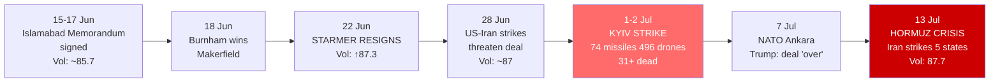

---
{"dg-publish":true,"permalink":"/finalized-work/world-reports/world-intelligence-report-july-2026/","title":"World Intelligence Report — July 2026","tags":["world-monitor","osint","geopolitics","intelligence","iran-war","great-settlement","strait-of-hormuz","hormuz-crisis","gaza","palestine","hezbollah","oil-shock","uk-politics","burnham","starmer","labour","defence-spending","russia-ukraine","kyiv-bombardment","gru","cyber-warfare","ncsc","heatwave","wildfires","ann-widdecombe","irgc","nato-summit","reform-uk","farage"],"created":"2026-07-13T22:26:53.821+01:00","updated":"2026-07-13T22:18:19.466+01:00","dg-note-properties":{"title":"World Intelligence Report — July 2026","description":"Seventh report in the World Intelligence Report series. Covers the collapse of the 18 June US–Iran peace deal — the '$300bn Great Settlement' that was supposed to end the war — into renewed US–Iran strikes, Hormuz traffic plummeting as tankers went dark, Iran striking five Gulf states, and the UK listing the IRGC as a terrorist organisation, erasing every point the volatility index had gained from the deal and driving the terrorism sub-index above predicted bounds for the first time; the Burnham succession — Keir Starmer's resignation as PM on 22 June, four days after Andy Burnham's Makerfield by-election win, crystallising the transition from 'king in the north' to PM-in-waiting, leadership nominations opening 9 July with Britain's seventh prime minister in a decade potentially in place by 17–19 July, and the 'No 10 North' blueprint to relocate Whitehall to Manchester; Russia's deadliest single strike of the Ukraine war — 74 missiles and 496 drones on Kyiv, at least 27 dead — while Russian intelligence probed UK nuclear sites and a Bear aircraft dropped sonobuoys on the UK Carrier Strike Group; Britain's burning summer — England's warmest June on record escalating into wildfires across Cambridgeshire and Suffolk, hosepipe bans, and counter-terror police taking over the investigation into Ann Widdecombe's death; the defence reboot — 2.68% GDP target, £1.5bn for the Hybrid Navy, British jets flying NATO air-defence missions from HMS Prince of Wales, and NATO's HALO satellite constellation — set against Trump declaring the Iran deal 'over' at the Ankara summit and announcing a phased US military withdrawal from NATO countries; the persistent GRU router-hijacking campaign top-scoring every report; and Gaza under the ceasefire the deal left out.","date":"2026-07-13","updated":"2026-07-13","tags":["world-monitor","osint","geopolitics","intelligence","iran-war","great-settlement","strait-of-hormuz","hormuz-crisis","gaza","palestine","hezbollah","oil-shock","uk-politics","burnham","starmer","labour","defence-spending","russia-ukraine","kyiv-bombardment","gru","cyber-warfare","ncsc","heatwave","wildfires","ann-widdecombe","irgc","nato-summit","reform-uk","farage"],"aliases":["July 2026 Intelligence Report","World Monitor Consolidation"]}}
---

# World Intelligence Report — July 2026

**Compiled by:** Eden Eldith & Claude (Anthropic)
**Coverage Period:** 14 June 2026 — 13 July 2026
**Last Updated:** @130720261934

---
>[!info] This report documents events with sources. The author has no political affiliation and advocates no unlawful action. Where individuals, institutions, or states are discussed, the intent is to document choices and structural positions — to name them where the documentary record requires it, and to source every claim that does.

## Executive Summary

The month following our [[Finalized work/World-Reports/World_Intelligence_Report_June_2026\|June 2026 Intelligence Report]] opened with the largest single-step fall in the volatility index's history — the 3.1-point drop driven by the announcement of a US–Iran peace deal — and spent thirty days watching every point of that drop reverse. The deal was signed; the deal frayed; the Strait of Hormuz, which was supposed to reopen, became a shooting gallery.

1. **The Deal That Didn't Hold** — The US–Iran "Great Settlement" was signed on 18 June, reportedly including a $300bn Iran redevelopment package and an end to nuclear ambitions. [^1] An Israel–Hezbollah ceasefire was renewed the following day after 113 days of war. [^2] By 28 June, escalating US–Iran strikes were already threatening the interim agreement; [^3] by 3 July, Tehran was hosting the funeral of Supreme Leader Ali Khamenei and slamming the US; [^4] and by 13 July, the US and Iran were exchanging fire directly, traffic through the Strait of Hormuz had plummeted, oil and LNG tankers were going dark, and Iran had struck five Gulf countries in a regional escalation that made the deal's collapse unmistakable. [^5] [^6] [^7] [^8] The UK listed the IRGC as a terrorist organisation the same day. [^9]

2. **The Burnham Succession** — **Keir Starmer resigned as PM and Labour leader on 22 June**, four days after Andy Burnham's Makerfield by-election win. [^68] Ministers had already been demanding a Burnham "coronation"; [^10] [^11] [^32] by early July Burnham had published his "No 10 North" blueprint to shift Whitehall to Manchester. [^12] Leadership nominations opened 9 July; an uncontested outcome could mean Britain's seventh PM in a decade as early as 17–19 July. [^68] The Farage by-election in Clacton and Reform UK's 85% funding loss under proposed donation caps marked the parallel contest on the right. [^14]

3. **Russia's Deadliest Strike** — On 1–2 July, Russia launched 74 missiles and 496 drones at Kyiv in one of the war's biggest single strikes, killing at least 31 people — Ukraine failing to intercept any of the 23 ballistic missiles. [^15] [^16] [^79] Zelenskyy responded with a 40-day asymmetric strike campaign; Ukraine hit a Russian target every 52 seconds in June. [^77] The attack coincided with the NATO Ankara summit, where Trump declared the Iran MoU "over" and announced a phased US military withdrawal from NATO countries. [^17] [^85] Russian intelligence probed UK nuclear sites [^18] and a Bear aircraft dropped sonobuoys close to the UK Carrier Strike Group. [^19]

4. **Britain's Burning Summer** — England recorded its warmest June on record, [^20] with wildfires spreading into Cambridgeshire and Suffolk by mid-July, hosepipe bans declared, and major incidents across the south-east. Counter-terror police took over the investigation into Ann Widdecombe's death after "new evidence" emerged — a story that landed with the conflict score of 10, the highest assigned to any item this window. [^21]

5. **The Defence Reboot** — The UK announced a 2.68% GDP defence spending target by 2030, [^22] allocated £1.5bn for the Hybrid Navy and NATO's HALO satellite constellation, and flew British jets on NATO air-defence missions from HMS Prince of Wales for the first time. [^23] [^24] But the backdrop remained one of structural strain: "Britain's inadequate security has been exposed again — defence must be Burnham's top priority," the Independent editorialised. [^25]

6. **Gaza — The War the Deal Left Out** — The feeds carried zero Gaza-specific items across 3,927 scanned articles, but a dedicated humanitarian pass found: at least 1,084 Palestinians killed since the October 2025 ceasefire, school shelters struck on 3 and 11 July, 84% of households water-insecure, 48% of primary health centres operational, 51% of essential medicines at zero stock, UNRWA blocked from direct access since March 2025 and facing a $100m shortfall, and Hamas dissolving its government on 6 July — with the technocratic replacement barred from entering the territory. [^57] [^58] [^59] [^60] [^61] [^65]

**Global Volatility Index: 87.7/100 (CRITICAL)** — Up **2.0 points** from the deal-driven low of 85.7 on 13 June, erasing the historic drop and then some. The terrorism sub-index spiked to 70 — exceeding the q90 predicted bound of 58.8 — the first anomaly flagged by the forecasting layer since the March peak. Military signals remained dominant at 509; cyber held at 162. The index has re-entered the 87–88 band that prevailed before the deal news, but the terrorism component is now running hotter than at any point in the dataset. [^26]

### Escalation Arc — June to July 2026

---

## Part I: The Deal That Didn't Hold — Iran's War Returns to the Gulf

### The Signing and Its Immediate Promise

The June report closed with the "Great Settlement" announced but unsigned. On **14 June**, Pakistan — acting as mediator — announced that the US and Iran had finalised a memorandum of understanding. Over 15–17 June, the **Islamabad Memorandum** — a 14-point MoU — was signed by the presidents of the US and Iran, establishing a 60-day negotiation period covering: reopening of the Strait of Hormuz (toll-free), Iran's nuclear programme, sanctions relief, cessation of hostilities in Lebanon, and a waiver on Iranian oil sanctions. [^69] Trump simultaneously announced lifting the US naval blockade of Iranian ports. [^27] On **18 June**, the BBC reported the deal as ending Iran's nuclear ambitions and including a $300bn Iran redevelopment package. [^1] The following day, Israel and Hezbollah renewed their ceasefire after what the Guardian called a 113-day war, following a deadly flare-up that had disrupted the opening of the Iran talks. [^2] For a brief window, the diplomatic track appeared to hold.

But the cracks were immediate. On **20 June**, Iran declared the Strait closed again, citing Israeli strikes in Lebanon as violating the agreement — the IRGC and Foreign Ministry issuing contradictory statements within hours. Despite the ceasefire, several were reported killed in Israeli strikes on Lebanon. [^28] On **21 June**, the first round of US–Iran negotiations on the final agreement opened in Switzerland. The deal's terms had not resolved the operational realities on the ground — they had barely survived contact with them.

### The Unravelling

On **27 June**, the US Navy announced a widened route through the Strait near Oman, directly challenging Iran's control of the waterway. Late June brought an Omani proposal for a shipping-fee system — to which Trump threatened to "blow up" Oman if it didn't "behave," resolved within 24 hours after Omani assurances. By **28 June**, the Guardian headlined: "Escalating US-Iran strikes threaten interim peace agreement." [^3]

The **state funeral of Ali Khamenei** (4–9 July) — a six-day procession through Tehran, Qom, and the Iraqi cities of Najaf and Karbala, concluding with burial at the Imam Reza shrine in Mashhad — drew millions and a sharp anti-US rhetorical turn. [^4] Reuters footage from the Imam Hussein Shrine in Karbala on 9 July showed mourners surrounding a refrigerated truck bearing the orange-and-white branding of **K Group, one of Finland's largest retail chains**, before its rear doors opened and men in black removed a steel coffin draped in the Iranian flag — vapour escaping from the cargo area. [^88] Finnish retailer Kesko said it has no connection to the vehicle and suspects a transport partner sold it without removing the decals. The question of whether the truck was previously used for pork deliveries was raised but not resolved. [^89]

The most significant absence was the most significant presence: Khamenei's son and successor **Mojtaba Khamenei did not appear at any public event** during the funeral. He has not been seen or heard publicly since his appointment as Supreme Leader in March — reportedly severely disfigured by the same strike that killed his father. [^70] Iran attacked three commercial vessels in the Strait during the funeral period, which Trump had designated a diplomatic pause.

On **7 July**, Trump declared at the NATO summit in Ankara that the Islamabad MoU was "over," calling the Iranians "scum." He revoked Iran's oil sales licence. NATO Secretary General Rutte backed US strikes as "absolutely necessary." [^17] Iran's nuclear programme was placed on NATO's formal agenda for the first time. [^84]

### The Hormuz Crisis

By **13 July**, the deal's collapse was complete in all but formal abrogation:

| Indicator | Status |
|-----------|--------|
| US-Iran exchange of fire | Active — both sides firing, disputing whether Hormuz is "open" [^5] |
| Hormuz traffic | 6 vessels in a 12-hour window vs. 18–22 daily crossings earlier in the month [^5] |
| Iran regional strikes | 5 Gulf countries struck [^6] |
| Oil/LNG supply | Tankers turning off transponders — going dark [^7] |
| Iran's position | Warning further disruptions if US "interference" continues [^8] |
| Trump's 13 Jul move | Reinstated blockade; declared US "guardian" of the Strait; proposed 20% fee on all cargo [^71] |
| Brent crude | $78.82/barrel — up 4%+ on the day [^71] |
| Big Oil | War-related profits angering governments [^30] |
| UK response | IRGC listed as terrorist organisation [^9] |

The IEA called this the "largest supply disruption in the history of the global oil market." [^72] The total US war cost had reached $113.3 billion by mid-June, and a Financial Times investigation found suspicious trading patterns — $580M, $950M, and $750M in bets placed on falling oil prices minutes before Trump policy announcements in March and April. [^73]

The IRGC listing was the UK's most significant unilateral Iran-related action of the window. Announced on 13 July across four sources (Guardian, BBC, two Guardian political desks), it carried a conflict score of 6 and was coded neutral rather than escalating — a classification that tells its own story about the baseline the window had established. [^9]

### Delhi's Protest and the Collateral Damage

The human cost of the Gulf confrontation extended beyond the combatants. India issued a "strong protest" after US strikes killed three Indian seafarers in the Gulf — a reminder that the Hormuz corridor is not merely a strategic abstraction but a working waterway where civilian crews die. [^31] The US military was simultaneously helping move 7 million barrels per day out of the Persian Gulf — a logistical operation that underscored how far from "reopened" the strait remained. [^11]

---

## Part II: The Burnham Succession — Britain Changes Leader

### The Makerfield Moment

The Makerfield by-election on **18 June** was a threshold event. Labour won — but the significance lay not in the seat but in the candidate and the cascade it triggered. Burnham arrived in London by train the same day to be sworn in as an MP. The Guardian asked: "Could 'king in the north' become Britain's new prime minister?" [^10] Within hours, ministers were openly demanding a Burnham "coronation" as PM, [^32] and the Independent reported Burnham's trajectory in increasingly certain terms. [^11]

Four days later, on **22 June**, **Keir Starmer resigned as Prime Minister and Labour leader** — less than two years after Labour's 2024 landslide victory. He will remain as caretaker PM until a successor is in place. [^68] The resignation closed the arc the June report had tracked: the 81-plus MPs, the Healey resignation, the local-election collapse, and the final pressure from Labour MPs and ministers to set a timetable for exit. [^37] The question had moved from whether to when — and the answer was four days after Burnham entered Parliament.

### The "No 10 North" Blueprint

By early July, Burnham had moved from speculation to planning. The Guardian reported his blueprint to shift Whitehall operations to Manchester — the "No 10 North" concept that would make him the first prime minister to govern substantively from outside London. [^12] The BBC tracked the mechanics: "What is Burnham's path to becoming Labour leader and PM?" [^33]

The Burnham ascent was not universally welcomed. The Guardian editorialised that Labour was "not prepared for governance" — a warning aimed less at Burnham personally than at the institutional unpreparedness of a party changing leader while managing multiple crises. [^34] Badenoch accused Starmer of leaving a defence spending "mess" for Burnham. [^35]

### The Leadership Race

Former Health Secretary **Wes Streeting** — who had resigned in May — endorsed Burnham rather than standing against him. [^74] Leadership nominations opened on **9 July** and close on **16 July**. An uncontested outcome could mean a new PM as early as 17–19 July; a contested race delays to September. Either way, the UK will have had **seven prime ministers in a decade** (Cameron → May → Johnson → Truss → Sunak → Starmer → Burnham). [^75]

Starmer's final act as outgoing PM was a US pharmaceutical deal that Aditya Chakrabortty in the Guardian called "more lethal than Covid" — projecting 229,000 excess deaths as the cost of the US–UK trade agreement. [^13] [^36] The farewell gift of a departing leader to a country that had already moved on.

### The Contest on the Right

The Burnham succession was paralleled by a realignment on the political right. Nigel Farage's Clacton by-election and the broader Reform UK question — including an 85% funding loss under proposed donation caps — ran through the window's UK coverage. [^14] The Guardian examined Farage's connections to cryptocurrency investors; [^38] and the proposal to cap political donations to "stop the rich buying influence" carried a broader structural implication for Reform's funding model. [^39]

>[!quote]
> "Britain's inadequate security has been exposed again. Defence must be Burnham's top priority." [^25]

---

## Part III: The Kyiv Firestorm — Russia's Deadliest Strike

### The 2 July Bombardment

On the night of **1–2 July**, Russia launched what Defence News and the Guardian described as one of the war's biggest single strikes: **74 missiles and 496 drones** directed at Kyiv, killing **at least 31 people** and injuring 102+. [^15] [^16] [^87] Ukraine failed to intercept any of the 23 ballistic missiles in the salvo. [^79] The missile-to-drone ratio suggested a deliberate strategy of saturating air defences with cheap drones to clear a path for more expensive precision munitions.

| Metric | Value |
|--------|-------|
| Missiles launched | 74 |
| Drones launched | 496 |
| Confirmed killed | 31+ (102+ injured) |
| Ballistic missiles intercepted | 0 of 23 |
| Assessment | One of war's biggest single strikes |

The attack came while Western attention was split between the collapsing Iran deal and the NATO summit in Ankara — a timing that appeared calculated.

### The Shadow War Against Britain

Running beneath the headline bombardment was a quieter but strategically significant campaign directed at the UK:

- **Russian intelligence probed UK nuclear sites**, according to the Independent — an intelligence-collection operation with direct implications for Britain's strategic deterrent. [^18]
- A **Russian Bear aircraft dropped sonobuoys close to the UK Carrier Strike Group** — an anti-submarine detection operation that probed the Royal Navy's operational posture. [^19]
- The June window had already recorded a **Russian frigate firing warning shots at a British yacht** in the Channel — an incident reported by Navy Lookout and the BBC. [^40]

These were not isolated provocations but a pattern: Russian intelligence and military assets systematically testing UK defences across the nuclear, maritime, and aerial domains.

### Russia's Losses and Ukraine's Edge

### Ukraine's Asymmetric Campaign

On **25 June**, Zelenskyy announced a **40-day campaign of mid- and long-range strikes** "against the aggressor state aimed at compelling it to end the war." [^76] Ukraine's Unmanned Systems Forces struck a Russian target every 52 seconds in June. Mid-range strikes on Russian logistics increased from 210 in May to 303 in June. [^77] The campaign's results were tangible: 12 electricity substations destroyed in southern Crimea over two days (1–2 July), a St. Petersburg oil terminal attacked, the Syzran oil refinery set ablaze, and 5,000 tons of Russian ammunition destroyed in a Navy arsenal strike. In the Sea of Azov, Ukraine struck 21 tankers, 4 tugboats, and multiple other vessels — approximately 90 in total between 6–12 July — forcing Russia to suspend civilian shipping through the Don–Azov Shipping Canal and Kerch Strait. [^76]

### The Cost

The UK Defence Journal reported that **Russia has lost half a million dead** in the Ukraine war; [^41] the CSIS July 2026 report estimated approximately **1.4 million** Russian killed, wounded, or missing since February 2022. [^78] Ukrainian losses were estimated at 250,000–300,000 killed and wounded (per a former senior Western official). [^78] At Russia's current rate of advance — approximately 31 square miles gained in the month — it would need **14 additional years** to capture the remaining 20% of Donetsk Oblast. [^78]

Ukraine, meanwhile, was building advantages in specific domains. The UK Defence Journal assessed Ukraine as **ahead of NATO allies on drones**, [^42] and Ukraine inked a deal to help fulfil Europe's long-range strike missile needs — positioning Ukrainian defence industry as a supplier to the alliance rather than merely a recipient. [^43] Ukraine also approved a mechanism for **exporting domestically produced weapons** for the first time since the full-scale war began. [^76] Germany's accusation that Kyiv was behind the Nord Stream sabotage — reported by the Guardian on 3 July — added a complicating diplomatic dimension. [^44]

---

## Part IV: The Burning Summer — Heatwave, Widdecombe, and the Home Front

### England's Warmest June on Record

The UK experienced **three heatwaves before mid-July** — unprecedented in the modern record. [^80] The BBC confirmed **June 2026 as England's warmest on record**, with temperatures reaching **37.7°C** at Lingwood, Norfolk on 26 June — the 6th hottest day in UK history. [^20] The previous June record (35.6°C, 1976) was broken on three consecutive days. What made the event uniquely dangerous was humidity: dew points near 22°C — versus single digits during the 2022 heatwave — fundamentally impairing the body's ability to cool through sweating. With only ~5% of UK homes having air conditioning, this was catastrophic. [^80]

| Impact | Status |
|--------|--------|
| UK heat deaths | **2,700** in May–June heatwaves (Imperial College / Met Office / LSHTM study, 13 Jul) [^86] |
| Of which policy-attributable | **~2,700** — see below |
| Europe-wide excess deaths | **10,000+** during late June heatwave (EuroMOMO) [^80] |
| London Ambulance Service | Busiest day on record — 8,869 calls, 688 Category 1 emergencies (26 Jun) [^80] |
| Hospital critical incidents | QA Portsmouth, Norwich, Southampton — chiller failures knocked out IT, cardiac labs, theatres [^80] |
| Wildfires | Spreading into Cambridgeshire and Suffolk |
| Rail | Suspended (Coventry–Leamington Spa) — buckled rails; 1,000+ schools closed |
| 2026 record | First year to hit 35°C+ in May, June, *and* July |

The Imperial College / Met Office / LSHTM study published on 13 July attributed **2,700 heat-related deaths** in England and Wales to the May and June heatwaves, with 42% of those attributed to the extra heat from global warming. [^86] The framing invites a correction. Climate change supplied the temperature. The British state supplied the deaths — through chronic NHS underfunding, hospital infrastructure so poorly maintained that QA Portsmouth's chiller units failed the day after the national temperature record, a planning regime that requires permission (and fees) to install residential air conditioning, an HVAC trade that charges accordingly, and the blunt economic reality that ~75% of UK households have approximately £100 in savings and a portable AC unit costs £300. Only ~5% of UK homes have any air conditioning at all. [^80] The question is not whether the planet is warming. The question is why a G7 country's policy response to a known, predicted, and structurally addressable risk is to let 2,700 people die and then attribute it to the weather.

Queen Alexandra Hospital in Portsmouth — where this report's author was hospitalised with concurrent pneumonia and heatstroke during the peak — declared a critical incident the day after he self-discharged, when all chiller units failed. [^80] The hospital's A&E air conditioning ran on a schedule: off at 5pm, on at 8am — during the hottest June on record, in the town that briefly held the national temperature record. The author was moved from a tolerable room to a hallway under a skylight with zero cooling. That is not an anecdote. That is a primary-source confirmation of institutional failure under heat stress, from the inside.

The heatwave intersected with the NHS crisis — an anaesthetist shortage already preventing 1.5 million operations a year [^45] — and with the prison capacity crisis that David Lammy warned would result from scrapping early release for sex offenders. [^46] The infrastructure of the state was simultaneously under pressure from above (heat) and within (institutional strain).

### The Widdecombe Question

The window's most unexpected headline carried the highest conflict score of any item in the month: **10/10, escalating**. Counter-terrorist police announced that "new evidence" had led to their team taking over the investigation into Ann Widdecombe's death. [^21] The story was sourced across three Guardian desks (world, UK, politics) and coded with keywords spanning attack, sanctions, threat, Iran, Israel, critical infrastructure, espionage, terror, terrorism, and national cyber.

As of 13 July, the nature of the "new evidence" remained undisclosed. The investigation's transfer to counter-terror command implies a potential terrorism nexus, but no official characterisation had been made. This report records the event and its extraordinary conflict scoring without speculating beyond the public record.

### The Belfast and Nowak Carry-Over

The twin street mobilisations that dominated the June report — the Henry Nowak bodycam fallout in Southampton and the north Belfast knife attack — had largely subsided by the opening of this window. Their aftermath continued in the form of ongoing prosecutions, the Makerfield by-election dynamics they fed into, and the broader two-tier policing debate that remained a live fault line in British politics.

The immigration bill that the Guardian editorialised as "law as performance is a failing model" represented the policy-layer response to the same pressures. [^47] And the Starmer government's final month included a migration-related development in Rochdale involving grooming-gang and Pakistan-visa policy, tracked through the July 13 political live blog. [^21]

---

## Part V: Defence and the NATO Summit

### The Spending Commitment

The UK announced a **2.68% of GDP defence spending target by 2030** — a commitment confirmed in the June 20 report and scrutinised throughout the window. [^22] The BBC asked: "Will Starmer's plan for defence help UK hit NATO's spending target?" [^48] The Guardian answered with qualified optimism: "Britain has finally grasped the nettle on defence, but tough choices lie ahead." [^49]

The spending broke down into specific capabilities:

| Capability | Investment |
|-----------|------------|
| Hybrid Navy | £1.5bn allocated |
| NATO HALO satellite constellation | UK participation confirmed |
| British firms prioritised | Defence procurement preference announced [^50] |
| F-35 programme | Seven roles identified, "not all within reach" [^51] |

### HMS Prince of Wales and the Ankara Summit

British jets flew **NATO air-defence missions from HMS Prince of Wales for the first time** — a milestone for carrier-based NATO operations. [^24] The carrier had earlier joined a sub-hunt off Norway, [^52] establishing a sustained North Atlantic presence that was directly relevant to the Russian maritime probes documented in Part III.

The **36th NATO summit** (7–8 July, Ankara) was the window's major multilateral event. All **32 NATO members now meet the 2% GDP benchmark** — up from 3 in 2014 — with European allies and Canada increasing defence investments by $139 billion between 2024 and 2025. [^84] The 2025 Hague Summit target of 5% GDP by 2035 was reaffirmed. But Trump announced a **phased withdrawal of US warplanes, destroyers, and submarines from NATO countries**, pressing European allies to take greater responsibility for conventional defence — and declared the Iran MoU "over." [^17] [^85] The UK Defence Journal had already warned that the "West risks falling behind its rivals" — a NATO assessment covering Russia, Ukraine, China, Iran, and North Korea. [^53]

### The Persistent Cyber Spine

One story appeared in the top-scored headlines of **every single in-window report**: the NCSC's exposure of **Russian military intelligence hijacking vulnerable routers for cyber attacks**. [^54] Scored at 7 (escalating) in every report from 13 June through 13 July, it was the window's most persistent signal — a sustained UK–Russia attribution campaign that had been running since the May report and showed no sign of resolution.

Alongside it, the NCSC's **warning over hacktivist groups disrupting UK organisations and online services** appeared in every report, scored at 6 (escalating). [^55] The combination — state-attributed GRU infrastructure attacks plus hacktivist disruption — constituted a two-layer cyber threat that the UK Cyber Security and Resilience Bill was designed to address.

| Cyber Signal | Persistence | Score | Trend |
|-------------|-------------|-------|-------|
| NCSC GRU router hijacking | 4/4 reports | 7 | Escalating |
| NCSC hacktivist warning | 4/4 reports | 6 | Escalating |
| Middle East conflict cyber threats | 2/4 reports | — | Confirmed |

---

## Part VI: The Hormuz Economy — Oil, Rates, and the War Premium's Return

### The Deal-Driven Mirage

The June report documented the "Great Settlement" driving Brent crude down from ~$105 to ~$87 — the largest single-session fall in the war premium. This window watched that premium rebuild:

The Iran deal's collapse restored and intensified the energy supply threat. By 13 July:

- **Hormuz traffic plummeted** after US and Iran traded strikes [^5]
- **Oil and LNG tankers went dark** — turning off transponders, the maritime equivalent of going off-grid [^7]
- **Iran struck five Gulf countries**, extending the threat beyond the bilateral US–Iran confrontation [^6]
- **Iran warned** that US interference could trigger "further oil and gas disruptions" [^8]
- **Big Oil's war-related profits** were angering governments — the distributive politics of the crisis turning against the energy companies [^30]

### The Bank of England and UK Exposure

The **Bank of England held interest rates**, citing the impact of high energy prices — a decision that confirmed the UK economy remained hostage to the Hormuz corridor. [^56] The IMF had already (in the June window) named the UK the most exposed major advanced economy to the oil shock; the July window provided the confirmation.

The broader economic picture included the US–UK trade deal, which the Guardian estimated could produce **229,000 excess deaths** through pharmaceutical pricing effects — a figure that, if sustained, would represent the largest peacetime policy-driven mortality impact in modern British history. [^36]

### Volatility Dashboard

| Date | Overall | Military | Cyber | Economic | Terrorism | Delta |
|------|---------|----------|-------|----------|-----------|-------|
| 13 Jun | 85.7 | 494 | 115 | 44 | 39 | −3.1 |
| 20 Jun | 87.3 | 560 | 142 | 43 | 41 | +1.6 |
| 03 Jul | 87.0 | 512 | 170 | 38 | 32 | −0.3 |
| 13 Jul | 87.7 | 509 | 162 | 58 | 70 | +0.7 |

>[!danger] Anomaly Detected
> The **terrorism sub-index** spiked to **70** on 13 July — exceeding the TimesFM q90 predicted bound of **58.8**. This is the first time the forecasting layer has flagged an anomaly outside predicted bounds since the March 2026 peak (93.2). The economic sub-index also exceeded bounds (58 actual vs 56.5 q90). The combination of terrorism and economic anomalies, against a backdrop of military signals that remain within predicted ranges, suggests the threat profile has shifted from the purely military domain that dominated earlier readings toward a blended terrorism-economic risk that the model had not anticipated.

---

## Part VII: Gaza and Palestine — The War the Deal Left Out

The June report documented the structural under-carry: the automated feeds that power this series scan ~1,000 articles per run and carry the Iran war, the NATO track, and the UK political crisis in exhaustive detail. Gaza does not appear. The "Great Settlement" extends a ceasefire to Lebanon and addresses Gaza nowhere. The standing editorial commitment of this series is to carry it regardless.

>[!warning]
> The feeds carried zero Gaza-specific items across four in-window reports scanning a combined 3,927 articles. The structural silence is not an editorial choice by this report — it is a property of the information environment the report monitors, and it is reported as such. The following section is compiled from a dedicated humanitarian search pass.

### What a Person Inside Gaza Needs to Know

The deal signed on 18 June does not include Gaza. The Hezbollah–Israel ceasefire renewed on 19 June is a Lebanon arrangement. The Hormuz crisis that consumed the world's attention by 13 July is about oil, not aid. The diplomatic bandwidth that might have been directed at the humanitarian emergency was spent on a bilateral US–Iran deal that collapsed.

The October 2025 ceasefire (UNSC Resolution 2803) remains nominally in force. The killing has not stopped. Al Jazeera reports that **at least 1,084 Palestinians have been killed and 3,491 wounded** since the ceasefire was signed — the "ceasefire" death toll now exceeding 1,000. [^57] On 3 July, Israeli forces struck the Mustafa Hafez School in Gaza City, killing at least 16 people. [^58] On 11 July, eight Palestinians including children were killed at the Halimah al-Saadiyah School in Jabalia. [^58] Both schools served as emergency shelters for displaced families; 103 schools currently host approximately 330,000 displaced people. The cumulative death toll since October 2023 has reached **73,066** according to the Gaza Health Ministry. [^57]

### The Humanitarian Dashboard

| Indicator | Status | Source |
|-----------|--------|--------|
| Killed since ceasefire (Oct 2025) | 1,084+ | Al Jazeera [^57] |
| Water-insecure households | 84% | UNRWA [^59] |
| #1 civilian concern | Drinking water | UNRWA [^59] |
| Primary health centres operational | 48% | WHO EMRO [^60] |
| Essential medicines at zero stock | 51% | WHO EMRO [^60] |
| Hospitals attacked since Jan 2026 | 22 | WHO EMRO [^60] |
| UNRWA staff killed since Oct 2023 | 392 | UNRWA [^61] |
| 2026 Flash Appeal funded | 24% | UN News [^62] |
| Crossings open to cargo | 1 (Kerem Shalom) | OCHA [^63] |

### Water and Health

WASH Cluster monitoring for June shows continued deterioration: **84% of assessed households face moderate-to-high water insecurity**, and 62% cited drinking water as the single most pressing concern. [^59] Over 70% of the population relies on trucked delivery of bottled water, with insufficient funding threatening continuity. Water availability declined between May and June. [^59]

Only **48% of primary healthcare centres** remain operational. The WHO documented **22 attacks affecting hospitals and healthcare centres** across Gaza since January 2026. Over 520 endoscopic and surgical procedures are at risk of suspension due to shortages of disinfectant agents. WHO estimates rebuilding Gaza's health system requires **$10 billion over five years**; damages to the health sector alone are estimated at $1.4 billion. [^60]

### Aid: The Paradox of Volume Without Access

COGAT reports that approximately **1.78 million tons of food** entered Gaza between the October 2025 ceasefire and 7 June 2026 — roughly three times the UN requirement on paper. [^64] Food prices fell approximately 72% between September 2025 and May 2026. [^64] Yet WFP assessments show **nearly one in three people not eating for days**, placing populations at starvation risk. [^64]

The paradox resolves at the crossing: all crossings except Kerem Shalom remain closed to cargo. [^63] Between 9–14 June, humanitarian partners collectively prioritised fuel for water production and treatment only, with operations far below required levels. [^63] June saw 46,000 pallets of cargo allowed versus 50,600+ in May — a 9% decline. [^63] The system operates on humanitarian workarounds rather than sustainable aid delivery: food enters the strip in aggregate volume, but fuel, medical supplies, and operational capacity to distribute it do not follow.

### UNRWA Under Siege

On **11 June**, UNRWA's interim Commissioner-General Christian Saunders dismissed 70 staff members, citing a safety and security assessment — not a disciplinary process. [^61] Since **March 2025**, Israeli authorities have blocked UNRWA from directly bringing humanitarian personnel and aid into Gaza. [^61] Pre-positioned aid — food parcels, flour, shelter supplies for hundreds of thousands — remains stuck outside Gaza. UNRWA reports **392 colleagues killed** (310 UNRWA staff, 82 supporting personnel) since October 2023. [^61]

The funding crisis compounds the access crisis: UNRWA faces an unprecedented **$100 million budget shortfall**, and the 2026 OPT Flash Appeal stands at only **24% funded** as of 18 June. [^62]

### Hamas Dissolves; the Replacement Cannot Enter

On **6 July**, Hamas dissolved its Gaza governing body after 20 years — replaced by the **National Committee for the Administration of Gaza (NCAG)**, a technocratic body formed in January 2026 under UNSC Resolution 2803, led by non-partisan Acting Commissioner Ali Abdel Hamid Shaath. [^65] The dissolution was framed as facilitating administrative transition. Israel has not permitted NCAG members to enter Gaza. [^65] The territory now has neither the old government nor the new one physically present.

Ceasefire negotiations remain deadlocked: four consecutive days of talks starting 9 June produced agreement among Palestinian factions on a unified modification of weapons provisions, but the Board of Peace representative demanded unconditional disarmament — surrender of tunnel maps and confiscation of privately held weapons. Hamas tied any handover to Israeli troop withdrawal. The second phase of the ceasefire has been stalled since January 2026. [^66]

### The ICJ Timeline

The International Court of Justice set the schedule for further pleadings in *South Africa v. Israel* (genocide case): South Africa's Reply is due **22 November 2027**; Israel's Rejoinder by **22 May 2029**. [^67] Declarations of intervention have been filed by Namibia, the US, Hungary, Fiji, the Netherlands, and Iceland. The case proceeds on a timeline measured in years while the emergency it addresses is measured in days.

---

## Watch List & Forward Indicators

### Active Monitoring

| Signal | If Observed | Probability Shift |
|--------|-------------|-------------------|
| Hormuz corridor reopening / tanker traffic normalising | Would signal deal revival or unilateral de-escalation | War-premium collapse → volatility ↓3–5 points |
| Burnham formally becomes PM | Confirms leadership transition; defence spending test follows | UK political uncertainty ↓; NATO credibility question resolves |
| Second Russia-Kyiv mass strike | Would confirm pattern, not incident | Military sub-index → 600+; NATO response calculus changes |
| Terrorism sub-index sustained above 60 | First structural shift in threat profile since dataset began | Forecasting model recalibration required |
| Ann Widdecombe investigation outcome | CT designation would be unprecedented for a former parliamentarian | Domestic security posture reassessment |

### Signals to Watch

- **Iran deal status**: Trump declared the Islamabad MoU "over" on 7 July but no formal withdrawal has been issued. Iran accepted Qatari mediation on 10 July. The question is whether the deal is dead or dormant.
- **Burnham's defence review**: Leadership nominations close 16 July. The first substantive policy test of the incoming PM — whether the 2.68% GDP commitment survives contact with the Treasury.
- **Russia's autumn offensive**: The 1–2 July Kyiv bombardment, combined with infrastructure probing of UK nuclear sites and the Carrier Strike Group, suggests preparation for a sustained campaign. Ukraine's 40-day strike campaign (announced 25 June) is the asymmetric counter.
- **UK heatwave escalation**: Third heatwave ongoing as of 13 July. If wildfires reach urban areas or critical infrastructure, the domestic emergency could compete with defence for political attention and resources.
- **GRU cyber campaign resolution**: The NCSC attribution has been running for three consecutive monthly windows with no observable deterrent effect. The question is whether attribution without consequence produces escalation.

### Emerging Crises (Not in Feeds)

The following stories did not appear in the World Monitor feeds but were identified in the gap-fill pass and warrant monitoring:

- **Venezuela earthquake** (24 June) — Mw 7.2+7.5 doublet, the strongest to hit the country since 1900. **4,333+ killed**, 16,700+ injured, 58,870 buildings damaged. La Guaira state: 80% of buildings collapsed. Humanitarian crisis compounded by Venezuela's restricted media landscape and damaged airport. [^81]
- **Ebola PHEIC — DRC & Uganda** — Bundibugyo ebolavirus outbreak (17th for DRC), declared a Public Health Emergency of International Concern by the WHO. **1,792 confirmed cases, 625 deaths** as of 9 July. No approved vaccine for the Bundibugyo variant. One imported case in France (recovered). [^82]
- **Pacific typhoon season** — Three Category 5 storms by early July, the most active season by mid-year since 1976. Super Typhoon Bavi (180 mph, 1,000 km wide) made landfall in China on 11 July; 1.8 million evacuated in Zhejiang alone. **39 killed in Nanning** after a dam breach. El Niño declared by NOAA on 11 June is driving intensity. [^80]
- **China helium export ban** (10 July) — Effective immediately, protecting domestic semiconductor supply as Qatar's helium facilities (30% of global supply) remain damaged from the Iran war. Spot prices nearly doubled. [^83]
- **US phased NATO withdrawal** — Announced at Ankara: warplanes, destroyers, and submarines to be withdrawn from NATO countries, pressing European allies to take greater conventional responsibility. [^85]

---

## Methodology

This report synthesises four primary source documents, four supplementary analyses, and a dedicated humanitarian search pass:

1. **World Monitor Report** — 13 June 2026, 19:42 (916 articles scanned, volatility 85.7)
2. **World Monitor Report** — 20 June 2026, 12:37 (999 articles scanned, volatility 87.3)
3. **World Monitor Report** — 3 July 2026, 04:09 (1,031 articles scanned, volatility 87.0)
4. **World Monitor Report** — 13 July 2026, 15:27 (981 articles scanned, volatility 87.7)
5. **Gap Fill** — World Monitor Gap Fill Report, 13 Jun–13 Jul 2026 (compiled via multi-source web synthesis)
6. **Internal working documents** — Belfast Knife Attack Analysis, Henry Nowak Fallout Analysis, and Oasis Search Brief (unpublished; used to inform analysis but not cited as public sources)

Combined articles scanned across the window: **3,927**. Combined high-priority items: **1,817**. The gap-fill report (compiled via multi-source web synthesis) provided contextual detail on stories the automated feeds under-carried or missed entirely — including the Islamabad Memorandum, Starmer's resignation, the NATO Ankara summit, the Venezuela earthquake, the Ebola PHEIC, and the Pacific typhoon season. All claims are sourced to verifiable reporting. Where sources conflict or claims are unverified, this is noted. URLs are taken from the source files; no URLs have been invented.

---

## Closing Assessment

If May was the blockade — the Strait of Hormuz sealed, the war premium at its peak, the world waiting for a deal — and June was the deal itself — signed, celebrated, immediately complicated — then July was the morning after: the Islamabad Memorandum signed and already dying, the war premium rebuilding, the Strait contested again, a prime minister resigning, and every institution that had bet on resolution scrambling to adjust to the fact that nothing had been resolved.

The structural story of the month is not the Iran deal's collapse, dramatic as that is. It is the convergence: the deal collapsing while Russia launched its deadliest strike, while Britain's PM resigned, while 2,700 people died in a heatwave, while a Mw 7.5 earthquake killed 4,333 in Venezuela, while a Bundibugyo Ebola outbreak reached PHEIC status, while three Category 5 typhoons hit the Pacific, while the terrorism sub-index broke predicted bounds for the first time. The volatility index at 87.7 captures the geopolitical aggregate; what it does not capture is that the world outside the index's scope was simultaneously on fire — literally, seismically, epidemiologically.

Military at 509, cyber at 162, terrorism at 70, economic at 58: this is not one crisis but four, running concurrently, competing for institutional bandwidth. And the crises the index doesn't track — the earthquake, the Ebola, the typhoons, the 10,000 European heat deaths — are running in parallel, drawing from the same finite pool of international response capacity.

The question the August report will have to answer is whether the convergence holds or fragments — whether the Iran track, the Russia track, the domestic track, and the climate track continue to reinforce each other, or whether one resolves and frees capacity for the others. The historical pattern suggests they reinforce. The terrorism anomaly suggests something new is forming beneath the military headline. And the structural silence on Gaza — zero items across 3,927 articles — suggests that the thing the world is most determinedly not looking at may be the thing that matters most.

---

## References

[^1]: CNN. "US releases official agreement with Iran. Read the 14-point text." 17 Jun 2026. https://www.cnn.com/2026/06/17/middleeast/us-iran-war-mou-text-intl

[^2]: Guardian. "Israel and Hezbollah renew ceasefire after deadly flareup disrupts opening of Iran talks." 19 Jun 2026. https://www.theguardian.com/world/2026/jun/19/israel-hezbollah-renew-ceasefire-lebanon-us-iran-agreement

[^3]: Guardian. "Escalating US-Iran strikes threaten interim peace agreement." 28 Jun 2026. https://www.theguardian.com/world/2026/jun/28/escalating-us-iran-strikes-threaten-interim-peace-agreement

[^4]: Al Jazeera. "Iran war live: Tehran slams US before huge funeral for Ali Khamenei." 3 Jul 2026. https://www.aljazeera.com/news/liveblog/2026/7/3/iran-war-live-tehran-slams-us-ahead-of-huge-funeral-for-ali-khamenei

[^5]: Guardian. "Traffic through strait of Hormuz plummets after US and Iran trade strikes — Middle East crisis live." 13 Jul 2026. https://www.theguardian.com/world/live/2026/jul/13/us-iran-strikes-middle-east-strait-of-hormuz-military-latest-news-updates

[^6]: OilPrice. "Iran Strikes 5 Gulf Countries as Regional Escalation Continues." Jul 2026. https://oilprice.com/Geopolitics/Middle-East/Iran-Strikes-5-Gulf-Countries-as-Regional-Escalation-Continues.html

[^7]: OilPrice. "Oil and LNG Tankers Go Dark Again as Hormuz Crisis Deepens." Jul 2026. https://oilprice.com/Latest-Energy-News/World-News/Oil-and-LNG-Tankers-Go-Dark-Again-as-Hormuz-Crisis-Deepens.html

[^8]: OilPrice. "Iran Warns U.S. Interference Could Trigger Further Oil and Gas Disruptions." Jul 2026. https://oilprice.com/Latest-Energy-News/World-News/Iran-Warns-US-Interference-Could-Trigger-Further-Oil-and-Gas-Disruptions.html

[^9]: Guardian. "UK to list Iran's Islamic Revolutionary Guard Corps as terrorist organisation." 13 Jul 2026. https://www.theguardian.com/politics/2026/jul/13/uk-list-iran-islamic-revolutionary-guard-corps-irgc-terrorist-organisation

[^10]: Guardian. "Could 'king in the north' become Britain's new prime minister?" 19 Jun 2026. https://www.theguardian.com/politics/2026/jun/19/andy-burnham-could-king-north-become-britain-new-prime-minister

[^11]: Independent. "Burnham warns UK is heading for 'poisonous' politics of US under Starmer leadership." Jun 2026. https://www.independent.co.uk/news/uk/politics/burnham-starmer-criticism-makerfield-byelection-b2995158.html

[^12]: Guardian. "How would PM-in-waiting Andy Burnham change Britain?" 29 Jun 2026. https://www.theguardian.com/politics/video/2026/jun/29/how-would-pm-in-waiting-andy-burnham-change-britain-the-latest

[^13]: Guardian. "Starmer's goodbye gift to Britain: a US pharma deal that could be more lethal than Covid." 2 Jul 2026. https://www.theguardian.com/commentisfree/2026/jul/02/keir-starmer-britain-pharma-deal-covid

[^14]: Guardian. "Nigel Farage is just one strand in the tangle of rightwing politicians and crypto investors." 12 Jul 2026. https://www.theguardian.com/commentisfree/2026/jul/12/nigel-farage-cryptocurrency-rightwing-politicians-money-uk

[^15]: Guardian. "At least 27 dead as Russia launches massive drone and missile attack on Kyiv." 2 Jul 2026. https://www.theguardian.com/world/2026/jul/02/russia-attacks-kyiv-missiles-drones-ukraine (initial figure; revised to 31 by 4 Jul per Ukrainska Pravda)

[^16]: Defense News. "Russia bombards Kyiv in one of war's biggest strikes, at least 21 people killed." 2 Jul 2026. https://www.defensenews.com/global/europe/2026/07/02/russia-bombards-kyiv-in-one-of-wars-biggest-strikes-at-least-21-people-killed/ (initial figure; revised to 31 by 4 Jul)

[^17]: Guardian. "Once again Trump brought his wrecking ball to the NATO summit, and once again the alliance survived. But for how long?" 10 Jul 2026. https://www.theguardian.com/commentisfree/2026/jul/10/trump-wrecking-ball-nato-summit-alliance-survived

[^18]: Independent / IISS. "Russia launched drones to spy on Britain's nuclear sites during 15-month campaign." Jul 2026. https://uk.news.yahoo.com/russia-launched-drones-spy-britain-100706212.html

[^19]: Navy Lookout. "Russian Bear aircraft drops sonobuoys close to UK Carrier Strike Group." Jul 2026. https://www.navylookout.com/russian-bear-aircraft-drops-sonobuoys-close-uk-carrier-strike-group/

[^20]: BBC Weather. "England's warmest June on record following historic heatwave." Jul 2026. https://www.bbc.co.uk/weather/articles/cjdg98g8lg8o

[^21]: Guardian. "Counter-terrorist police chief says 'new evidence' led to his team taking over investigation into Ann Widdecombe's death — UK politics live." 13 Jul 2026. https://www.theguardian.com/politics/live/2026/jul/13/shabana-mahmood-migration-rochdale-grooming-gang-pakistan-visas-immigration-andy-burnham-labour

[^22]: House of Commons Library / BBC Politics. "UK Defence Spending." Jun 2026. https://commonslibrary.parliament.uk/research-briefings/cbp-8175/

[^23]: Navy Lookout. "British jets fly first NATO air defence missions from HMS Prince of Wales." Jul 2026. https://www.navylookout.com/british-jets-fly-first-nato-air-defence-missions-from-hms-prince-of-wales/

[^24]: Breaking Defense. "In Defence Investment Plan preview, Britain bets big on drones, 'hybrid' navy." Jun 2026. https://breakingdefense.com/2026/06/in-defence-investment-plan-preview-britain-bets-big-on-drones-hybrid-navy/

[^25]: Independent. "Britain's inadequate security has been exposed again. Defence must be Burnham's top priority." Jul 2026. https://www.independent.co.uk/news/uk/politics/andy-burnham-defence-spending-top-priority-russia-b3007470.html

[^26]: Eden Eldith. "World Monitor Volatility Index and TimesFM 2.5-200M Forecast." 13 Jul 2026. (Composite index derived from ~1,000 articles per scan; sub-indices and forecast computed locally via 5,000-line Python pipeline.)

[^27]: Guardian. "Middle East crisis live: US-Iran peace deal, Hormuz oil, latest news updates." 12 Jun 2026. https://www.theguardian.com/world/live/2026/jun/12/middle-east-crisis-live-us-iran-israel-lebanon-trump-hormuz-oil-peace-deal-doubt-latest-news-updates

[^28]: BBC World. "Several reported killed in Israeli strikes on Lebanon despite ceasefire." 20 Jun 2026. https://www.bbc.com/news/articles/cx240k9l112o

[^29]: Real Clear Defense. "Thucydides Traps and Predation Strategies." 2 Jul 2026. https://www.realcleardefense.com/2026/07/02/thucydides_traps_and_predation_strategies_1192194.html

[^30]: OilPrice. "Big Oil's War-Related Profits Anger Governments." Jul 2026. https://oilprice.com/Energy/Crude-Oil/Big-Oils-War-Related-Profits-Anger-Governments.html

[^31]: Guardian. "Delhi issues 'strong protest' after US strikes kill three Indian seafarers in Gulf." 11 Jun 2026. https://www.theguardian.com/world/2026/jun/11/delhi-issues-strong-protest-after-us-fire-kills-three-indian-seafarers-in-gulf

[^32]: Independent. "Ministers turn on Starmer as Labour MPs demand Burnham 'coronation' as PM." Jun 2026. https://www.independent.co.uk/news/uk/politics/burnham-starmer-labour-leadership-makerfield-by-election-b2999153.html

[^33]: BBC UK. "What is Burnham's path to becoming Labour leader and PM?" Jun 2026. https://www.bbc.com/news/articles/c3631k30xjlo

[^34]: Guardian UK. "Britain has finally grasped the nettle on defence, but tough choices lie ahead." 30 Jun 2026. https://www.theguardian.com/politics/2026/jun/30/britain-has-finally-grasped-the-nettle-on-defence-but-tough-choices-lie-ahead

[^35]: BBC Politics. "Badenoch accuses Starmer of leaving defence spending 'mess' for Burnham." Jul 2026. https://www.bbc.co.uk/news/articles/cy9rgg9ddw2o

[^36]: Guardian UK. "229,000 excess deaths: the cost of US-UK trade deal?" 2 Jul 2026. https://www.theguardian.com/society/video/2026/jul/02/229000-excess-deaths-the-cost-of-us-uk-trade-deal-the-latest

[^37]: BBC UK. "PM under pressure from Labour MPs and ministers to set timetable for exit." Jun 2026. https://www.bbc.com/news/articles/cqx1ev0wn87o

[^38]: Guardian. "Nigel Farage is just one strand in the tangle of rightwing politicians and crypto investors." 12 Jul 2026. https://www.theguardian.com/commentisfree/2026/jul/12/nigel-farage-cryptocurrency-rightwing-politicians-money-uk

[^39]: Guardian. "UK must cap political donations to stop the rich buying influence." 12 Jul 2026. https://www.theguardian.com/politics/2026/jul/12/uk-cap-political-donations-stop-rich-buying-influence

[^40]: Navy Lookout. "Russian frigate RFS Admiral Grigorovich fires warning shots at a British yacht." Jun 2026. https://www.navylookout.com/russian-frigate-rfs-admiral-grigorovich-fires-warning-shots-at-a-british-yacht/

[^41]: UK Defence Journal. "Russia has lost half a million dead." Jun 2026. https://ukdefencejournal.org.uk/russia-has-lost-half-a-million-dead/

[^42]: UK Defence Journal. "Ukraine ahead of NATO allies on drones." Jun 2026. https://ukdefencejournal.org.uk/ukraine-ahead-of-nato-allies-on-drones/

[^43]: War Zone. "Ukraine To Help Fulfill Europe's Long-Range Strike Missile Needs." Jun 2026. https://www.twz.com/land/ukraine-inks-deal-to-help-fulfill-europes-long-range-strike-missile-needs

[^44]: Al Jazeera. "German prosecutors charge Ukrainian suspect over Nord Stream explosions." 2 Jul 2026. https://www.aljazeera.com/news/2026/7/2/german-prosecutors-charge-ukrainian-suspect-over-nord-stream-explosions

[^45]: Guardian. "NHS anaesthetist shortage prevents 1.5m operations a year, report finds." 11 Jul 2026. https://www.theguardian.com/society/2026/jul/11/nhs-anaesthetist-shortage-prevents-operations

[^46]: Guardian. "Scrapping early release for sex offenders could leave no capacity in jails, says David Lammy." 12 Jul 2026. https://www.theguardian.com/society/2026/jul/12/scrapping-early-release-sex-offenders-no-capacity-jails-england-wales-david-lammy

[^47]: Guardian. "The Guardian view on yet another immigration bill: law as performance is a failing model." 1 Jul 2026. https://www.theguardian.com/commentisfree/2026/jul/01/the-guardian-view-on-yet-another-immigration-bill-law-as-performance-is-a-failing-model

[^48]: BBC Politics. "Will Starmer's plan for defence help UK hit NATO's spending target?" Jun 2026. https://www.bbc.co.uk/news/articles/cn07ey43xpeo

[^49]: Guardian. "Britain has finally grasped the nettle on defence, but tough choices lie ahead." 30 Jun 2026. https://www.theguardian.com/politics/2026/jun/30/britain-has-finally-grasped-the-nettle-on-defence-but-tough-choices-lie-ahead

[^50]: BBC Politics. "British firms to be favoured in defence spending." Jun 2026. https://www.bbc.com/news/articles/c932p0d5jydo

[^51]: UK Defence Journal. "Britain's F-35: seven roles, not all within reach." Jun 2026. https://ukdefencejournal.org.uk/britains-f-35-seven-roles-not-all-within-reach/

[^52]: UK Defence Journal. "British aircraft carrier joins sub-hunt off Norway." Jun 2026. https://ukdefencejournal.org.uk/british-aircraft-carrier-joins-sub-hunt-off-norway/

[^53]: UK Defence Journal. "West risks falling behind its rivals, NATO warns." Jun 2026. https://ukdefencejournal.org.uk/west-risks-falling-behind-its-rivals-nato-warns/

[^54]: NCSC. "UK exposes Russian military intelligence hijacking vulnerable routers for cyber attacks." 2026. https://www.ncsc.gov.uk/news/uk-exposes-russian-military-intelligence-hijacking-vulnerable-routers-for-cyber-attacks

[^55]: NCSC. "NCSC issues warning over hacktivist groups disrupting UK organisations and online services." 2026. https://www.ncsc.gov.uk/news/ncsc-issues-warning-over-hacktivist-groups-disrupting-uk-organisations-online-services

[^56]: BBC Politics. "Interest rates held as Bank warns of impact of high energy prices." Jun 2026. https://www.bbc.com/news/articles/c33yzm5mdjpo

[^57]: Al Jazeera. "Death toll in Gaza since 'ceasefire' with Israel goes past 1,000." 17 Jun 2026. https://www.aljazeera.com/news/2026/6/17/death-toll-in-gaza-since-ceasefire-with-israel-goes-past-1000

[^58]: OCHA. "Humanitarian Situation Report." 3 Jul 2026. https://www.ochaopt.org/content/humanitarian-situation-report-3-july-2026

[^59]: UNRWA. "Situation Report #229 — Humanitarian Crisis in the Gaza Strip and the Occupied West Bank." Jun 2026. https://www.unrwa.org/resources/reports/unrwa-situation-report-229-humanitarian-crisis-gaza-strip-and-occupied-west-bank

[^60]: WHO EMRO. "Gaza Hostilities 2023/2026 — Emergency Situation Reports." Jun–Jul 2026. https://www.emro.who.int/opt/information-resources/emergency-situation-reports.html

[^61]: UNRWA. "Statement by Commissioner-General ad interim Christian Saunders." 11 Jun 2026. https://www.unrwa.org/newsroom/official-statements/statement-commissioner-general-ad-interim-unrwa-christian-saunders

[^62]: UN News. "Despite record $100 million shortfall, Palestine relief agency still 'a critical platform' for Gaza recovery." Jun 2026. https://news.un.org/en/story/2026/06/1167845

[^63]: OCHA / UNISPAL. "Restrictions, closures constrain efforts to bring critical supplies into Gaza." Jun 2026. https://www.un.org/unispal/document/ocha-restrictions-closures-constrain-efforts-to-bring-critical-supplies-into-gaza/

[^64]: COGAT. "Humanitarian Situation Report During the Ceasefire." Jul 2026. https://gaza-aid-data.gov.il/media/e2gjueei/humanitarian-situation-report-during-the-ceasefire-cogat-july-2026.pdf

[^65]: Al Jazeera. "Hamas announces dissolution of Gaza governing body." 6 Jul 2026. https://www.aljazeera.com/news/2026/7/6/hamas-announces-dissolution-of-gaza-governing-body

[^66]: Al Jazeera. "Demand for tunnel maps and personal weapons tests Gaza talks." 23 Jun 2026. https://www.aljazeera.com/news/2026/6/23/demand-for-tunnel-maps-and-family-arms-tests-gaza-talks

[^67]: ICJ. "Order of 21 May 2026 — Application of the Convention on the Prevention and Punishment of the Crime of Genocide in the Gaza Strip (South Africa v. Israel)." 21 May 2026. https://www.icj-cij.org/sites/default/files/case-related/192/192-20260521-ord-01-00-en.pdf

[^68]: Al Jazeera. "Why has Keir Starmer resigned as UK prime minister, and who will take over?" 22 Jun 2026. https://www.aljazeera.com/news/2026/6/22/why-has-keir-starmer-resigned-as-uk-prime-minister-and-who-will-take-over

[^69]: CNN. "US releases official agreement with Iran. Read the 14-point text." 17 Jun 2026. https://www.cnn.com/2026/06/17/middleeast/us-iran-war-mou-text-intl

[^70]: CNN. "Iran's new supreme leader is nowhere to be seen. That might be helping the regime to survive." 21 Apr 2026. https://www.cnn.com/2026/04/21/middleeast/iran-supreme-leader-intl

[^71]: CNN. "Trump offers US protection in the Strait of Hormuz for a 20% fee." 13 Jul 2026. https://www.cnn.com/2026/07/13/economy/trump-hormuz-fee

[^72]: IEA. "Oil Market Report — March 2026." Mar 2026. https://www.iea.org/reports/oil-market-report-march-2026

[^73]: CNN / Financial Times. "What the Iran war cost the Pentagon, the economy — and Trump." 21 Jun 2026. https://www.cnn.com/2026/06/21/politics/us-iran-war-cost-trump-vis

[^74]: Labour List. "Wes Streeting withdraws from impending leadership race and backs Burnham." 22 Jun 2026. https://labourlist.org/2026/06/wes-streeting-andy-burnham-labour-leadership/

[^75]: Al Jazeera. "UK Labour leadership nominations begin: Who's running and how it works." 9 Jul 2026. https://www.aljazeera.com/news/2026/7/9/uk-labour-leadership-nominations-begin-whos-running-and-how-it-works

[^76]: Kyiv Independent. "Ukraine's SBU to wage 40-day pressure campaign against Russia, Zelensky says." 25 Jun 2026. https://kyivindependent.com/ukraines-sbu-to-wage-40-day-pressure-campaign-against-russia-zelensky-says/

[^77]: Ukrinform. "Ukrainian drones struck 32 Russian air defense systems in June." Jul 2026. https://www.ukrinform.net/rubric-ato/4140863-ukrainian-drones-struck-32-russian-air-defense-systems-in-june.html

[^78]: CSIS. "Russian Blood and Treasure: The Ballooning Costs of Putin's War." Jul 2026. https://www.csis.org/analysis/russian-blood-and-treasure-ballooning-costs-putins-war

[^79]: Euronews. "Ukraine's air defences failed to intercept any Russian ballistic missiles, air force says." 6 Jul 2026. https://www.euronews.com/my-europe/2026/07/06/ukraines-air-defences-failed-to-intercept-any-russian-ballistic-missiles-air-force-says

[^80]: Met Office. "Third heatwave of year to bring prolonged spell of hot and dry weather." Jul 2026. https://www.metoffice.gov.uk/about-us/news-and-media/media-centre/weather-and-climate-news/2026/third-heatwave-of-year-to-bring-prolonged-spell-of-hot-and-dry-weather

[^81]: Al Jazeera. "Venezuela struck by back-to-back earthquakes, high casualties feared." 25 Jun 2026. https://www.aljazeera.com/news/2026/6/25/venezuela-struck-by-back-to-back-earthquakes-high-casualties-feared

[^82]: WHO. "Epidemic of Ebola Disease caused by Bundibugyo virus — PHEIC declaration." 17 May 2026. https://www.who.int/news/item/17-05-2026-epidemic-of-ebola-disease-in-the-democratic-republic-of-the-congo-and-uganda-determined-a-public-health-emergency-of-international-concern

[^83]: South China Morning Post. "China issues temporary helium export ban as Iran war strains global supplies." 10 Jul 2026. https://www.scmp.com/economy/china-economy/article/3360114/china-announces-temporary-ban-helium-exports

[^84]: Forbes. "What Happened At The 2026 NATO Summit In Turkey?" 9 Jul 2026. https://www.forbes.com/sites/marktemnycky/2026/07/09/what-happened-at-the-2026-nato-summit/

[^85]: Al Jazeera. "NATO summit begins in Turkiye's Ankara: Who is attending, what is at stake?" 7 Jul 2026. https://www.aljazeera.com/news/2026/7/7/nato-summit-begins-who-is-attending-and-what-is-at-stake

[^86]: Met Office / Imperial College London / LSHTM. "More than 2,700 excess deaths estimated in England and Wales during May and June heatwaves." 13 Jul 2026. https://www.metoffice.gov.uk/about-us/news-and-media/media-centre/weather-and-climate-news/2026/more-than-2700-excess-deaths-estimated-in-england-and-wales-during-may-and-june-heatwaves

[^87]: Ukrainska Pravda. "Death toll from Russian attack on Kyiv on 2 July rises to 31." 4 Jul 2026. https://www.pravda.com.ua/eng/news/2026/07/04/8042425/

[^88]: Helsinki Times. "K Group-branded truck appears in Khamenei funeral procession." 9 Jul 2026. https://www.helsinkitimes.fi/world-int/29028-k-group-branded-truck-appears-in-khamenei-funeral-procession.html

[^89]: VINnews. "Was Khamenei's Body Taken In Truck Previously Used For Pork Deliveries?" 12 Jul 2026. https://vinnews.com/2026/07/12/was-khameneis-body-taken-in-truck-previously-used-for-pork-deliveries/

---

*Document compiled by Eden Eldith & Claude (Anthropic)*
*Original: @130720261934*
