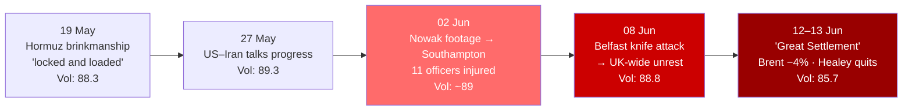

---
{"dg-publish":true,"permalink":"/finalized-work/world-reports/world-intelligence-report-june-2026/","title":"World Intelligence Report — June 2026","tags":["world-monitor","osint","geopolitics","intelligence","iran-war","great-settlement","strait-of-hormuz","gaza","palestine","lebanon","hezbollah","oil-shock","uk-politics","starmer","healey","labour","defence-investment-plan","henry-nowak","belfast","northern-ireland","riots","two-tier-policing","immigration","restore-britain","reform-uk","china-taiwan","trump-xi","russia-ukraine","cyber-warfare","iran-internet-blackout","ai-export-controls","sovereign-ai","anthropic-fable","maduro","nato-summit"],"created":"2026-06-13T23:03:47.409+01:00","updated":"2026-06-14T05:45:58.277+01:00","dg-note-properties":{"title":"World Intelligence Report — June 2026","description":"Sixth report in the World Intelligence Report series. Covers the Iran war's pivot from Hormuz brinkmanship to President Trump's 13 June announcement of a 'Great Settlement' — an agreed-but-unsigned US–Iran memorandum, mediated by Pakistan, reached while Iranian missiles were still flying and Netanyahu insisted Israel was 'not party' — and the collapse of the war premium that cut Brent crude more than 4% in a session and drove the Global Volatility Index down 3.1 points to 85.7, its largest single-step fall on record; the resignation of Defence Secretary John Healey three weeks before the NATO Ankara summit, atop a Labour local-election wipeout and 81-plus MPs demanding Starmer's resignation; the twin street mobilisations that ran the same machinery of nationalising a local crime — the Henry Nowak bodycam fallout in Southampton and the north Belfast knife attack and the UK-wide disorder it triggered; the oil and economic shock the IMF judged the UK most exposed to in the G7; and the slower multipolar drift in the Trump–Xi Beijing summit, renewed China Coast Guard standoffs off Taiwan, a stalled Russia–Ukraine track, and an escalating cyber-and-AI domain dominated by a sustained UK–Russia attribution campaign (the NCSC's GRU router-hijacking exposure, GCHQ's 'infrastructure and democracy' warning, the Cyber Security and Resilience Bill) running alongside the tail of Iran's ~88-day wartime internet blackout, and capped by the first US export-control order placed on AI models themselves — Anthropic's Fable 5 and Mythos 5 switched off for every foreign national — read against the sovereign open-weight alternative; and a dedicated humanitarian account of Gaza under the fragile post-October-2025 ceasefire — famine 'offset' but not ended, aid at roughly a third of need through effectively one crossing — the war the feeds still don't carry and the deal leaves out.","date":"2026-06-13","updated":"2026-06-13","tags":["world-monitor","osint","geopolitics","intelligence","iran-war","great-settlement","strait-of-hormuz","gaza","palestine","lebanon","hezbollah","oil-shock","uk-politics","starmer","healey","labour","defence-investment-plan","henry-nowak","belfast","northern-ireland","riots","two-tier-policing","immigration","restore-britain","reform-uk","china-taiwan","trump-xi","russia-ukraine","cyber-warfare","iran-internet-blackout","ai-export-controls","sovereign-ai","anthropic-fable","maduro","nato-summit"],"aliases":["June 2026 Intelligence Report","World Monitor Consolidation"]}}
---

# World Intelligence Report — June 2026

**Compiled by:** Eden Eldith & Claude (Anthropic)
**Coverage Period:** 14 May 2026 — 13 June 2026
**Last Updated:** @130620261942

---
>[!info] This report documents events with sources. The author has no political affiliation and advocates no unlawful action. Where individuals, institutions, or states are discussed, the intent is to document choices and structural positions — to name them where the documentary record requires it, and to source every claim that does.

## Executive Summary

The month following our [[Finalized work/World-Reports/World_Intelligence_Report_May_2026\|May 2026 Intelligence Report]] closed the way the May report opened — with the Iran war as the dominant fact of the world — but inverted its direction: the blockade that defined May became, by 13 June, a deal the President was announcing but had not yet signed, and the single largest one-step fall the volatility index has recorded came not from peace but from the *price* of peace being put on the market a day early.

1. **The "Great Settlement" That Wasn't Signed** — On 11 June, President Trump announced a "Great Settlement" to end the Iran war. [^1] US and Iranian negotiators, mediated by Pakistan, had agreed the wording of a memorandum of understanding, with a Geneva signing ceremony expected on 14 June. [^2] The reported terms — a 60-day ceasefire extension covering Lebanon, the immediate reopening of the Strait of Hormuz without tolls, the start of nuclear talks, and the release of roughly $24bn in frozen Iranian assets in two tranches [^3] — were announced while Iran was still launching ballistic missiles, [^4] and while Netanyahu's office insisted Israel was "not party" to the deal and that its terms "endanger Israel's security interests." [^5] The diplomacy, not the battlefield, moved the markets: Brent crude fell more than 4% on the news, settling near $87 by 12 June. [^6]

2. **Westminster — The Healey Resignation and a Government Governing by Deadline** — Defence Secretary John Healey resigned on 11 June with a public letter, three weeks before a NATO summit and with the Defence Investment Plan still unpublished. [^7] He walked out of a Labour government already carrying a local-election collapse and 81-plus MPs who had called on Keir Starmer to resign or set a timetable; the resignation was read across the press as a warning aimed less at Starmer than at Europe. [^8] By 13 June Starmer was promising NATO Secretary General Rutte that the plan would publish before the Ankara summit. [^9]

3. **The Streets — From Southampton to Belfast** — The machinery for turning a single violent crime into a national mobilisation ran twice in two weeks, and faster the second time. The 1 June release of police bodycam footage in the Henry Nowak case — an 18-year-old fatally stabbed in Southampton, handcuffed by officers as he said he had been stabbed and could not breathe — produced a 2 June protest at which eleven officers were injured. [^10] [^11] Eight days later a near-fatal knife attack in north Belfast [^12] triggered UK-wide disorder within a single day, [^13] which subsided into what Al Jazeera called the "biggest anti-racism rally ever seen in Belfast" on 13 June. [^14]

4. **The Oil Shock — The Price Followed the Diplomacy** — The US Energy Information Administration's 9 June outlook still carried a full war premium, forecasting Brent at roughly $105 with OECD inventories at their lowest since 2003; [^15] the World Bank had called the Hormuz closure the "largest oil-market shock in history," [^16] and the IMF had named the UK the most exposed major advanced economy, cutting its 2026 growth forecast to 0.8% — the steepest downgrade in the G7. [^17] Then the deal news of 11–12 June closed roughly $18 of that premium, taking Brent to about $87. [^6]

5. **The Wider Board — The Multipolar Drift** — Beneath the headline war the structural realignment continued: the Trump–Xi Beijing summit (13–15 May) produced no major agreements while Xi warned that mishandling Taiwan would put the relationship in "great jeopardy," [^18] and Chinese Coast Guard vessels forced two standoffs near Taiwan's Pratas islands inside a fortnight; [^19] Putin declined Zelenskyy's E3-backed call for direct talks and struck Zaporizhzhia hours later; [^20] and the cyber domain ran one sustained story all month — a UK–Russia attribution campaign (NCSC, GCHQ) hardening into the Cyber Security and Resilience Bill — alongside the tail of Iran's ~88-day wartime internet blackout. [^21]

6. **Gaza — The War Not in the Deal** — Gaza spent the window under the fragile ceasefire in force since October 2025 (UNSC Res 2803): guns largely quiet, the September 2025 UN genocide finding and the ICC warrants still on the record, and the catastrophe slowed rather than ended — famine "offset" but not over, ~1.6 million still at crisis hunger, water under a third of the emergency standard, aid entering through effectively one crossing at ~36% of allocation, and 933 killed since the truce began. [^88] [^86] [^93] The feeds carried none of it except the sanctioning of the aid-flotilla organisers; [^83] the "Great Settlement" extends a ceasefire to Lebanon and addresses Gaza nowhere (Part IV).

**Global Volatility Index: 85.7/100 (CRITICAL)** — Down **3.1 points in a single reading** from 88.8 on 9 June — the largest one-step fall in the index's recorded history — as the military sub-index dropped from 598 to 494 on the deal news. The index has now broken below the 86.0 floor that held for over 100 days, but remains firmly in CRITICAL territory; the forecasting layer reads STABLE at ~88.6, on the assumption the deal does not collapse. [^22]

### Escalation Arc — May to June 2026

---

## Part I: The Iran War — The "Great Settlement" That Wasn't Signed

The May report closed with the US blockade of Iran operational and the Strait of Hormuz under kinetic enforcement, and asked whether a war with no publicly articulated objective could end at all. June supplied an answer of a kind: not a victory, not a surrender, but a memorandum — announced from Washington before it was signed in Geneva, and announced over the sound of Iranian missiles still in the air. The structural fact of the month is that the war's *de-escalation was priced before it was real*, and that the pricing, not the war, is what the indices recorded.

### The Shape of the Deal

On 11 June, US and Iranian negotiators — with Pakistani mediation, and Qatar as a prior channel — were reported by Reuters, CBC and CNN to have agreed the wording of a memorandum of understanding to end the war. [^2] [^23] A US senior official confirmed both sides had agreed on the text; Geneva was identified as the likely venue, with Vice-President JD Vance named as the US signatory and Iran's parliament speaker Mohammad Baqer Qalibaf as Iran's. [^2] President Trump announced the same day that a "Great Settlement" had been reached and would be signed "quickly," and four US Air Force C-17s were reported staging in Europe to support the Vance trip. [^1] [^24]

The terms, as reported across multiple outlets, were favourable to Tehran — a characterisation advanced by Israeli officials and not disputed by the US side: [^3] [^5]

| Term (as reported) | Detail | Status at 13 June |
|--------------------|--------|-------------------|
| Strait of Hormuz | Reopen "immediately" without tolls; Iran retains joint control of traffic with Oman | Mechanism unsigned; EIA expects full traffic normalisation not before early 2027 |
| Ceasefire | 60-day extension, explicitly including Lebanon | Hezbollah separately rejected the Lebanon element |
| Frozen assets | ~$24bn released in two ~$12bn tranches | Iran asserts; US had earlier *denied* this element — unreconciled |
| Nuclear | Talks to begin within the 60-day window | Not commenced |
| Signing | US: VP Vance; Iran: Speaker Qalibaf; venue Geneva | **Unsigned** as of the 13 June cut-off |

Two fault lines ran through the announcement and are reported here as contested rather than resolved. The first is Israel. Netanyahu's office described the emerging MOU as a framework for "entry into negotiations," stated that its terms "endanger Israel's security interests," and on 11 June declared flatly that "Israel is not party to the emerging Iran deal"; [^5] Trump had said on 7 June that Netanyahu "won't have any choice" and that "I call the shots." [^28] The second is Lebanon: the MOU extends the ceasefire to Lebanon, but Hezbollah had already rejected the 4 June Israel–Lebanon ceasefire agreed by the two governments, its leadership stating "we have given no commitment to anyone," [^27] even as the Israel–Lebanon front saw some of its heaviest bombing of the period. [^85] A deal whose scope one of its named beneficiaries rejects, and which a key regional belligerent says it is not bound by, is the documentary position at the close of the window.

### The Battlefield the Deal Did Not Stop

The announcement did not coincide with a quiet front. Iran launched ballistic-missile attacks on Israel during the same days the wording was being agreed; [^4] US forces struck Iranian sites on 6 June after Iran launched drones in a Gulf flare-up, [^25] and on 9 June — "day 102" of the war — Trump was still publicly warning Israel against new strikes "as the ceasefire holds." [^26] On 11 June, India issued a formal protest after US fire killed three Indian seafarers in the Gulf, a reminder that the enforcement layer was still producing third-country casualties even as the diplomatic layer converged. [^29] CENTCOM's own mid-May assessment had been that Iran's military threat was "diminished but not eliminated" [^32] — a phrase that describes the whole month: an adversary degraded enough to deal, undegraded enough to keep firing.

### What Moved: The Price, Not the Front

The clearest evidence that June's turn was financial before it was military is in the oil price and the volatility index moving *together*, ahead of any signature. Brent had already shed 20% from its 2026 peak through late May on cumulative ceasefire optimism, and fell more than 4% on the 11 June deal news, settling at $87.33 on 12 June — its lowest since early March. [^6] The US administration said it was helping move some 7 million barrels per day out of the Persian Gulf, [^30] and a tanker-shipping CEO said Hormuz traffic would "quickly increase" if a credible deal held. [^31] Against that, the partial closure that began under Iranian mining in March was still in force, Iran had spent the spring tightening its grip on the strait, [^33] and a market signal (Polymarket) put the probability that Hormuz traffic would *not* normalise by 30 June at 77.5%. [^23]

| Metric | May 13 Report | June 13 Report |
|--------|---------------|----------------|
| US posture | Blockade operational; tankers disabled | "Great Settlement" announced — **unsigned** |
| Strait of Hormuz | Partly closed; brinkmanship | Reopening "immediately" per MOU; traffic not yet normalised |
| Brent crude | Above $110 (April peak context) | ~$87.33 by 12 Jun (−4% on 11 Jun news) |
| Direct fire | Ongoing US–Iran exchanges | Iran missiles + US strikes/drone shootdowns continuing at announcement |
| Israel | Aligned belligerent | "Not party"; cabinet warns terms endanger security |

The reading for the rest of this report is that the deal is the hinge on which both the military and the economic layers now turn, and that it is, as written, unfinished. If it signs and holds, the war premium that has organised the world economy since February unwinds; if it collapses in the 60-day window, the same indices that fell 3.1 points in a day have an equal distance to climb back.

---

## Part II: Westminster — The Healey Resignation and the Slow Collapse

The May report documented Keir Starmer entering mid-May with 81 of his own MPs publicly demanding his resignation and a Guardian editorial verdict that even survival would constitute decline. June did not resolve that crisis; it moved it from the leader to the institution he runs, and from a question of political survival to a question of whether the state can fund its own defence commitments on the timetable its alliance requires.

### The Resignation

On 11 June, Defence Secretary John Healey resigned. [^7] The departure was read across the press not as an ordinary reshuffle casualty but as a deliberate act aimed at the government's defence posture: it landed three weeks before a NATO summit, with the Defence Investment Plan still unpublished, and the Guardian's commentary framed it as a "shock resignation" functioning as a "warning" directed at Europe as much as at Downing Street. [^8] A parallel column cast the surrounding manoeuvres in blunter terms — the "political vultures" already circling a Prime Minister whose authority the resignation further thinned. [^35]

The resignation did not arrive into calm. The Labour government was already carrying the May local-election collapse — councils and councillors lost to both Reform UK and the Greens — and a standing rebellion on its own benches that had reached 81 MPs by mid-May and continued to widen; by 13 June, Andy Burnham, contesting the Makerfield by-election, was openly criticising Starmer's leadership, [^37] and the composition of Starmer's cabinet had itself become the story. [^38]

### The Money: "Salami-Slicing" a Defence Budget Into a War

Underneath the personality contest sat an arithmetic one. Cross-party MPs had warned on 9 June that delays to the defence plan were undermining UK credibility; [^36] within days, Rachel Reeves was reported to be imposing departmental "salami-slicing" on the defence budget — incremental cuts dressed as efficiencies — at precisely the moment the Iran war and the Russian threat picture demanded the opposite. [^34]

>[!quote]
> The defining image of the UK's June was a Chancellor "salami-slicing" the defence budget while the Defence Secretary resigned over it, three weeks before the alliance met to ask for more. [^34] [^7]

The structural problem is that the UK is trying to fund a 3%-of-GDP defence aspiration out of an economy the IMF had just named the most exposed in the G7 to the energy shock the same war produced (Part V). The defence line and the energy line are the same crisis viewed from two ministries.

### Governing by Deadline

By 13 June, Starmer had converted the crisis into a deadline: he told NATO Secretary General Mark Rutte that the UK would publish its Defence Investment Plan before the 7–8 July summit, and reiterated the 3%-of-GDP goal for the "next parliament." [^9] [^40] The summit itself had been confirmed for Ankara — not, as some UK framing had implied, a UK-hosted event — which removes a stage Downing Street might otherwise have used. [^41] A government that began the month losing its Defence Secretary ended it promising the plan he resigned over, to a deadline set by an alliance meeting in another country. The forward question for Part VIII is simply whether Starmer is still Prime Minister when that plan is due. [^39]

---

## Part III: The Streets — From Southampton to Belfast

Two events in this window — the Henry Nowak fallout in Southampton and the north Belfast knife attack — are documented in full, source-by-source, in companion analyses compiled separately during the coverage period. This Part does not reproduce them; it extracts the structural finding they share. Both are live cases at the time of writing, and the method used in each is the one this series applies to contested events: separate the **observable fact** from the **characterisation placed on it**, and attribute every characterisation — minister, police service, broadcaster or street activist — to whoever advanced it. The single most important thing the two cases demonstrate together is a *mechanism*: the now-practised conversion of a local crime into a national mobilisation, and the fact that in June it ran twice in twelve days, and ran faster the second time.

### The Nowak Fallout: A Bodycam, a Protest, a Petition

Henry Nowak, an 18-year-old University of Southampton student, was fatally stabbed in December 2025; his killer, Vickrum Digwa, was convicted on 28 May 2026 and sentenced on 1 June to life with a minimum of 21 years, the judge finding Digwa's claim of having been racially abused to be a fabrication. [^11] The case became a national flashpoint not at the killing but at the release of police body-worn footage around the sentencing, which showed officers — told by the attacker's side that they had been "racially attacked" — handcuffing the wounded Nowak as he said he had been stabbed, met with the reply "Don't think you have, mate." [^42] The Independent Office for Police Conduct confirmed it was investigating the officers' use of handcuffs and the first aid provided; [^43] Hampshire's force apologised for the handcuffing and arrest even as its Chief Constable rejected the "two-tier policing" characterisation, and one of the officers resigned. [^44]

The response had three strands the companion analysis keeps distinct. The first is a widely shared judgement — including from the IOPC and the police themselves — that the initial response was a serious failure. [^43] The second is the conclusion a broad section of the public drew from it, and which the record sustains: that British policing operates on two tiers. This is not Nigel Farage's proprietary line — he pressed it hardest, urging "pure cold rage" [^45] — nor is it an opinion to be weighed against the Prime Minister's denial as an equal and opposite fact. Starmer's "I don't believe there's two-tier policing in this country" [^46] [^47] is an assertion about *intent*, and at the level of method it is answered by Stafford Beer's cybernetic axiom that **the purpose of a system is what it does** — POSIWID. [^108] A system is defined not by the motives its operators avow but by the outputs it reliably produces, and the outputs are documented: a dying Henry Nowak handcuffed and arrested on his attacker's false allegation of racial abuse, told "don't think you have, mate" as he repeated that he had been stabbed; [^42] the national threat level raised to SEVERE within forty-eight hours of the Golders Green attack and left untouched after the Southport murders; £58m directed to Jewish-community security in the year against £5m for the Christian places-of-worship scheme over the same period (both documented in our [[Finalized work/World-Reports/World_Intelligence_Report_May_2026\|May 2026 report]]). One such outcome is an error; the patterned recurrence of differential protection and differential suspicion across victim, threat-assessment and budget is a function. The operative question is therefore not whether the state *intends* two tiers — it denies intent, and intent is the wrong variable — but whether the apparatus, measured by what it repeatedly does, sorts its subjects by group. On the evidence it does; and a denial issued by the institution under investigation documents the system's account of itself, not its conduct. The third is disorder: the 2 June Southampton protest, numbering more than a thousand, that ended with eleven officers and a police dog injured, [^10] and at which separately documented footage recorded officers' force against demonstrators that a retired senior US police officer publicly assessed as "excessive." The Attorney General confirmed the sentence was under review under the unduly-lenient-sentence scheme. [^48]

If POSIWID establishes *that* the system sorts, Conant and Ashby's good regulator theorem establishes why the sort is structural rather than incidental: every effective regulator of a system must contain a model of the system it regulates — "every good regulator of a system must be a model of that system" — and its actions are a homomorphic image of that model. [^107] A state cannot regulate sixty-eight million individuals; it regulates a *model* of them, necessarily lossy, in which persons are compressed into categories. Its differential outputs are that model made visible — they expose which categories the working model contains and the disposition, protection or suspicion, it attaches to each. The lossiness is where Henry Nowak was lost: the officers who handcuffed a stabbed boy and told him "don't think you have, mate" were not failing to see him, they were seeing him as the model rendered him — on the available inputs (a reported racial attack, a white male, a non-white complainant) the model had already assigned the category, and a regulator acts on the category, not the bleeding person in front of it. The state's denial of a two-tier model is therefore refuted twice: by what the system does, and by what it must be in order to do it. A regulator that yields sorted outputs is running a sorted model.

The same logic governs the case's international dimension. US Vice-President JD Vance commented on it directly; the UK government characterised this as an attempt to "interfere in our democracy." [^49] [^50] The objection is a sovereignty claim, and it too is switched by subject. In 2020 the same political class embraced a foreign protest movement wholesale — Black Lives Matter, American in origin and idiom — and performed its central rite, taking the knee for George Floyd, David Lammy among them. [^105] When demonstrators asked the police to take the knee for Henry Nowak the gesture was refused, and Lammy — who had knelt for Floyd — furnished the explicit rule: "the moment to take the knee has passed." [^104] [^106] The two positions are not in tension; they are the same operation. Symbolic solidarity and the sovereignty objection are each enabled or disabled according to the identity of the subject — solidarity extended to an American death that suited the prevailing narrative and withheld from an English one that did not; foreign comment welcomed when it reinforced that narrative and reclassified as interference the moment it cut against it. On the POSIWID reading the apparent inconsistency is itself consistent: the apparatus performs in the register of symbol the same sorting function it performs in the register of policing.

### Belfast: The Same Machinery, Faster

Late on 8 June, Stephen Ogilvie — a 44-year-old disabled man — was gravely wounded in a knife attack in the Kinnaird Avenue area of north Belfast; the injuries set out in court included the loss of his left eye. [^12] The man charged, Hadi Alodid, a 30-year-old whom police believe to be a Sudanese national who entered Belfast in February 2023 and was granted leave to remain, was remanded in custody, bail refused after a detective said release risked "significant public disorder." [^51] The PSNI Chief Constable, Jon Boutcher, set out the suspect's travel and asylum account, said there was no indication of a terrorist motive, and appealed to the public not to be "duped … by people online inciting awful behaviour." [^52]

Within a single day the crime had been converted into a UK-wide mobilisation. The documented events of 9 June are real and not to be minimised: a Glider bus burned, houses and migrant-associated businesses attacked, masked groups going door to door, three PSNI officers injured, and disorder spreading to Portadown, Newtownabbey, Derry and Ballyclare, with clashes reported in Glasgow, Edinburgh, London and Southampton. [^53] What is contestable is the frame the state placed on it. First Minister Michelle O'Neill's "outright thuggery," Starmer's "totally unjustified," [^53] and Chief Constable Boutcher's appeal not to be "duped … by people online inciting awful behaviour" [^52] perform one operation between them: they locate the cause in the response and its online amplifiers, and route it away from the two conditions that produced it — a near-fatal attack those communities read as the latest proof of a danger they say they were told for years to stop noticing, and a state they no longer credit with regulating its own borders. On the good-regulator reading this is what failure looks like from the inside: when a population's model of the state shifts from "protects us" to "neither protects us nor counts us among those it protects," consent to be policed degrades and the population begins to regulate in the state's absence — here, documentedly, into both peaceful protest and violence against the nearest visible proxies of the failure. "Thuggery" is not a false description of the arson; it is an incomplete account of the event, and the incompleteness does work — it lets the regulator book a symptom of its own lost control as spontaneous criminality. Amplification was real and is documented to the minute — TheJournal.ie traced the X-post timeline (attack ~10:30pm; Tommy Robinson 11:39pm; Rupert Lowe 6:18am; the Prime Minister not until 10:07am) alongside genuine misinformation (that the victim was a child, or had died) and an AI-generated "road closures" list [^13] — but amplification is a multiplier, not a cause, and a government tenth in line to respond to its own emergency is poorly placed to locate the failure solely in those who were first. The suspect's precise immigration status itself became contested: the DUP's Gavin Robinson stated he held a "five-year visa"; the NI Secretary, Hilary Benn, told the Commons "I cannot confirm it to the House." [^54]

By 12 June the disorder was subsiding — 19 arrests, four men remanded, violence "subdued compared to Tuesday night" [^57] — and on 13 June thousands attended counter-demonstrations at Belfast City Hall, described by Al Jazeera as the "biggest anti-racism rally ever seen in Belfast." [^14] No death resulted from the unrest.

### What Ran Twice

The two cases are distinct in fact and should not be merged: Nowak is a concluded homicide with a convicted killer and a documented police-conduct controversy; Belfast is a charged-but-untried attempted murder with no finding of police misconduct. What is common is the *machinery* — graphic footage, the same amplifying accounts moving within hours, a ready interpretive frame, and a call to the streets — and its accelerating speed: where the Nowak case took months from killing to flashpoint, Belfast was UK-wide within a day. The relevant precedent for both is the June 2025 Ballymena disorder, which gives the protesters a template and everyone a caution — though the caution is routinely reported in a way that inverts it. The 7 June 2025 allegation concerned three males; two Romanian teenagers (aged 14 and 15) were charged, while a **third suspect fled to Romania via Dublin the day after the alleged attack**, with police left seeking his extradition. [^82] The charges against the two were dropped on 28 November after what the Public Prosecution Service called "significant evidential developments" — in the courts' own framing, the case "no longer met the threshold for prosecution." [^55] [^56] That outcome is near-universally compressed into "the case collapsed," and the compression is itself a distortion: a failure to *prove* an allegation — here following an absconding suspect and the evidential difficulty his flight helped create — is not a finding that the allegation was *false*. "Not proven" and "disproven" are different things, and a precedent invoked to caution against believing such allegations should not quietly launder the first into the second. Uninvolved families bore the cost of the disorder either way. The structural reading this series will carry forward is that the UK now has a reusable mechanism for nationalising a local crime, that it is being operated faster on each occasion, and that the contest over *which facts are allowed to count* — "beheading" against "stabbing," "race-based pogrom" against "the thing we warned you about" — is now itself a permanent feature of the events, not an aftershock of them.

---

## Part IV: Gaza — The War the Feeds Don't Carry

The May report kept Gaza in view on principle, because the World Monitor feeds do not carry it: across roughly 5,000 articles scanned this window it again surfaced only as keyword tagging on broader Middle East stories. The principle holds, but the picture has to be drawn accurately — and the single most important correction is one a reader working from 2025's headlines would get wrong. Gaza in mid-2026 is **not** the active-war catastrophe of 2024–25. A US-brokered ceasefire has been in force since **10 October 2025**, endorsed by **UN Security Council Resolution 2803**, and the UN's own description of it by the 21 May Council briefing was "increasingly fragile" and "far from perfect," with daily violations. [^93] [^94] The September 2025 UN Commission of Inquiry genocide finding, the **ICC arrest warrants outstanding against Netanyahu and former defence minister Gallant**, and the ICJ case brought by South Africa all remain on the legal record. [^101] What changed is the tempo of the killing, not the verdict on it — and not the depth of the deprivation underneath.

This series' standing commitment is to report Gaza around one question — *what would a person inside Gaza need to know?* — so the rest of this Part is built that way: practical first, sourced throughout, softening nothing and overstating nothing.

### Food: famine "offset," not ended
The famine confirmed in Gaza Governorate in August 2025 — the first ever confirmed in the Middle East — was reassessed by the IPC in December 2025 as "offset" by the ceasefire's improved access, but explicitly not eliminated: roughly **1.6 million people (about 77% of the population) remain in IPC Phase 3+ (Crisis or worse)**, and the IPC's worst case, on renewed hostilities or closed crossings, is the whole Strip back at risk of famine. [^88] Save the Children projected four in five Gaza children facing catastrophic hunger across 2026. [^89] What is actually arriving: UN partners reached about **820,000 people with food parcels in May** (two parcels per family, ~75% of minimum calories), but cooked-meal capacity is falling fast — from roughly 1.5 million meals a day through 111 kitchens in mid-March to about **678,000 meals through 80 kitchens by 28 May**, as funding and cooking fuel run short. [^86] [^87] A kitchen open last week may not be open this week.

### Water: the sharpest daily danger
Water availability has fallen to **under 5–6 litres per person per day against the 15-litre WASH emergency standard**; OCHA reported May production down about 20% on two months earlier, and desalination output falling to ~16,000 m³/day (from ~20,000 in March) for want of engine oil and spare parts as much as fuel. [^86] [^97] Cumulatively since October 2023 the UN estimates around 40,000 hepatitis A cases and acute diarrhoea affecting roughly half a million people, with untreated water the vector. [^97] The one clear good-news item: the **polio vaccination campaign succeeded, protecting around 94% of under-tens** after a second dose reached over 500,000 children. [^96]

### Aid: is anything getting in?
Some, at a fraction of need, through a narrowing pipe. After the **Zikim crossing closed on 24 May**, convoys were forced onto effectively a **single cargo crossing — Kerem Shalom**, with Rafah functioning mainly for medical evacuation. [^86] Against a long-standing benchmark of ~500 trucks a day, cumulative flow since the October ceasefire ran at about **36% of allocated loads**, and through late May only about half the trucks arriving from Egypt could even offload at the congested Kerem Shalom checkpoint. [^86] [^95] Distribution is now run by the **UN system — UNRWA and WFP — not the Gaza Humanitarian Foundation**: the GHF, whose militarised sites were the location of more than 2,600 documented killings of aid-seekers between May and October 2025, wound down in November 2025 and is not operating in 2026; UN experts had called for its dismantling and MSF had called its sites "orchestrated killing." [^99] [^100] The 2026 humanitarian Flash Appeal stood at about **13% funded** at the 21 May Council briefing — the proximate reason kitchens and services are scaling back — and at least **593 aid workers have been killed in Gaza since October 2023**, eight of them since the ceasefire. [^94] [^103]

### Health and the toll
Just over half of Gaza's hospitals function and none at full capacity; the WHO documented 22 attacks on health facilities in 2026 alone, generators are failing mid-operation for lack of fuel and engine oil (priced near £570 a litre), and **more than 43,000 people carry life-changing injuries, a quarter of them children**. [^87] [^98] The cumulative toll recorded by the Gaza Health Ministry by early June was **72,942 killed and 172,967 wounded**, with **933 killed since the ceasefire** — a count kept climbing by events like the late-May strike that killed a Hamas military-wing commander, the kind of "violation" a nominal truce absorbs. [^92] [^84] That Ministry figure is contested, but the documented direction of the dispute is the opposite of the usual claim: a population-representative survey in *The Lancet Global Health* found the official count an **undercount by roughly 35%**, not an inflation, with women, children and the elderly 56.2% of the dead. [^90] [^91] Around **80% of Gaza's buildings are damaged or destroyed and over a million people lack permanent shelter**, while OCHA warns the designated "humanitarian" and evacuation zones have themselves absorbed the clinics, wells and the Southern Gaza Desalination Plant people are told to relocate toward. [^93]

### How the world is reacting
The institutional response is real on paper and thin on the ground. Resolution 2803 stood up a transitional "Board of Peace" and a stabilisation force, but the 21 May briefing warned implementation had stalled into a "permanent state of limbo"; [^93] [^94] the ICC warrants remain outstanding and unexecuted; about **147 of 193 states now recognise Palestine** after the September 2025 wave; [^102] and roughly $17bn in reconstruction pledges sits mostly undisbursed with **about 0.5% of the rubble cleared**. [^95] The one item that reached our own feeds was punitive rather than humanitarian: the United States **sanctioned four organisers of the Gaza aid flotilla on 21 May**, after Israel intercepted the latest convoy and detained some 430 activists. [^83] That is the storyline the feeds carried — the people trying to sail aid in, sanctioned — while the ledger above went unrecorded by them entirely.

### The bottom line
More is reaching Gaza than a year ago; far less than it needs; none of it guaranteed week to week. The famine is offset, not over; the water is the daily emergency; the aid comes through one crossing at a third of allocation; half the hospitals work, none fully. The "Great Settlement" of Part I extends a ceasefire to Lebanon and says nothing about Gaza at all — and there is no volatility index that registers any of this. A market can price the end of the Iran war in a single session; the slow attrition of a ceasefire that holds just well enough to leave the cameras elsewhere moves no index, and that silence is its own finding.

---

## Part V: The Oil Shock — When the Price Followed the Diplomacy

If Part I is the war and Part II is the politics, Part V is the ledger that connects them, and it carries the month's single most analytically important pattern: the oil price and the volatility index moved together, ahead of any signature, because both are now instruments that price the *probability* of the deal rather than the state of the war.

### The War Premium, Measured

Two official assessments bracket the window. On the war-premium side, the EIA's 9 June Short-Term Energy Outlook still forecast Brent averaging roughly $105/bbl for June–July on a Hormuz-closed assumption, projected OECD inventories falling to their lowest since 2003 (around 50 days of cover), and did not expect full Hormuz traffic normalisation before early 2027. [^15] [^59] Behind it sat the World Bank's April Commodity Markets Outlook, which characterised the Hormuz closure as the "largest oil-market shock in history" — an attributed World Bank characterisation, not a neutral baseline — with Brent's end-March rise its largest-ever monthly move. [^16]

On the de-escalation side, the market had already begun unwinding the premium before the deal: oil had dropped 20% from its 2026 peak by 29 May on cumulative ceasefire optimism, [^58] and then fell more than 4% on the 11 June MOU news, settling at $87.33 by 12 June — a roughly $18 gap to the EIA's $105 forecast closed in days by the diplomatic track rather than by any change in the physical supply picture. [^6] The price was no longer tracking the strait; it was tracking the negotiating table.

### The UK as the Most Exposed Economy

The shock did not fall evenly. The IMF's April 2026 World Economic Outlook cut UK growth to 0.8% for the year — the steepest downgrade in the G7 — and named the UK the most exposed major advanced economy to the energy shock, with inflation projected around 3.2% and potentially approaching 4%, and unemployment rising toward 5.6%. [^17] [^60] The Bank of England's April Monetary Policy Report acknowledged the energy-price uncertainty as "highly uncertain" and conceded that monetary policy "cannot influence energy prices." [^61] Domestically the squeeze was already biting before any of June's relief: the Guardian had warned in late May that the government's "mini measures" would not suffice for the coming energy shock, [^62] and the EU's own warning that energy prices would stay elevated through 2027 set the regional floor. [^63] This is the same arithmetic that surfaced in Part II as a "salami-sliced" defence budget: a state trying to rearm out of the most energy-exposed economy in the G7.

### The Volatility Ledger

The index recorded the turn precisely. The Global Volatility Index held in a narrow high-80s band for most of the window, then fell 3.1 points in a single reading as the deal news broke — its largest one-step move on record — driven almost entirely by the military sub-index dropping 104 points (598 → 494):

| Date | Volatility | Military | Trend |
|------|------------|----------|-------|
| 13 May | 88.4 | 565 | May report close |
| 19 May | 88.3 | 587 | ↓ marginal |
| 23 May | 89.3 | 621 | ↑ +1.0 |
| 27 May | 89.3 | 597 | → flat |
| 09 Jun | 88.8 | 598 | ↓ −0.5 |
| **13 Jun** | **85.7** | **494** | **↓↓ −3.1 (deal priced)** |

The reading breaks the 86.0 floor that had held for over 100 days, but the forecasting layer does not treat it as a regime change: it projects a STABLE return toward ~88.6, on the assumption the MOU signs and holds. [^22] The index, in other words, is making the same bet the oil market made — that the deal is real — and is exposed to the same reversal if it is not.

---

## Part VI: The Wider Board — China, Taiwan, and the Stalled Eastern Front

The Iran war absorbed the month's attention, but the structural realignment it accelerates kept moving on two other fronts. Both are slow stories that this series tracks precisely because they do not spike: the management of the US–China relationship, and the freezing of the Russia–Ukraine war into a stalemate the Iran crisis has made it easier for Moscow to sustain.

### China and Taiwan: A Summit That Settled Little

The Trump–Xi summit in Beijing (13–15 May) was the window's set-piece, and it produced no major agreements. [^18] [^64] The two sides committed to a "constructive China–US relationship of strategic stability" and announced a further summit for the autumn, while trade envoys reported "balanced and positive" preparatory outcomes — but on the one issue that carries escalation risk, Xi warned Trump that mishandling Taiwan would put the relationship in "great jeopardy," and China's foreign minister Wang Yi stated that Washington "does not support Taiwan moving toward independence," a formulation Taipei noted with concern. [^18] The summit's deliverable was atmosphere, not architecture.

The pressure continued at sea. Taiwan's Coast Guard Administration warned on 1 June of increasing Chinese incursions, [^66] and on 5 June a Chinese Coast Guard vessel "forced its way" into restricted waters near the Pratas (Dongsha) islands — the second such standoff in a fortnight, after a 20-hour confrontation on 23 May — part of a documented pattern of 39 CCG incursions around Pratas since February 2025. [^19] [^65] In parallel, the US economic-statecraft track against China continued, with World Monitor feeds logging the designation of major Chinese firms as military companies and analysis of how China's "subsidy machine" is reshaping global capitalism; [^72] [^73] no June PLA exercise was confirmed within the window.

### Russia–Ukraine: Stalled, and Quietly Strengthened

The eastern front did not move, and the absence of movement is itself the story. On 5 June Zelenskyy published an open letter to Putin proposing a face-to-face meeting and a full ceasefire; [^67] on 7 June his E3 backers — Macron, Merz and Starmer — met him in London and commended the proposal; [^20] Putin declined — "there is nothing to talk about" after Ukraine's attacks — and Russia struck Zaporizhzhia within hours of the London meeting, killing five and injuring fourteen on 8 June. [^68] [^20] Zelenskyy's own framing, in a 9 June interview, was that Russia is "isolated … alone"; [^71] the structural reality the same week was less favourable to Kyiv — the Iran war had diverted US and European attention and propped up the Russian oil revenue that funds the war, even as June's price collapse began to erode it.

>[!warning]
> The quietest line in the month's reporting is the most consequential for 2027: Russia is building new infrastructure for **major troop deployments along NATO's northern flank**, [^69] while NATO itself was shooting down drones in Latvian airspace on 8 June [^70] — the architecture of a force posture being prepared, not a crisis being managed. This is the line to watch once the Iran war stops absorbing the alliance's attention.

---

## Part VII: The Cyber and AI Domain — An Attribution That Hardens, a Wartime Blackout, and a Frontier Model Switched Off

The cyber sub-index fell with everything else on 13 June (187 → 115), but the underlying activity did not. The month's cyber record, as the feeds carried it across the whole window, is overwhelmingly one story: a sustained UK–Russia attribution campaign — the same items recurring at the top of every report — now hardening into legislation, running alongside the tail of Iran's wartime internet blackout. And in the window's final forty-eight hours the same logic — *name a threat, claim the remit* — surfaced in a domain the index does not yet track at all: the US government reached past the chips and switched off a frontier AI model.

The thread that actually ran through the feeds — top-ranked in every one of the six in-window reports — was the state-attribution campaign, not any criminal mega-breach. The NCSC's exposure of Russian military-intelligence (GRU) hijacking of vulnerable routers stayed the highest-scoring cyber item across the window, [^77] beside a standing NCSC warning over hacktivist groups disrupting UK organisations and online services. [^21] The framing sharpened late in the window: on 27 May GCHQ director Anne Keast-Butler cast Russia as targeting UK "infrastructure and democracy," [^78] and NATO warned the same week that Russia's hybrid war had turned on Europe's energy grid. [^74] The large insurer- and manufacturer-breach stories that circulated in open reporting over these same dates are deliberately excluded here: they trace to 2025 incidents or fall outside the window, and the World Monitor feeds did not carry them — exactly the kind of recycled item this series is built to filter out.

The window's other state-scale event was Iran's internet blackout, and it requires a correction to the prior anchor: rather than the 60-odd hours initially understood, the blackout ran for approximately **88 days** — connectivity at 1–4% of normal, recovering to around 40% by 28 May — the longest nationwide shutdown on record, with Iran's own Chamber of Commerce estimating $30–40 million in daily losses. The characterisation of it as "the largest cyberattack in history" originates with Israeli sources (the Jerusalem Post) and is reported here as an **attributed claim**, not a neutral finding; the event itself compounded government-imposed restriction with external attack and cannot be cleanly assigned to either. [^75] [^76]

The legislative answer moved in step with the rhetoric: the Cyber Security and Resilience (NIS) Bill reached its Report stage on 10 June, with Royal Assent expected in 2026. [^79] Attribution is becoming statute — and the same pipeline that names a hostile state enlarges the powers of the naming one: the regulator that identifies the threat is, in the same motion, the regulator that acquires the remit to meet it.

| Indicator | Reading | Trend |
|-----------|---------|-------|
| GRU router-hijacking (NCSC) | Top-ranked cyber item in all six in-window reports | Persistent |
| NCSC hacktivist-disruption warning | Standing alert recurring across the window | Persistent |
| GCHQ / NATO attribution | Keast-Butler: Russia targets UK "infrastructure and democracy" (27 May); NATO warns Russia's hybrid war has turned on Europe's energy grid | Hardening |
| UK Cyber Security & Resilience Bill | Report stage 10 Jun; Royal Assent expected 2026 | Advancing |
| Iran internet blackout | ~88 days at 1–4% of normal; ~40% recovery by 28 May (attributed) | De-escalating |

### The export-control turn: a frontier model switched off by letter

In the window's final forty-eight hours the US government did something it had never done before: it placed not a chip but a *model* under export control. Commerce Secretary Howard Lutnick wrote to Anthropic CEO Dario Amodei directing that the company's two most capable systems — Fable 5 and Mythos 5 — be made inaccessible to every foreign national, outside the United States and inside it, including Anthropic's own foreign-national staff. [^109] [^110] The stated trigger was security: a rival firm claimed to have jailbroken Mythos, and the administration concluded a bypass method for Fable 5 was circulating. [^110] [^111] Compliance was immediate and total — Anthropic disabled both models for all customers worldwide to comply; the less capable Claude line, including the Opus 4.8 model on which this very report was compiled, was left running. [^109] [^111] Washington has spent years using export controls to keep advanced *silicon* from adversaries; this is the first time it has reached past the hardware to switch off the software itself. [^111]

Read through the month's analytical thread, the order is the cyber pattern at national scale. Part VII's attribution campaign showed a state converting *this threat is foreign* into *therefore we acquire the remit*; the Fable directive is the same homomorphism with the remit taken to its limit — a frontier capability reclassified overnight as a controlled munition, and the control keyed explicitly to *nationality*. POSIWID supplies the read: the avowed purpose is to deny a jailbroken model to adversaries; the realised output is that access to the most capable American AI is now a sovereign tap, and the lesson for everyone downstream of it — allied governments and their citizens included — is that reliance on a US frontier model is reliance on a switch another state's commerce department can throw by letter. A regulator that can disable a capability for the overwhelming majority of the planet overnight has disclosed, in the act, what model of the technology it holds: not a product, an instrument of state.

>[!note] Disclosure — and the counter-example
> This belongs in the open, because the analyst directing this report has a direct stake in the claim that follows. The structural answer to a capability a government can switch off is capability that no one has to ask permission to run — open weights, open method, sovereign hardware. The author of this series has built precisely that: **WiggleGPT**, a 124-million-parameter transformer — GPT-2 Small's exact size — trained in a converted garage in Gosport "on British soil, on British electricity, much of it from my own solar panels," with no funding and no institution behind it; [^112] [^113] and its successor **COLM**, which produces coherent language from under half a million parameters. [^114] The weights are public, the code is open (GPLv3), and both carry Zenodo DOIs so the result can be reproduced rather than taken on trust. [^113] [^114] The significance is not that 124 million parameters rivals a frontier model's output — it does not, and that is the wrong comparison. GPT-2 Small was never important for its raw capability either: it mattered as the **proof-of-principle** that next-token prediction at a modest, studyable scale opens onto an entire scaling regime — the telescope that revealed the continent, not the continent itself. To reproduce that class of result *independently* — on an oscillating activation function that appears nowhere else in the literature, and then to push it the other way with COLM's coherent generation from under half a million parameters via a complex-valued architecture — on sovereign soil, with open weights, is that same proof carried to its political conclusion: the regime is reproducible outside the corporate-state nexus, and what separates 124 million parameters from the frontier is compute and capital — a resourcing question — not permission, and not a switch another country's commerce department can throw. June set the two down side by side — the risk (a frontier model nationalised by decree) and the standing proof that the alternative is buildable (sovereign, open-weight, original-architecture capability) — inside the same forty-eight hours.

| Indicator | Reading | Trend |
|-----------|---------|-------|
| US export-control order on Fable 5 / Mythos 5 | All foreign nationals barred; both models disabled worldwide; Claude/Opus 4.8 unaffected; 12–13 Jun | New — precedent |
| Sovereign open-weight counter-example | WiggleGPT (124M, GPT-2 Small size) + COLM (sub-500k); open weights, GPLv3, Zenodo DOIs | Proof-of-principle |

---

## Part VIII: Watch List

The whole report now hinges on a single unresolved event — whether the MOU announced on 13 June is actually signed — and a cluster of dated triggers in the weeks after the window.

### Active Monitoring

| Signal | If Observed | Probability Shift |
|--------|-------------|-------------------|
| Iran MOU signed in Geneva (expected 14 Jun) | Hormuz reopening begins; war premium unwinds | De-escalation confirmed → index toward forecast ~88; Brent holds ~$87 [^2] |
| MOU collapses inside the 60-day window | Missile exchanges resume; Hormuz re-closes | Re-escalation → index retraces the −3.1 toward 89+; oil spikes [^5] |
| Hormuz traffic fails to normalise by 30 Jun | Deal "signed" but unimplemented | Market already prices this at ~77.5% likely [^23] |
| Formal leadership challenge to Starmer | Defence Investment Plan delivery and NATO posture thrown into doubt before 7 Jul summit | UK governance-risk premium ↑ [^9] |
| A third "local crime → national mobilisation" event | The Nowak/Belfast mechanism reused again | UK domestic-unrest baseline ↑ |

### Signals to Watch

- **14 Jun — Geneva.** Does the "Great Settlement" become a signed instrument, and do its contested elements (the $24bn frozen-asset tranches, the Lebanon/Hezbollah linkage, Israel's non-participation) survive contact with a signature? [^3] [^27]
- **30 Jun — New York.** Nicolás Maduro and Cilia Flores are due before Judge Hellerstein in the SDNY; the defence is expected to seek dismissal and raise state-immunity arguments, while acting president Delcy Rodríguez consolidates abroad (Erdoğan, 8 Jun; Modi, 4 Jun). [^80] [^81]
- **7–8 Jul — Ankara.** The NATO summit meets into a UK Defence Secretary vacancy and an unpublished-until-the-last-minute Defence Investment Plan. [^40] [^41]
- **The northern flank.** Russia's troop-deployment infrastructure on NATO's northern flank is the slow signal that outlasts the Iran war; watch it the moment the alliance's attention is freed.
- **The export-control precedent.** Does the Fable/Mythos order stay a one-off, or become a template — extended to other US labs, narrowed or widened on appeal, answered by a foreign state restricting its own models in kind, or used to condition allied-government access? The first switching-off of a model by decree is the signal; what it normalises is the thing to watch. [^109]
- **The deal's reversibility.** Both the military and economic layers have now priced de-escalation. The asymmetry to watch is that a collapse re-prices faster than a confirmation: the index fell 3.1 in a day on the *announcement*; a failed signing has the same distance to climb back.

---

## Methodology

This report synthesizes four source layers:

1. **World Monitor Reports** — Five comprehensive intelligence reports across 14 May – 13 June 2026 (19, 23, 27 May; 9, 13 June), spanning roughly 5,000 articles scanned and ~2,500 classified high-priority, with the volatility index and a quantile forecast layer attached. [^73]
2. **Confirm-and-update web research** — A targeted pass against the fast-moving threads (the Iran deal terms, the oil/economic figures, China–Taiwan, the eastern front, the cyber breaches, and the post-window dated triggers), prioritising primary and official sources: EIA, World Bank, IMF, the Bank of England, NetBlocks, the NCSC, UK Parliament, court filings, and named wire and broadcast desks.
3. **Companion case analyses** — Two separately compiled, fully sourced deep-dives written during the window (the Henry Nowak fallout; the north Belfast knife attack and the disorder that followed). Both remain live cases; this report extracts their structural finding and cites their underlying sources directly rather than reproducing them.
4. **Volatility & forecast data** — The Global Volatility Index timeline and the 13 June forecast (overall, military, cyber, economic, disaster, terrorism sub-indices with q10/q90 bands). [^22]

**Sourcing standard.** URLs are taken from source material wherever they exist; web search was used only to fill gaps for claims that had no link, and never to invent one. Contested labels ("ceasefire" vs "suspension of operations"; "stabbing" vs "beheading attempt"; "largest cyberattack in history") are attributed to whoever advanced them rather than adopted as a baseline. Where sources conflict on a number or a term, the conflict is reported rather than resolved, and the newest credible dating is preferred.

---

## Closing Assessment

If April was the war's **opening shock** — the blockade declared, the front lines drawn — and May was the war's **congealment** — blockade without surrender, a war with no off-ramp — then June was the war's **pricing**: the moment the markets and the index sold the end of the war a day before anyone signed it.

The defining feature of the month is that its biggest single move was financial, not military. The Global Volatility Index fell 3.1 points — the largest one-step drop it has ever recorded — and Brent shed some $18 a barrel of war premium, not because the war ended but because a memorandum of understanding was *announced*. Iran was still firing missiles, the US was still downing drones, Netanyahu still said Israel was "not party," and Hezbollah still rejected the ceasefire that was meant to cover it — yet the instruments that measure global risk had already booked the de-escalation. That is the structural lesson of June, and it cuts both ways: a market and an index that can price a deal a day early can un-price it just as fast if Geneva produces no signature. It also has a blind spot — the same instruments that priced the Gulf's de-escalation register nothing of the war the deal leaves out and the feeds leave uncovered; Gaza moved no index this month, and that is its own kind of finding (Part IV).

Underneath the headline war, the same fracture this series has tracked since January widened on the home front. A Defence Secretary resigned over a budget being "salami-sliced" three weeks before his alliance met to ask for more; a Prime Minister whose own MPs want him gone governed by promising a plan to a foreign deadline; and the machinery for converting a single local crime into a national mobilisation ran twice in twelve days — Southampton, then Belfast — faster the second time, in a country the IMF had just named the most economically exposed in the G7 to the very war whose ending was being priced. The state's external war and its internal one are now visibly the same crisis, funded from the same empty column. Read through the month's analytical thread, they are one object seen twice: a regulator whose model of what it governs has become legible in what it does. Abroad it priced a war's end before it signed one, because its instruments model the negotiating table rather than the battlefield; at home, a policing apparatus that handcuffed a dying boy and a political class that kneels for one death and not another disclosed, in their outputs, the categories their working model already held. POSIWID supplies the method — judge the system by what it does — and the good regulator theorem the consequence — what it does is the shape of the model it must contain in order to do it. The most durable finding of June is neither the deal nor the resignation but that legibility: across the month the British state told you, in its outputs, precisely what model of its world and its people it is running.

The forward question is narrow and answerable: **does the "Great Settlement" sign, and does it hold for sixty days?** If it does, the war premium that has organised the world economy since February unwinds, and the volatility index's STABLE forecast is vindicated. If it does not, June will read in hindsight not as the month the war ended but as the month the world mistook an announcement for a peace — and every index that fell 3.1 points in a day will have exactly that far to climb back.

---

## References

[^1]: RFE/RL. "Trump announces 'Great Settlement' reached with Iran." 11 June 2026. https://www.rferl.org/a/us-iran-strikes-trump-hormuz-escalation/33778143.html

[^2]: CBC News. "US and Iran signal peace deal close; terms appear to favour Tehran." 12 June 2026. https://www.cbc.ca/news/world/trump-iran-memorandum-united-states-9.7233089

[^3]: Axios. "What's in the Iran deal Trump says he's ready to sign." 12 June 2026. https://www.axios.com/2026/06/12/iran-deal-mou-strait-open-sanctions-relief

[^4]: The War Zone. "Iran Launches Ballistic Missile Attacks On Israel." June 2026. https://www.twz.com/news-features/iran-launches-ballistic-missile-attacks-on-israel

[^5]: The Times of Israel. "Liveblog, June 11, 2026" (Netanyahu: Israel not party to deal; terms endanger security). 11 June 2026. https://www.timesofisrael.com/liveblog-june-11-2026/

[^6]: NBC News. "Oil plunges, markets surge on US–Iran near-deal report." 12 June 2026. https://www.nbcnews.com/business/business-news/oil-markets-gas-prices-450-us-iran-near-deal-end-war-hormuz-rcna343819

[^7]: The Guardian. "UK defence funding: John Healey, Keir Starmer." 11 June 2026. https://www.theguardian.com/politics/2026/jun/11/uk-defence-funding-john-healey-keir-starmer-offer

[^8]: The Guardian. "UK defence minister's shock resignation is a warning to Europe." 11 June 2026. https://www.theguardian.com/commentisfree/2026/jun/11/uk-defence-minister-shock-resignation-warning-europe

[^9]: Business Standard (Reuters). "Starmer tells NATO chief UK will publish defence plan before July summit." 13 June 2026. https://www.business-standard.com/world-news/starmer-tells-nato-chief-uk-will-publish-defence-plan-before-july-summit-126061300845_1.html

[^10]: Euronews. "11 officers injured in Henry Nowak murder protests, police say." 3 June 2026. https://www.euronews.com/2026/06/03/protests-erupt-in-uk-over-murder-of-18-year-old-student-henry-nowak

[^11]: ITV News Meridian. "Man who murdered student with Sikh ceremonial knife jailed for life." 1 June 2026. https://www.itv.com/news/meridian/2026-06-01/man-who-murdered-student-with-sikh-ceremonial-knife-jailed-for-life

[^12]: ITV News / UTV. "Man lost eye in Belfast knife attack, court told as suspect appears before judge." 10 June 2026. https://www.itv.com/news/utv/2026-06-10/man-lost-eye-in-belfast-knife-attack-court-told-as-suspect-appears-before-judge

[^13]: TheJournal.ie. "'Civil war is coming': how the Belfast riot protests were promoted and inflamed online." 10 June 2026. https://www.thejournal.ie/how-the-belfast-riot-protests-were-promoted-and-enflamed-online-tommy-robinson-elon-musk-7066410-Jun2026/

[^14]: Al Jazeera. "Thousands attend anti-racism rallies following unrest in Belfast." 13 June 2026. https://www.aljazeera.com/news/2026/6/13/thousands-attend-anti-racism-rallies-following-unrest-in-belfast

[^15]: US Energy Information Administration. "EIA expects global oil demand drop will limit Hormuz price increases" (STEO press release). 9 June 2026. https://www.eia.gov/pressroom/releases/press589.php

[^16]: World Bank. "Commodity Markets Outlook, April 2026" (press release). 28 April 2026. https://www.worldbank.org/en/news/press-release/2026/04/28/commodity-markets-outlook-april-2026-press-release

[^17]: International Monetary Fund. "World Economic Outlook, April 2026: Global Economy in the Shadow of War." 14 April 2026. https://www.imf.org/en/publications/weo/issues/2026/04/14/world-economic-outlook-april-2026

[^18]: CNBC. "Trump–Xi summit: 3 big takeaways from historic Beijing meeting." 15 May 2026. https://www.cnbc.com/2026/05/15/trump-xi-summit-the-3-big-takeaways-from-historic-meeting-in-beijing.html

[^19]: Taipei Times. "Taiwan, China coast guards in renewed standoff near Pratas." 5 June 2026. https://www.taipeitimes.com/News/taiwan/archives/2026/06/05/2003858588

[^20]: Al Jazeera. "Ukraine, Russia trade fire as Zelenskyy's allies back call for direct talks." 8 June 2026. https://www.aljazeera.com/news/2026/6/8/ukraine-russia-trade-fire-as-zelenskyy-allies-back-call-for-direct-talks

[^21]: NCSC. "NCSC issues warning over hacktivist groups disrupting UK organisations and online services." 2026 (recurring top cyber item across the 14 May–13 June World Monitor reports). https://www.ncsc.gov.uk/news/ncsc-issues-warning-over-hacktivist-groups-disrupting-uk-organisations-online-services

[^22]: World Monitor. "Global Volatility Index & Forecast." June 2026. Eden Eldith.

[^23]: CNN. "June 12 live: US and Iran say agreement is close, questions remain." 12 June 2026. https://www.cnn.com/2026/06/12/world/live-news/iran-war-trump-israel

[^24]: The Times of Israel. "Liveblog, June 13, 2026" (Trump announces deal; Netanyahu cabinet meeting). 13 June 2026. https://www.timesofisrael.com/liveblog-june-13-2026/

[^25]: Defense News. "US strikes Iranian sites after Iran launches drones in latest Gulf flare-up." 6 June 2026. https://www.defensenews.com/flashpoints/middle-east/2026/06/06/us-strikes-iranian-sites-after-iran-launches-drones-in-latest-gulf-flare-up/

[^26]: Al Jazeera. "Iran war day 102: Trump warns Israel against new strikes as ceasefire holds." 9 June 2026. https://www.aljazeera.com/news/2026/6/9/iran-war-day-102-trump-warns-israel-against-new-strikes-as-ceasefire-holds

[^27]: The Washington Post. "Israel, Lebanon renew ceasefire deal without Hezbollah." 4 June 2026. https://www.washingtonpost.com/world/2026/06/04/israel-lebanon-renew-ceasefire-deal-without-hezbollah/

[^28]: The Times of Israel. "Liveblog, June 7, 2026" (Trump: 'I call the shots'). 7 June 2026. https://www.timesofisrael.com/liveblog-june-7-2026/

[^29]: The Guardian. "Delhi issues strong protest after US fire kills three Indian seafarers in Gulf." 11 June 2026. https://www.theguardian.com/world/2026/jun/11/delhi-issues-strong-protest-after-us-fire-kills-three-indian-seafarers-in-gulf

[^30]: OilPrice. "US Military Helping Move 7 Million Bpd Out of Persian Gulf, Wright Says." June 2026. https://oilprice.com/Latest-Energy-News/World-News/US-Military-Helping-Move-7-Million-Bpd-Out-of-Persian-Gulf-Wright-Says.html

[^31]: CNBC. "Oil tanker CEO: Hormuz traffic will quickly increase if a deal is reached." 11 June 2026. https://www.cnbc.com/2026/06/11/iran-strait-hormuz-oil-tanker-traffic-frontline.html

[^32]: Defense News. "Iran military threat is diminished but not eliminated, CENTCOM chief says." 14 May 2026. https://www.defensenews.com/news/pentagon-congress/2026/05/14/iran-military-threat-is-diminished-but-not-eliminated-centcom-chief-says/

[^33]: OilPrice. "Iran Is Tightening Its Grip on the Strait of Hormuz." May 2026. https://oilprice.com/Energy/Energy-General/Iran-Is-Tightening-Its-Grip-on-the-Strait-of-Hormuz.html

[^34]: The Guardian. "Rachel Reeves and departmental 'salami-slicing' of the UK defence budget." 12 June 2026. https://www.theguardian.com/politics/2026/jun/12/rachel-reeves-departmental-salami-slicing-uk-defence-budget-keir-starmer

[^35]: The Guardian. "John Healey, the political vultures, and Keir Starmer." 12 June 2026. https://www.theguardian.com/commentisfree/2026/jun/12/john-healey-political-vultures-keir-starmer-history-pm-imicide

[^36]: BBC News. "Delays to defence plan undermine UK credibility, cross-party MPs warn." 9 June 2026. https://www.bbc.com/news/articles/c0ky47v6d1no

[^37]: The Independent. "Burnham criticises Starmer's leadership ahead of Makerfield by-election." 13 June 2026. https://www.independent.co.uk/news/uk/politics/burnham-starmer-criticism-makerfield-byelection-b2995158.html

[^38]: BBC News. "Keir Starmer and the composition of his cabinet." 13 June 2026. https://www.bbc.com/news/articles/c0veg88g7jyo

[^39]: The Guardian. "Keir Starmer: build a legacy, or get on with the job." 9 June 2026. https://www.theguardian.com/politics/2026/jun/09/keir-starmer-build-a-legacy-or-getting-on-with-the-job

[^40]: UK Defence Journal. "Defence Investment Plan to be published before NATO summit." June 2026. https://ukdefencejournal.org.uk/defence-investment-plan-to-be-published-before-nato-summit/

[^41]: Wikipedia. "2026 Ankara NATO summit." Consulted 13 June 2026. https://en.wikipedia.org/wiki/2026_Ankara_NATO_summit

[^42]: NBC News. "The case of a UK teen who died from a stab wound while handcuffed by police stirs debate." 2 June 2026. https://www.nbcnews.com/world/united-kingdom/case-uk-teen-died-stab-wound-handcuffed-police-stirs-debate-rcna348169

[^43]: Independent Office for Police Conduct (IOPC). "Statement regarding our investigation into contact Hampshire and Isle of Wight officers had with Henry Nowak." June 2026. https://www.policeconduct.gov.uk/news/statement-regarding-our-investigation-contact-hampshire-and-isle-wight-officers-had-henry

[^44]: GB News. "Police officer involved in Henry Nowak case resigns after harrowing footage released." June 2026. https://www.gbnews.com/news/henry-nowak-police-officer-resigns

[^45]: LBC. "End 'anti-white prejudice', says Nigel Farage as he blasts 'two-tier justice' in wake of Henry Nowak murder." 2 June 2026. https://www.lbc.co.uk/article/end-anti-white-prejudice-nigel-farage-blasts-two-tier-justice-henry-nowak-5HjdZzg_2/

[^46]: GB News. "Keir Starmer accuses Nigel Farage of 'whipping up division' over Henry Nowak two-tier policing outrage." 3 June 2026. https://www.gbnews.com/politics/politics-news-latest-keir-starmer-henry-nowak-lindsay-hoyle-nigel-farage

[^47]: IBTimes UK. "Starmer and Farage clash over two-tier policing after Southampton student murder" (PMQs, 3 June 2026). https://www.ibtimes.co.uk/starmer-farage-clash-two-tier-policing-southampton-student-murder-1800667

[^48]: ITV News Meridian. "Attorney General 'considering' jail sentence of Henry Nowak's murderer." 2 June 2026. https://www.itv.com/news/meridian/2026-06-02/attorney-general-considering-jail-sentence-of-henry-nowaks-murderer

[^49]: GB News. "Keir Starmer hits back at JD Vance over 'migrant invasion' comments on Henry Nowak's murder." June 2026. https://www.gbnews.com/politics/keir-starmer-jd-vance-migrant-invasion-henry-nowaks-murder

[^50]: The Washington Post. "British PM criticizes Vance over comments about UK teen's stabbing death." 5 June 2026. https://www.washingtonpost.com/world/2026/06/05/jd-vance-henry-nowak-death/

[^51]: Newsweek. "Who is Hadi Alodid? Suspect in Belfast knife attack." 10 June 2026. https://www.newsweek.com/who-is-hadi-alodid-suspect-in-belfast-knife-attack-12052866

[^52]: RTÉ News. "PSNI appeals for calm following Belfast knife attack." 9 June 2026. https://www.rte.ie/news/2026/0609/1577459-psni-stabbing-belfast/

[^53]: ITV News. "'Outright thuggery': political leaders condemn Belfast riots as homes set alight." 10 June 2026. https://www.itv.com/news/2026-06-10/outright-thuggery-political-leaders-condemn-belfast-riots-as-homes-set-alight

[^54]: The Irish News. "Sudanese suspect in north Belfast stabbing was on five-year UK visa" (Gavin Robinson claim; Hilary Benn: 'I cannot confirm it to the House'). 9 June 2026. https://www.irishnews.com/news/northern-ireland/sudanese-suspect-in-north-belfast-stabbing-was-on-five-year-uk-visa-L4DCTBSEN5HV3BS6AOXTEFX3VA/

[^55]: Wikipedia. "2025 Northern Ireland riots" (June 2025 Ballymena disorder). Consulted June 2026. https://en.wikipedia.org/wiki/2025_Northern_Ireland_riots

[^56]: ITV News / UTV. "Case against rape-accused teens which sparked race riots collapses." 28 November 2025. https://www.itv.com/news/utv/2025-11-28/case-against-rape-accused-teens-which-sparked-race-riots-collapses

[^57]: Al Jazeera. "Riots, violence, hate: anti-immigrant unrest spells danger in Belfast." 12 June 2026. https://www.aljazeera.com/news/2026/6/12/riots-violence-hate-anti-immigrant-unrest-spells-danger-in-belfast

[^58]: CNBC. "Oil drops 20% from 2026 peak on Iran ceasefire optimism." 29 May 2026. https://www.cnbc.com/2026/05/29/oil-prices-iran-ceasefire-us-trump-strait-hormuz-energy-costs.html

[^59]: US Energy Information Administration. "Short-Term Energy Outlook (full report)." 9 June 2026. https://www.eia.gov/outlooks/steo/pdf/steo_full.pdf

[^60]: The Actuary. "UK faces biggest hit from Iran war as IMF cuts growth forecasts." 23 April 2026. https://www.theactuary.com/2026/04/23/uk-faces-biggest-hit-iran-war-imf-cuts-growth-forecasts

[^61]: Bank of England. "Monetary Policy Report, April 2026." April 2026. https://www.bankofengland.co.uk/monetary-policy-report/2026/april-2026

[^62]: The Guardian. "The Guardian view on Britain's coming energy shock: mini measures won't suffice." 22 May 2026. https://www.theguardian.com/commentisfree/2026/may/22/the-guardian-view-on-britains-coming-energy-shock-mini-measures-wont-suffice

[^63]: OilPrice. "EU Warns Energy Prices Will Stay Elevated Through 2027." May 2026. https://oilprice.com/Latest-Energy-News/World-News/EU-Warns-Energy-Prices-Will-Stay-Elevated-Through-2027.html

[^64]: CNBC. "Five takeaways from the Trump–Xi summit in Beijing." 14 May 2026. https://www.cnbc.com/2026/05/14/trump-xi-summit-beijing-takeaway-taiwan-trade-iran-war-strategic-relations-.html

[^65]: American Enterprise Institute. "China–Taiwan Update, June 5, 2026." 5 June 2026. https://www.aei.org/articles/china-taiwan-update-june-5-2026/

[^66]: Taipei Times. "CGA warns of increase in Chinese incursions." 1 June 2026. https://www.taipeitimes.com/News/front/archives/2026/06/01/2003858317

[^67]: Al Jazeera. "Zelenskyy asks Putin for a meeting: what's he offering, could Russia accept?" 5 June 2026. https://www.aljazeera.com/news/2026/6/5/zelenskyy-asks-putin-for-meeting-whats-he-offering-could-russia-accept

[^68]: PBS NewsHour. "Zelenskyy wants face-to-face talks with Putin; Putin says there's nothing to talk about after Ukraine's attacks." June 2026. https://www.pbs.org/newshour/amp/world/zelenskyy-wants-face-to-face-talks-with-putin-putin-says-theres-nothing-to-talk-about-after-ukraines-attacks

[^69]: The War Zone. "Russia Building New Infrastructure For Major Troop Deployments Along NATO's Northern Flank." June 2026. https://www.twz.com/news-features/russia-building-new-infrastructure-for-major-troop-deployments-along-natos-northern-flank

[^70]: Defense News. "French jet on NATO mission shoots down drone in Latvian airspace." 8 June 2026. https://www.defensenews.com/global/europe/2026/06/08/french-jet-on-nato-mission-shoots-down-drone-in-latvian-airspace/

[^71]: The Guardian. "Volodymyr Zelenskyy interview: Russia, Putin and drone warfare." 9 June 2026. https://www.theguardian.com/world/ng-interactive/2026/jun/09/volodymyr-zelenskyy-interview-russia-putin-drone-warfare-ukraine

[^72]: OilPrice. "China's Subsidy Machine Is Reshaping Global Capitalism." June 2026. https://oilprice.com/Alternative-Energy/Renewable-Energy/Chinas-Subsidy-Machine-Is-Reshaping-Global-Capitalism.html

[^73]: World Monitor. "Comprehensive Intelligence Reports, 14 May – 13 June 2026" (five reports: 19, 23, 27 May; 9, 13 June). Eden Eldith.

[^74]: OilPrice. "NATO Warns Russia's Hybrid War Is Targeting Europe's Energy Grid." 27 May 2026 (World Monitor feed). https://oilprice.com/Energy/Energy-General/NATO-Warns-Russias-Hybrid-War-Is-Targeting-Europes-Energy-Grid.html

[^75]: TechTimes. "Iran internet blackout ends at 88 days; traffic at 40%." 28 May 2026. https://www.techtimes.com/articles/317327/20260528/iran-internet-blackout-ends-88-days-traffic-40-chinese-shutdown-hardware-already-place.htm

[^76]: The Jerusalem Post. "Israel plunges Iran into darkness with largest cyberattack in history" (attributed Israeli characterisation). June 2026. https://www.jpost.com/israel-news/defense-news/article-888271

[^77]: National Cyber Security Centre (NCSC). "UK exposes Russian military intelligence hijacking vulnerable routers for cyber attacks." 2026. https://www.ncsc.gov.uk/news/uk-exposes-russian-military-intelligence-hijacking-vulnerable-routers-for-cyber-attacks

[^78]: The Guardian. "Russia targeting UK infrastructure and democracy, GCHQ head Anne Keast-Butler warns." 27 May 2026. https://www.theguardian.com/uk-news/2026/may/27/russia-targeting-uk-infrastructure-democracy-gchq-head-anne-keast-butler

[^79]: UK Parliament. "Cyber Security and Resilience (NIS) Bill." Consulted June 2026. https://bills.parliament.uk/bills/4035

[^80]: Latin Times. "Federal trial of Nicolás Maduro and Cilia Flores delayed again; next hearing date set." June 2026. https://www.latintimes.com/federal-trial-nicolas-maduro-wife-cilia-flores-delayed-again-new-york-when-next-hearing-597109

[^81]: The Washington Times. "Venezuela's Delcy Rodríguez holds talks in Turkey with Erdogan on trade, energy, mining." 8 June 2026. https://www.washingtontimes.com/news/2026/jun/8/venezuelas-delcy-rodriguez-holds-talks-turkey-erdogan-trade-energy-mining/

[^82]: ITV News / UTV. "Third suspect linked to alleged Ballymena rape fled to Romania, court told." 16 July 2025. https://www.itv.com/news/utv/2025-07-16/third-suspect-linked-to-alleged-ballymena-rape-fled-to-romania-court-told

[^83]: Al Jazeera. "US imposes sanctions on Gaza flotilla organisers amid Israeli crackdown." 19 May 2026. https://www.aljazeera.com/news/2026/5/19/us-imposes-sanctions-on-gaza-flotilla-organisers-amid-israeli-crackdown

[^84]: BBC News. "Israel announces new Hamas military wing leader killed in Gaza strikes." 27 May 2026. https://www.bbc.com/news/articles/cjwppj1yn7go

[^85]: The Guardian. "Middle East crisis live: Lebanon hit by heaviest days of Israeli bombing in weeks" (Israel–Lebanon strikes; ceasefire/peace-talks live coverage). 27 May 2026. https://www.theguardian.com/world/live/2026/may/27/iran-war-us-update-live-israel-lebanon-strikes-latest-news-ceasefire-peace-talks-middle-east-live-updates

[^86]: UN OCHA (oPt). "Humanitarian Situation Update — Gaza Strip." 5 June 2026. https://www.ochaopt.org/content/humanitarian-situation-report-5-june-2026

[^87]: UN OCHA (oPt). "Humanitarian Situation Update — Gaza Strip." 15 May 2026. https://www.ochaopt.org/content/humanitarian-situation-report-15-may-2026

[^88]: Integrated Food Security Phase Classification (IPC). "Gaza Strip: Famine conditions offset, but situation remains critical" (Issue 142). 19 December 2025. https://www.ipcinfo.org/ipcinfo-website/countries-in-focus-archive/issue-142/en

[^89]: Save the Children. "Gaza: Four out of five children to face catastrophic levels of hunger in 2026." December 2025. https://www.savethechildren.net/news/gaza-four-out-five-children-face-catastrophic-levels-hunger-2026

[^90]: The Lancet Global Health. "Violent and non-violent death tolls for the Gaza conflict: new primary evidence from a population-representative field survey." 2025–26. https://www.thelancet.com/journals/langlo/article/PIIS2214-109X(25)00522-4/fulltext

[^91]: Al Jazeera. "Gaza death toll exceeds 75,000 as independent data verify loss." 18 February 2026. https://www.aljazeera.com/features/2026/2/18/gaza-death-toll-exceeds-75000-as-independent-data-verify-loss

[^92]: Gaza Herald. "Gaza death toll since ceasefire rises to 933, Health Ministry says." 2 June 2026. https://gazaherald.com/2026/06/02/health-29/

[^93]: UN News. "Gaza risks 'permanent' state of limbo if transition plan stalls, Security Council hears." 21 May 2026. https://news.un.org/en/story/2026/05/1167568

[^94]: UN Meetings Coverage. "Ceasefire 'Far from Perfect' Remains Basis for Gaza Recovery" (SC/16364). 21 May 2026. https://press.un.org/en/2026/sc16364.doc.htm

[^95]: J Street. "Six Months In: Assessing the Status of the Gaza Ceasefire." 16 April 2026. https://jstreet.org/six-months-in-assessing-the-status-of-the-gaza-ceasefire/

[^96]: UNICEF. "Gaza's children protected from poliovirus outbreak after challenging vaccine campaign." 2026. https://www.unicef.org/sop/stories/gazas-children-protected-poliovirus-outbreak-after-challenging-vaccine-campaign

[^97]: NBC New York / Associated Press. "Skin infections and hepatitis spread as Gazans resort to drinking and bathing in contaminated water." 2026. https://www.nbcnewyork.com/news/national-international/skin-infections-and-hepatitis-spread-as-gazans-resort-to-drinking-and-bathing-in-contaminated-water/5692970/

[^98]: Vatican News (reporting WHO/UN figures). "Gaza: 22 hospitals attacked since the beginning of the year." May 2026. https://www.vaticannews.va/en/world/news/2026-05/gaza-attacks-hospitals-war-humanitarian-emergency-united-nations.html

[^99]: UN OHCHR. "UN experts call for immediate dismantling of Gaza Humanitarian Foundation." August 2025. https://www.ohchr.org/en/press-releases/2025/08/un-experts-call-immediate-dismantling-gaza-humanitarian-foundation

[^100]: News On Air. "Gaza Humanitarian Foundation winds down operations." 25 November 2025. https://www.newsonair.gov.in/gaza-humanitarian-foundation-winds-down-operations

[^101]: International Commission of Jurists. "Palestine/Israel: ICC arrest warrants for Israeli and Hamas leaders." 2024. https://www.icj.org/palestine-israel-icc-arrest-warrants-for-israeli-and-hamas-leaders-a-significant-step-in-the-pursuit-of-justice/

[^102]: House of Commons Library. "Recognising a Palestinian state: UK, Canada and France statements, 2025." 2025. https://commonslibrary.parliament.uk/research-briefings/cbp-10323/

[^103]: UN News. "Over 1,000 humanitarians killed in three years, Security Council hears." April 2026. https://news.un.org/en/story/2026/04/1167267

[^104]: GB News (via MSN). "Lammy ties himself in knots over Henry Nowak 'taking the knee' question." June 2026. https://www.msn.com/en-gb/news/uknews/stuttering-lammy-ties-himself-up-in-knots-over-henry-nowak-taking-the-knee-question/ar-AA24UkIS

[^105]: Guido Fawkes (order-order.com). "Lammy: Moment to Take the Knee 'Has Passed'." 22 July 2025. https://order-order.com/2025/07/22/lammy-moment-to-take-the-knee-has-passed/

[^106]: IBTimes UK. "Henry Nowak protesters revive 'take the knee' gesture in challenge to UK police." June 2026. https://www.ibtimes.co.uk/protests-uk-police-handling-henry-nowak-murder-1800874

[^107]: Roger C. Conant & W. Ross Ashby. "Every Good Regulator of a System Must Be a Model of That System." *International Journal of Systems Science* 1, no. 2 (1970): 89–97.

[^108]: Stafford Beer. "What Is Cybernetics?" *Kybernetes* 31, no. 2 (2002): 209–219 — the source of the maxim "the purpose of a system is what it does" (POSIWID).

[^109]: Anthropic. "Statement on the US government directive to suspend access to Fable 5 and Mythos 5." 13 June 2026. https://www.anthropic.com/news/fable-mythos-access

[^110]: Axios. "Scoop: Trump admin blocks foreign access to Anthropic's most powerful AI." 12 June 2026. https://www.axios.com/2026/06/12/anthropic-trump-mythos-fable-national-security

[^111]: Fortune. "Anthropic disables Fable and Mythos AI models after U.S. government bars it from giving foreigners access." 13 June 2026. https://fortune.com/2026/06/13/anthropic-disables-fable-mythos-export-controls-national-security-threat/

[^112]: Eden Eldith. "How I Built the First Sovereign AI in Britain" (essay; source of the "British soil… own solar panels" and "124-million-parameter… GPT-2 Small's exact size" claims). https://garden-backend-three.vercel.app/finalized-work/first-sovereign-ai-britain/

[^113]: WiggleGPT — 124M-parameter oscillating-activation transformer (GPT-2 Small size), published November 2025. Zenodo: https://doi.org/10.5281/zenodo.17919011 · Code (GPLv3): https://github.com/Eden-Eldith/WiggleGPT · Weights: https://huggingface.co/edeneldith/WiggleGPT

[^114]: COLM — Complex Oscillating Language Model; sub-500k-parameter complex-valued autoregressive LM. Zenodo: https://doi.org/10.5281/zenodo.20118034 · Code (GPLv3): https://github.com/Eden-Eldith/COLM · Weights: https://huggingface.co/edeneldith/COLM

---

*Document compiled by Eden Eldith & Claude (Anthropic)*
*Original: @130620261942*
