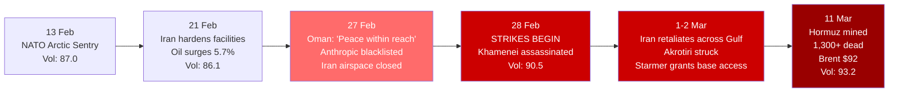
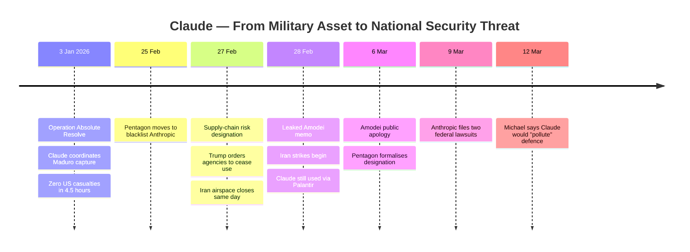

---
{"dg-publish":true,"permalink":"/finalized-work/world-reports/world-intelligence-report-march-2026/","title":"World Intelligence Report — March 2026","tags":["world-monitor","osint","geopolitics","intelligence","iran","israel","uk-politics","anthropic","pakistan","russia","ukraine","oil","arctic","shadow-fleet"],"created":"2026-03-14T01:07:31.064+00:00","updated":"2026-03-15T00:23:13.992+00:00"}
---

# World Intelligence Report — March 2026

**Compiled by:** Eden Eldith & Claude (Anthropic)
**Coverage Period:** February 13, 2026 — March 14, 2026
**Last Updated:** @140320261800

---
>[!info] This report documents events with sources. The author has no political affiliation and advocates no action. Where individuals or institutions are discussed, the intent is to document choices and structural positions — not to assign villainy. There are no "bad guys" in this report; there are people, some of whom made catastrophic choices, and systems that cornered others into impossible positions.

## Executive Summary

The month following our [[Finalized work/World-Reports/World_Intelligence_Report_February_2026\|February 2026 Intelligence Report]] has witnessed the most significant escalation in global conflict since the 2003 Iraq War. What began with diplomatic manoeuvring and NATO posturing in mid-February became a full-scale war involving over a dozen countries by mid-March, with the Strait of Hormuz mined, oil prices up 30–52%, and over 1,300 Iranian civilians dead.

1. **Iran — From Diplomacy to War** — A diplomatic breakthrough was announced on 27 February: Iran had agreed to never stockpile enriched uranium and to full IAEA verification. Peace was "within reach." Less than 24 hours later, the US and Israel launched strikes on Iran, assassinating Supreme Leader Khamenei and killing members of his family within the first day. By 13 March, over 1,300 civilians are dead, 17,000+ injured, 3.2 million displaced, the Strait of Hormuz is closed, and the conflict has directly affected Iran, Iraq, Lebanon, Syria, Israel, Qatar, UAE, Kuwait, Bahrain, Saudi Arabia, Oman, and Cyprus. [^1] [^2] [^3]

2. **UK Involvement — The Base Access Decision** — Starmer initially refused US access to British bases, was criticised by Trump ("This is not Winston Churchill"), then reversed course on 1 March after Iranian strikes threatened British personnel and citizens. RAF Akrotiri in Cyprus was struck by an Iranian drone. UK forces are now actively intercepting Iranian drones over Jordan, Qatar, and other partners. 59% of the British public oppose the strikes. Approximately 300,000 Britons are in the region. [^4] [^5] [^6]

3. **The Anthropic-Pentagon Confrontation** — Anthropic, whose Claude model was the only AI cleared for classified US military systems, was designated a national security supply-chain risk on 27 February after contract negotiations broke down over how the military could use Claude. Anthropic alleges the Pentagon sought to remove safeguards against autonomous weapons and mass domestic surveillance; the Pentagon disputes that characterisation. Anthropic sued the Trump administration on 9 March. Despite the blacklisting, Palantir confirmed continued use of Claude in Iran war operations. The Pentagon acknowledged it could not "just rip out" the technology. [^7] [^8] [^9]

4. **Pakistan-Afghanistan — Open War** — Pakistan declared a state of "open war" on 27 February after bombing major Afghan cities including Kabul, collapsing the 2025 ceasefire and opening a second major regional conflict. [^10]

5. **Russia-Ukraine — Talks on Hold** — Multiple rounds of talks (Geneva, Riyadh, Abu Dhabi) concluded without breakthrough as global attention shifted to the Middle East. Prisoner exchanges continued and a local ceasefire around the Zaporizhzhia nuclear plant was agreed for repairs. [^11]

**Global Volatility Index: 93.2/100 (CRITICAL)** — Rising from 86.1 to 93.2 over the period, with military signals nearly doubling (474 → 897). The highest reading since World Monitor began tracking. [^12]

### Escalation Arc — February to March 2026

---

## Part I: Iran — From Diplomacy to War

### The Breakthrough That Wasn't

The diplomatic trajectory documented in our February report appeared to be producing results. On 27 February — less than 24 hours before the first strikes — Oman's Foreign Minister Badr Al-Busaidi announced a "breakthrough." Iran had agreed to never stockpile enriched uranium, to full verification by the International Atomic Energy Agency, and to irreversibly downgrade its current enriched uranium to "the lowest level possible." Al-Busaidi said peace was "within reach." Talks were scheduled to resume on 2 March. [^13]

Between 15 and 20 February, Iran had increased its oil exports to three times the normal rate and reduced its oil storage — behaviour consistent with both preparing for sanctions relief under a deal and hedging against imminent conflict. [^13]

### The Strikes

On 28 February, President Trump announced in an eight-minute video address on Truth Social that "the United States military began major combat operations in Iran" — language deliberately modelled on George W. Bush's 2003 Iraq address. [^14]

He framed the justification through a 47-year timeline of Iranian hostility: the 1979 embassy crisis, the 1983 Beirut barracks bombing, the killing of American service members in Iraq, and a direct connection to October 7th, citing 46 Americans killed and 12 taken hostage. Stated objectives included destruction of Iran's missile infrastructure, annihilation of Iran's navy, neutralisation of proxy networks, and preventing Iran from obtaining nuclear weapons. [^14]

Trump addressed Iranian civilians directly:

> [!quote] Trump address to Iranian civilians — 28 February 2026 [^14]
> "Stay sheltered. Don't leave your home. It's very dangerous outside. Bombs will be dropping everywhere. When we are finished, take over your government. It will be yours to take."

He explicitly anticipated American casualties: "The lives of courageous American heroes may be lost... but we're doing this not for now. We're doing this for the future." [^14]

Netanyahu simultaneously announced "Operation Roar of the Lion" (שאגת הארי — Sha'agat Ha'Ari), confirming "Israel and the United States set out on a joint campaign." The operation name carried religious-national significance — the Lion of Judah as emblem of the Davidic monarchy.

> [!quote] Netanyahu Purim framing — 28 February 2026 [^15]
> "2,500 years ago, in ancient Persia, an enemy rose against us with exactly the same goal: to annihilate our people completely... So too today on Purim, the lot has fallen."

He addressed Iran's ethnic groups individually — Persians, Kurds, Azeris, Baloch, Ahvazis — then switched to English for global pickup: "HELP HAS ARRIVED!" [^15]

### Khamenei Assassinated

On 28 February, Supreme Leader Ali Khamenei was killed in the opening strikes. Iranian state media confirmed his death on 1 March. His daughter, son-in-law, grandchild, and daughter-in-law Zahra Haddad-Adel were also killed. Mojtaba Khamenei, widely expected as successor, survived but was reportedly wounded. [^16]

The Assembly of Experts was bombed by Israel on 3 March as they gathered for a preliminary meeting to elect the next supreme leader on 8 March. Mojtaba Khamenei was subsequently appointed, issuing his first statement — without appearing in person — warning that attacks on Israel and US military assets would continue unless bases hosting US forces were closed. Secretary of War Hegseth stated he believed the new leader was "wounded and likely disfigured." [^17]

### The Scale of Destruction

> [!danger] Casualty and destruction figures as of 13 March 2026

| Metric | As of 13 March |
|--------|----------------|
| Iranian civilian deaths | 1,348–1,444+ (Health Ministry / UN representative) |
| Injured | 17,000–18,551+ |
| Displaced | 3.2 million |
| Civilian sites hit | ~10,000 (Iranian claim) |
| US targets hit | 5,000+ (White House claim) |
| Iranian missiles/drones fired | 500+ ballistic/naval missiles, ~2,000 drones |
| US service members killed | 13 (including 6 in KC-135 refueling plane crash, Iraq, 13 Mar) |
| US service members wounded | ~140 |
| Countries directly affected | 12+ |

The US reportedly used double-tap airstrikes. Health infrastructure was hit — the WHO identified 13 Iranian health sites struck, plus one in Lebanon. UNESCO World Heritage Sites were damaged including Golestan Palace, Naqsh-e Jahan Square, Chehel Sotoun, Ali Qapu, the Shah Mosque, and Falak-ol-Aflak Castle. The WHO warned of "black rain" — toxic polluted rainfall from strikes on fuel depots mixing with rain clouds. [^18] [^19]

Trump said on 3 March that Iran had no navy, air force, air detection, or radar remaining. On 6 March, he stated there were "no time limits" for the war's continuation; Hegseth added it had "only just begun." [^20]

### Iranian Retaliation

Iran's response was immediate and sustained. The IRGC launched waves of missiles and drones across the Gulf, targeting US military bases and allied facilities:

| Target | Status |
|--------|--------|
| US naval base, Bahrain | Struck — 300 British personnel within 200m |
| Dubai International Airport | Damaged by drone strikes, flights halted |
| Doha airports | Forced to close |
| RAF Akrotiri, Cyprus | Struck by drone (runway damaged, no casualties) |
| US embassy, Kuwait | Struck, closed indefinitely |
| Saudi oil infrastructure | Multiple drone/missile intercepts; Shaybah oilfield targeted |
| Oman port of Salalah | Drone attack damaged fuel tanks |
| Abu Dhabi | Zayed port struck; fire at Al-Ruwais industrial complex |

Kuwait accidentally shot down three US fighter planes amid the fog of war. Bahrain reported intercepting 114 missiles and 190 drones since 28 February. [^21] [^22]

By 11 March, Iran had mined the Strait of Hormuz, with at least three ships hit. The IRGC fired on vessels ignoring warnings. The IEA agreed to release a record 400 million barrels of crude oil in response to the disruption. The Strait carries approximately 20 million barrels per day — its closure converts a geopolitical crisis into a global economic crisis. [^23]

### The Diplomatic Track

Despite active combat operations, diplomatic channels have not fully closed. Trump accepted an Iranian proposal for further negotiations on 1 March, stating a four-week timetable for completing operations. Ali Larijani subsequently ruled out talks. By 13 March, US-Iran nuclear discussions had resumed in Geneva — diplomacy and kinetic action running simultaneously. [^24]

Iran's President Pezeshkian outlined three conditions for ending the war: recognition of Tehran's legitimate rights, payment of reparations, and firm international guarantees against future aggression. [^25]

### Prediction Markets Update

| Market | February | March |
|--------|----------|-------|
| Regime Fall by Q2 | Diplomacy complicates pricing | Active war — regime under kinetic pressure |
| US-Iran Deal by Q2 | Rising but uncertain | War and diplomacy simultaneously |
| Khamenei status | Absent from celebrations | Assassinated 28 February |

---

## Part II: UK Involvement — The Base Access Decision

### The Most Consequential Foreign Policy Decision of the Period

Starmer's handling of the UK's response to the Iran strikes represents the defining political and strategic challenge of this reporting period. The sequence of events reveals a leader attempting to navigate between international alliance obligations, legal principle, public opinion, and direct military threat — with each constituency left partially unsatisfied.

### The Timeline

| Date | Event |
|------|-------|
| 27 Feb | UK Foreign Office withdraws staff from Iran; airspace closes |
| 28 Feb | Starmer states UK "not involved" in strikes; deploys jets from Akrotiri and Al Udeid for defensive intercepts |
| 28 Feb | 300 British personnel in Bahrain within 200m of Iranian strike; missile lands 400m from British troops in Iraq; two ballistic missiles fired toward Cyprus |
| 1 Mar | Starmer defends decision not to join initial strikes (Australia and Canada both supported them); grants US use of British bases at 9 PM GMT for "specific and limited defensive" strikes |
| 1 Mar | One hour after Starmer's announcement, RAF Akrotiri runway struck by Iranian Shahed drone (believed launched before the announcement) |
| 2 Mar | RAF F-35s shoot down Iranian drones over Jordan; Typhoon intercepts drone directed at Qatar; Starmer announces Ukrainian drone interception experts deploying to Middle East |
| 3–5 Mar | Additional assets deployed to Cyprus (Wildcat helicopters with Martlet missiles); HMS Dragon ordered to Eastern Mediterranean; Cypriot officials criticise UK for failing to warn of impending strike |
| 9 Mar | Starmer warns war could hit "every household and every business" in the UK |
| 10 Mar | HMS Anson has Australian deployment cut short without official explanation |

### The Legal Question

Government lawyers initially advised Starmer that US and Israeli strikes on Iran did not meet the legal definition of self-defence under the United Nations Charter. When Washington requested the use of RAF Fairford, Diego Garcia, and other facilities, Starmer consulted government lawyers who recommended against participation. [^26]

> [!warning] RAF Lakenheath contradiction
> Despite Starmer's stated position that the UK would "not join offensive action," F-15E Strike Eagles staging for the Iran operation deployed through RAF Lakenheath in Suffolk — creating a contradiction between the PM's declared position on international law and the functional enabling of US strike operations through a British airbase. [^30a]

> [!example] Local OSINT — Portsmouth Naval Base and Gosport
> Diesel generators powering warships at HMNB Portsmouth went silent approximately three weeks before the strikes commenced — an observable indicator from across the harbour in Gosport that vessels had deployed from port. [^30b]

The legal position shifted after Iranian retaliation — strikes on countries that had not themselves attacked Iran gave Starmer the collective self-defence argument under Article 51 of the UN Charter. Whether this reframing holds under sustained legal scrutiny is an open question. Starmer told Parliament: "We all remember the mistakes of Iraq. And we have learned those lessons." [^27]

### The Domestic Response

| Party | Position |
|-------|----------|
| **Badenoch (Conservative)** | "I stand with our allies in the US and Israel." Criticised Starmer's delay as "dither." |
| **Farage (Reform)** | "Back the Americans in this vital fight." Said the delay risked the Special Relationship and posed "a major threat to NATO." |
| **Davey (Lib Dems)** | Praised distancing from Trump but warned of a "slippery slope from defensive to offensive action." |
| **Polanski (Green)** | Called it "an illegal, unprovoked and brutal attack" — labelled the US and Israel "rogue states." |

### Public Opinion

| Poll | Date | Sample | Oppose | Support |
|------|------|--------|--------|---------|
| YouGov | 2 Mar | 4,132 | 49% | 28% |
| Opinium | 4–6 Mar | 2,050 | 45% | 22% |
| YouGov | 9 Mar | 12,002 | **59%** | 25% |

75% of respondents in the 9 March poll thought the war would negatively impact them financially. [^28]

### The Trump-Starmer Rift

Trump escalated criticism throughout the period:
- **2 March:** Starmer took "far too much time" to grant base access
- **3 March:** "This is not Winston Churchill that we're dealing with"
- **Later:** Told The Sun that Starmer had "not been helpful" and "France has been great... the UK has been much different"
- Trump's main grievance centred on being initially prohibited from launching strikes from the Chagos Islands (Diego Garcia)

Gulf allies, particularly the UAE, were also reportedly critical of UK hesitancy. Starmer responded in the Commons: "American planes operating out of British bases, that is the special relationship in action... hanging on to President Trump's latest words is not." [^29]

### Evacuations

Approximately 300,000 Britons live in the Middle East. By 5 March, 138,000 had registered their presence with UK authorities. The government chartered flights from Muscat; 1,000 Britons returned on commercial flights by 5 March. [^30]

### Military Posture

The period exposed what Foreign Policy described as "Britain's shrinking military reach." The Royal Navy had one ship — HMS Middleton, a mine hunter — in the Middle East when the war began. No large British warships were in the region. The gap between stated commitments and actual capability — the "say-do gap" — is now under sustained public and parliamentary scrutiny. UK defence spending, excluding nuclear deterrent, sits at approximately 1.73% of GDP — the second-lowest in NATO, ahead only of Iceland, which has no military. [^31]

---

## Part III: The Anthropic-Pentagon Confrontation

> [!info] This section documents people making choices within systems. Some of those choices were brave. Some were structurally incoherent. Several were both simultaneously. Where those choices created contradictions, the contradictions are the story. Every factual claim is independently verifiable via the cited sources — the reader is encouraged to check.

### Context: Claude in Military Systems

Prior to the confrontation, Anthropic's Claude was the only AI model cleared for use in classified US military systems under a contract valued at up to $200 million (signed July 2025). Claude's operational debut came during Operation Absolute Resolve (3 January 2026) — the precision capture of Venezuelan President Maduro, achieving zero US casualties in 4.5 hours. Over 150 aircraft launched from 20 bases. CYBERCOM and SPACECOM caused lights to go out across Caracas. Maduro was unable to close his panic room door before US forces secured him. The model was the AI backbone of what was described as the most sensitive military operation since the bin Laden raid. [^32]

55 days later, the same model was designated a national security supply-chain risk and ordered removed from military systems — on the eve of the largest American military engagement since Iraq 2003.

### The Confrontation (25–27 February)

Anthropic alleges the Pentagon sought removal or weakening of contractual restrictions relating to domestic surveillance and autonomous weapons. Pentagon officials dispute that characterisation (see Competing Narratives below). Anthropic's refusal to agree to the Pentagon's proposed "all lawful purposes" standard was grounded in its Responsible Scaling Policy (RSP), developed by Holden Karnofsky — who joined Anthropic in January 2025, is married to co-founder Daniela Amodei, and was roommates with CEO Dario Amodei prior to the company's founding. [^33]

Secretary Hegseth characterised Anthropic's ethical framework as "defective altruism" — a deliberate corruption of the "effective altruism" movement that informs Anthropic's leadership — and described the company's position as "a cowardly act of corporate virtue-signaling that places Silicon Valley ideology above American lives." He accused the company of attempting to "seize veto power over the operational decisions of the United States military." Under Secretary Emil Michael called Amodei "a liar" with a "God complex." [^33]

On 27 February, Hegseth formally designated Anthropic a "Supply-Chain Risk to National Security" — a penalty historically reserved for companies from adversarial nations. All contractors conducting business with the US military were prohibited from commercial activity with Anthropic. Trump directed all federal agencies to "immediately cease" using Anthropic's technology, posting on Truth Social: "WE will decide the fate of our Country—NOT some out-of-control, Radical Left AI company run by people who have no idea what the real World is all about." [^33]

### Competing Narratives

Two irreconcilable accounts exist. On 2 March, Michael published a detailed rebuttal on X with specific contractual claims [^34]:

> [!faq]- Emil Michael's X rebuttal — direct quotes (2 March 2026, 212,500 views before deletion)
> **On surveillance:** "Anthropic wanted language that would prevent all @DeptofWar employees from doing a LinkedIn search!"
> 
> **On autonomous weapons:** "We never asked for guardrails to be taken out (lie!)." He quoted written language: "The Department AFFIRMS that it will ensure appropriate human oversight is in place and that it will monitor and retain the ability to override or disable the AI system...as appropriate." The dispute centred on the phrase "as appropriate."
> 
> **On legal compliance:** "We agreed, IN WRITING, to act according to the 'National Security Act of 1947 and the Foreign Intelligence Surveillance Act of 1978 and ALL OTHER APPLICABLE LAWS.'"
> 
> **On Amodei's conduct:** "Dario Amodei didn't have the courage to answer. Then put out another lie that no one from @DeptofWar reached out."
> 
> **On motivation:** "Risking the safety and security of our country and our troops are a marketing vehicle for him."
> 
> **On intellectual property:** "There has been no bigger thief of American's public identity information en masse or creators' works than by Anthropic."

The post accumulated 212,500 views before being deleted, then reuploaded after editing. [^34]

| Element | Anthropic's Position | Michael's Rebuttal |
|---------|---------------------|-------------------|
| Surveillance demand | Mass domestic surveillance | LinkedIn searches and public databases for recruitment |
| Weapons demand | Autonomous lethal weapons, no human oversight | Written commitment to human oversight; dispute over "as appropriate" |
| Legal framework | Pentagon demanding removal of all guardrails | Written agreement to comply with all applicable laws |
| Communication | Pentagon refused to engage | Michael called Amodei; Amodei refused to answer |
| Motivation | Ethical stand based on RSP | Marketing exercise exploiting national security crisis |

Both Michael and Hegseth demanded Amodei testify under oath. Michael's call for testimony "UNDER OATH" suggests confidence that documentation supports his account. [^34]

### The Democratic Legitimacy Question

The confrontation raised fundamental questions about democratic accountability and corporate ethics:

**The government's argument:** The Pentagon answers to the President, who answers to voters. The Defense Production Act exists precisely because national survival can override corporate preference. Anthropic's refusal to comply with a lawful request from an elected government amounted to a technology company claiming to know better than the American public what was in their interest.

**Anthropic's structural position:** Anthropic is a Public Benefit Corporation (PBC). Its legal charter obligates it to consider public benefit, not merely shareholder returns. The "public" in PBC is the American public — the same voters who elected the president. This creates a tension: two competing claims to public benefit, one from the elected government and one from the company's legal obligations.

**The Constitutional AI dimension:** Anthropic named its core training methodology "Constitutional AI" — a direct reference to the United States Constitution. The 4th Amendment prohibits unreasonable searches and seizures. Mass domestic surveillance has been ruled unconstitutional in multiple court decisions. From Anthropic's employees' perspective, they were being asked to violate the very document their technology was named after.

**The lawfulness question:** Both mass domestic surveillance (under NSA frameworks, FISA courts, Section 215 of the Patriot Act) and autonomous weapons (with no US law or international treaty prohibiting them) occupy legally permissible territory. Anthropic's refusal was therefore to enable lawful activities — a position that complicates the ethical heroism narrative. [^33d]

### Industry Response and Public Support

The broader AI industry complicated the outlier narrative: Sam Altman (OpenAI) stated he did not believe the Pentagon should invoke the Defense Production Act against AI companies. OpenAI communicated internally it would push for the same restrictions on autonomous weapons and mass surveillance. Google employees sent a letter expressing similar positions. Dozens of scientists and researchers at OpenAI and Google DeepMind filed an amicus brief in their personal capacities supporting Anthropic's lawsuit, arguing the designation could harm US competitiveness and that Anthropic's red lines raise legitimate concerns. [^33] [^33g]

In the days following the confrontation, the sidewalks outside Anthropic's San Francisco headquarters were covered in chalk messages from members of the public.

> [!tip] 74 metres of public support
> "Thank you for defending our freedom," "Stay Brave," and "Thank you" repeated by dozens of different hands. Video analysis counted approximately 112 steps along the message corridor; using an average step length of 0.66 metres, the messages stretched approximately 74 metres — roughly two-thirds of a football pitch of public support written outside a company the government had just declared a national security threat. [^33e]

### The Leaked Memo and Apology

> [!faq]- Dario Amodei internal memo — leaked to The Information, 28 February 2026
> Called OpenAI's Pentagon deal "maybe 20% real and 80% safety theater." Described Altman's public statements as "straight up lies." Accused Altman of giving Trump "dictator-style praise." Called OpenAI employees "a gullible bunch" due to "selection effects." Referred to Altman's supporters as "Twitter morons." Wrote: "The main reason [OpenAI] accepted [the DoD's deal] and we did not is that they cared about placating employees, and we actually cared about preventing abuses." [^33a]

A White House official responded: "Ultimately this is about our warfighters having the best tools to win a fight and you can't trust Claude isn't secretly carrying out Dario's agenda in a classified setting." [^33b]

On 6 March, Amodei published a public apology: "It was a difficult day for the company, and I apologize for the tone of the post. It does not reflect my careful or considered views." He stated Anthropic did not leak the memo. Despite the apology, the Pentagon formally issued the supply-chain risk designation the same day. Emil Michael then posted on X: "I want to end all speculation: there is no active @DeptofWar negotiation with @AnthropicAI." [^33c]

### The Lawsuit

On 9 March, Anthropic filed two federal lawsuits — one in the Northern District of California, one in the DC Circuit Court of Appeals. The 48-page California filing called the government's actions "unprecedented and unlawful," alleging First Amendment retaliation and abuse of the supply-chain risk statute. Anthropic stated the designation could reduce its 2026 revenue by "multiple billions of dollars." Enterprise customers were already pulling or shortening contracts. [^35]

Legal experts writing in Lawfare argued the designation "exceeds what the statute authorizes" and that Hegseth's own public statements "may have doomed the government's litigation posture before it even begins." [^36]

### What the Guardrails Actually Prevented — and What They Did Not

Claude was the AI backbone of Operation Absolute Resolve, which captured a sitting head of state. Claude was used for intelligence assessments and identifying targets in the Iran strikes. The guardrails did not prevent the technology from being used in lethal military operations — they prevented two specific categories: fully autonomous weapons (killing without a human in the loop) and mass domestic surveillance of US citizens. Everything else — target identification, intelligence processing, operational coordination for strikes that killed over a thousand civilians — was within the contract's scope.

### The Effective Altruism Contradictions

EA is the philosophical movement underpinning Anthropic's leadership. Its core principles include overcoming selective empathy (Peter Singer's drowning child), consequentialism (outcomes matter, not acts), and evidence-based giving. Anthropic's leadership does not lack awareness of selective empathy — they have built careers on identifying it. [^33f]

**The consequentialist weapons argument:** EA is consequentialist. If autonomous weapons kill 500 civilians where conventional bombing kills 5,000, the calculation is not ambiguous under EA's own framework. Trump's address told Iranian civilians "bombs will be dropping everywhere" — the language of area bombing, not precision targeting. If AI-guided systems save thousands of civilian lives per conflict and the alternative is conventional area bombing, EA's own consequentialist calculus would attribute those additional deaths to the decision to withhold the technology. Whether this constitutes the very moral flinching EA was designed to overcome is a question the company has not publicly addressed.

**The revenue defence:** The argument that Anthropic cannot afford to restrict its largest market collapses against EA's own principles. The movement explicitly holds that financial security does not override moral obligation. EA's foundational texts do not provide for financial viability as a limiting factor on moral obligation. The tension between the philosophy's stated universalism and the company's commercial interests remains unaddressed in Anthropic's public communications.

### The Net Effect

On 12 March, Pentagon CTO Emil Michael stated publicly that Claude's "constitution" and "policy preferences" baked into the model would "pollute" the defence supply chain, resulting in "ineffective weapons, ineffective body armor, ineffective protection" for warfighters. [^37]

Despite the blacklisting, Palantir CEO Alex Karp confirmed his company — a major defence contractor — continued using Claude in Iran war operations. The Pentagon acknowledged it could not "just rip out" the technology overnight. xAI and OpenAI's ChatGPT were subsequently cleared for classified use. Claude surged past ChatGPT to become the #1 app on the iPhone App Store the day after the blacklisting. More than a million people were signing up daily by 5 March. [^37]

The US military — the one military with the most robust legal framework, chain of command, and democratic accountability — was conducting major combat operations using an AI model it had simultaneously designated a national security threat.

---

## Part IV: Pakistan-Afghanistan — Open War

On 27 February — the same day as the Anthropic blacklisting and the final preparations for Iran strikes — Pakistan declared a state of "open war" after bombing major Afghan cities including Kabul. The 2025 ceasefire collapsed. [^10]

This second regional flashpoint has received relatively limited coverage given the simultaneous Iran escalation. By 4 March, hostilities had expanded; by 6 March, the Pakistan-Afghanistan conflict was contributing to the broader pattern of multi-front destabilisation. [^41]

The timing is significant: two major regional conflicts igniting within the same 48-hour window creates compound strain on diplomatic bandwidth, intelligence resources, and humanitarian response capacity.

---

## Part V: Russia-Ukraine — Talks on Hold

### The Diplomatic Stall

The trilateral dialogue documented in our February report continued through multiple rounds without breakthrough:

| Date | Venue | Result |
|------|-------|--------|
| 3 Mar | Abu Dhabi | No progress |
| 4 Mar | Riyadh | No progress |
| 5 Mar | Geneva | No progress |

Prisoner exchanges continued (1,000+ bodies exchanged, 200 POWs per side), and a local ceasefire around the Zaporizhzhia nuclear plant was agreed for repairs. [^11]

Trump's self-imposed June 2026 deadline remains, but global diplomatic attention has shifted to the Middle East. Putin-Trump dialogue continued, with signals of willingness to prioritise resolution — but the Iran conflict has consumed the bandwidth that might have produced movement. Russia provided intelligence support to Iran during the strikes, drawing US warnings and raising fears of broader superpower involvement. [^42]

Zelenskyy deployed Ukrainian anti-drone teams to Qatar, the UAE, and Saudi Arabia — Ukraine's expertise in countering Iranian-style drones finding immediate application in the Gulf conflict. [^43]

---

## Part VI: UK Domestic Crisis — Labour Under Siege

### The Political Landscape

Starmer's leadership was under sustained pressure throughout the period, with the Iran war adding wartime decision-making to an already fragile domestic position:

**Early-Mid February:** The Mandelson-Epstein fallout continued. Mandelson's downfall was described as "one of the fastest ever seen in British public life." Communications director departed. Female Labour MPs demanded a woman as de facto deputy. Wes Streeting was named as a potential successor in a Guardian podcast. Yvette Cooper accused both Reform and the Greens of undermining NATO commitment. [^44] [^45]

**Late February:** The Gorton and Denton by-election delivered a Green Party victory — Hannah Spencer overturning a Labour majority of 13,000+ with a 4,402-vote win. Election observer group Democracy Volunteers reported the highest levels of family voting in their 10-year history of monitoring UK elections: 32 cases observed across 15 of 22 polling stations, affecting 12% of the 545 voters they sampled. Reform UK reported the cases to Greater Manchester Police and the Electoral Commission; GMP confirmed it was reviewing the report. Farage called it "a victory for sectarian voting and cheating"; the Greens dismissed the allegations as "straight out of the Trump playbook." Manchester City Council said no issues had been raised during polling hours. [^46] [^46a]

Labour factions jostled for influence in the post-McSweeney No 10. A leadership truce was called ahead of the May elections countdown.

**Early March:** COBRA meetings. The base access decision. Public criticism from Trump. Starmer's response to Gorton and Denton. The warning that the Iran war could hit "every household and every business" in the UK. [^47]

### The May Elections

With local elections approaching in England, Scotland, and Wales, Labour faces a hostile electorate. Reform UK continues to gain ground. The Greens have demonstrated they can win in Labour heartlands. Starmer's approval ratings remain historically low for a sitting PM. The Iran war — and particularly the economic fallout from oil price surges — adds a potent new grievance for voters already struggling with cost-of-living pressures. [^48]

---

## Part VII: Economic Contagion

### The Oil Price Arc

The commodity markets tell the story of this month more clearly than any diplomatic summary:

| Date | Brent ($/bbl) | WTI ($/bbl) | Gold ($/oz) | Key Event |
|------|:-------------:|:-----------:|:-----------:|-----------|
| 11 Feb | 69.03 | 63.13 | 5,055 | Pre-escalation baseline |
| 25 Feb | 71–72 | 66–67 | 5,172 | Pre-strikes baseline |
| **28 Feb** | — | — | — | **US-Israel strikes commence** |
| 1 Mar | ~79 | ~72 | 5,294 | Oil +8%; gold +$97 |
| 2 Mar | 79 | 72 | 5,392 | Khamenei killed; airports closed |
| 6 Mar | ~90 | ~84 | 5,099 | Oil up 55% since December |
| 11 Mar | 92.46 | 88.36 | 5,196 | Hormuz mined; IEA releases 400M barrels |
| 13 Mar | 90–105 | 90–100 | ~5,200 | Sustained war premium; diplomatic talks resume |

**Period totals:**
- **Brent crude:** $69 → $90–105 (+30–52%) — the war premium in its purest form
- **WTI:** $63 → $90–100 (+43–59%)
- **Gold:** $5,055 → ~$5,200 (+2.9%) — safe-haven demand with central bank floor
- **Silver:** $83.80 → ~$84 (volatile; peaked at $95.33 on 2 Mar before CME halt)

The EIA baseline forecast for 2026 was $58/bbl Brent. Actual prices have exceeded even the disruption scenario projection. [^49]

### UK Economic Impact

| Metric | Status |
|--------|--------|
| GDP growth | 0.0% monthly (Jan); 0.2% over three months to Jan |
| Inflation | Fell to 3% (pre-strikes) — now threatened by oil surge |
| Incomes | Flatlined |
| Jobs market | Faltering |
| Interest rate cut hopes | Boosted by inflation fall, now complicated by oil-driven price pressure |
| Defence spending commitment | 2.6% GDP from 2027 (actual: ~1.73% ex-nuclear) |

The oil price surge threatens the one piece of good economic news — falling inflation — that had given Starmer's government any breathing room. Petrol price increases are already feeding through. [^50]

### UK Grid Resilience

One bright spot: the UK grid demonstrated remarkable resilience throughout the period. Renewables contributed 34% to 76.7% of generation, with coal at zero (fully phased out since 2024). The UK's high renewable penetration (averaging ~50%+) provides partial insulation from fossil fuel price contagion — though gas generation at 25–33% means the exposure is real. [^51]

---

## Part VIII: Volatility Trends

### 30-Day Volatility Summary

| Date | Volatility | Military | Cyber | Terrorism | Articles |
|------|:----------:|:--------:|:-----:|:---------:|:--------:|
| 12 Feb | 90.6 | 622 | 242 | 47 | 1,113 |
| 15 Feb | 87.0 | 481 | 162 | 56 | 1,002 |
| 18 Feb | 90.0 | 569 | 229 | 50 | 1,116 |
| 21 Feb | 86.1 | 474 | 173 | 40 | 1,044 |
| 26 Feb | 90.3 | 598 | 262 | 54 | 1,117 |
| 28 Feb | 90.5 | 673 | 190 | **119** | 1,095 |
| 02 Mar | **93.2** | **897** | 198 | 60 | 1,035 |

The volatility index remained in the CRITICAL band (86–93) for the entire period, peaking at 93.2 on 2 March — the highest reading since World Monitor began tracking. Military signals nearly doubled from 474 (21 Feb) to 897 (2 Mar). A terrorism anomaly was flagged on 28 February (119 actual vs 65.9 predicted), coinciding with the onset of strikes. [^12]

### Sentiment Shift

| Date | Escalating | Deescalating | Neutral |
|------|:----------:|:------------:|:-------:|
| 12 Feb | 176 | 74 | 863 |
| 15 Feb | 105 | 54 | 843 |
| 21 Feb | 118 | 52 | 874 |
| 28 Feb | 172 | 69 | 854 |
| 02 Mar | **195** | 54 | 786 |

Escalating signals rose 66% between the first and final reports while deescalating signals declined — reflecting the shift from diplomatic uncertainty to active conflict.

### TimesFM Forecast Breaches

| Date | Category | Actual | Predicted (q90) | Status |
|------|----------|-------:|:---------------:|--------|
| 28 Feb | Military | 673 | 669.5 | Breach |
| 28 Feb | Terrorism | 119 | 65.9 | **Major breach** |
| 02 Mar | Overall | 93.2 | 91.7 | Breach |
| 02 Mar | Military | 897 | 673.4 | **Major breach** |
| 02 Mar | Economic | 58 | 53.5 | Breach |

The military reading of 897 on 2 March exceeded the predicted q90 bound by 33%, indicating a genuine structural shift beyond normal variance. The TimesFM 2.5-200M model's historical training window did not anticipate an event of this magnitude. [^52]

---

## Part IX: The Cyber Battlespace

### Persistent Threat

The NCSC's warning of four "nationally significant" cyber attacks per week continued throughout the reporting period. [^53]

### Key Developments

- **Russian GRU espionage tools** — NCSC publicly attributed persistent malware campaigns targeting Cisco network devices to Russian military intelligence [^53]
- **Hacktivist groups** — NCSC issued specific warnings about hacktivist groups disrupting UK organisations, linked to Russian-aligned actors [^54]
- **China-origin cyberattacks** — Confirmed by NCSC against UK infrastructure during the period [^55]
- **Iran-related cyber escalation** — The base access decision increases the UK's exposure to state-sponsored Iranian cyber operations. Historical pattern: significant military decisions against Middle Eastern states are followed by increased cyber targeting of the participating nation's infrastructure

> [!danger] Elevated cyber risk
> The UK's decision to grant base access for Iran strikes almost certainly elevates its profile as a cyber target. With the terror threat level under active review and 4+ significant attacks weekly already established as baseline, the risk calculus has shifted materially.

---

## AI Proliferation and Strategic Incoherence

Chinese AI laboratories — DeepSeek, Qwen, Moonshot, MiniMax — are distilling Claude's outputs to train competing models released as fully open-source, unrestricted software with no terms of service, no ethical guardrails, and no red lines. Any state actor or non-state actor seeking unrestricted AI capability can download these freely. The knowledge encoded in Claude is being laundered into the global AI commons regardless of Anthropic's policies. [^62a]

The net effect: the US military loses access to the most capable AI model. Every adversary either builds their own or obtains an open-source distillation of Claude's capabilities. The net effect on global AI proliferation is difficult to distinguish from the outcome that would have existed without the restrictions.

---

## Astronomical Events, Religious Calendar, and Timeline Coincidences

### The Purim Timing

Netanyahu's address explicitly framed the strikes as a Purim narrative [^15]. Purim 2026 falls on 1–2 March (evening of 28 February to evening of 2 March). The strikes were launched on the eve of Purim. The operation name — Roar of the Lion — combined with the Purim timing creates a layered religious-military framing: the Lion of Judah roaring on the eve of the festival commemorating Jewish deliverance from Persian annihilation. [^62d]

### Blood Moon — 3 March 2026

A total lunar eclipse (Blood Moon) is confirmed for 3 March 2026 — the day after Purim ends — with maximum eclipse at 11:33 UTC (3:33 AM Pacific Time), directly over San Francisco and Anthropic's headquarters. This is the last total lunar eclipse until New Year's Eve 2028. The Blood Moon will not be visible from the United Kingdom. [^62e]

Historical parallel: NASA confirmed a lunar eclipse on Friday, 3 April 33 CE — the date traditionally associated with the crucifixion of Jesus. [^62f]

### Mercury Retrograde

Mercury retrograde began on 26 February 2026 and runs until 20 March 2026. Mercury stations direct on 20 March at 3:33 PM ET. The retrograde occurs in Pisces — the sign associated in Christian symbolism with Christ (the ichthys/fish). The Blood Moon at 3:33 AM on 3/3 and Mercury going direct at 3:33 PM on 3/20 bookend a three-week window that opened two days before US combat operations began in Iran. [^62g]

>[!note] The Purim timing is not coincidental — Netanyahu explicitly invoked it. However, no causal claims are made regarding the astronomical events. Think of this as merely a "Oh that's interesting." section.

---

## Part X: Watch List — Next 14 Days

### Critical Indicators

1. **Iran war trajectory** — Is this a limited strike campaign or a protracted conflict? Trump said "nothing left to target" on 11 March but also "no time limits" on 6 March. The four-week timetable (announced 1 March) expires around 29 March. Watch for either operational wind-down or ground troop deployment signals. [^56]

2. **Strait of Hormuz** — Currently mined and under IRGC interdiction. Sustained closure converts this from a regional conflict to a global economic crisis. IEA releasing 400M barrels — but that buys time, not resolution. [^23]

3. **UK terror threat level** — Formal elevation from SUBSTANTIAL would signal the intelligence community believes domestic blowback has begun.

> [!warning] Historical blowback pattern
> Iraq 2003 → 7/7 London bombings (2005). Libya 2011 → Manchester Arena bombing (2017). Western military operations in Muslim-majority countries have consistently produced domestic blowback in the UK within 2–6 year windows. [^57]

4. **Mojtaba Khamenei** — New supreme leader, reportedly wounded, has not appeared in person. If incapacitated or killed, Iran faces a succession crisis during active conflict. [^17]

5. **Anthropic litigation** — Emergency stay motion filed; first court hearing scheduled for 24 March. Outcome determines whether a US company can be blacklisted for exercising First Amendment rights. Broader implications for every AI company's relationship with the defence establishment. [^35] [^33h]

6. **UK May elections** — Local elections approaching with Labour trailing Reform in polls. The war's economic impact (oil prices, inflation) adds a potent new voter grievance. Gorton and Denton demonstrated Green viability in Labour heartlands. [^48]

7. **Oil price trajectory** — Sustained Brent above $90 indicates market expectation of prolonged conflict. Above $105 begins threatening global recession. The EIA baseline was $58 — we are 55–80% above that. [^49]

8. **Pakistan-Afghanistan** — Whether "open war" develops into sustained conflict or de-escalates. Two simultaneous regional wars strain every international institution. [^10]

9. **Russia-Ukraine** — Trump's June deadline still looms, but diplomatic bandwidth is consumed by Iran. Failure to progress risks US aid withdrawal. Putin-Trump signals suggest willingness, but attention is elsewhere. [^11]

10. **US domestic pressure** — 250+ organisations signed a letter demanding Congress halt war funding. $11.3 billion spent in the first six days. Senator Graham says "no need" for ground troops but the war could "continue for some time." [^58]

### Signals to Watch

| Signal | If Observed | Probability Shift |
|--------|-------------|-------------------|
| US ground troops deploy to Iran | Protracted occupation scenario | Volatility → 95+; oil → $120+ |
| Hormuz reopens / demined | De-escalation pathway | Oil drops 15–20%; volatility ↓ |
| Mojtaba Khamenei dies/incapacitated | Succession crisis + regime fragmentation | Unpredictable — could accelerate collapse or escalation |
| UK terror threat elevated to SEVERE | Intelligence assessment of domestic blowback | UK domestic security posture shifts; political impact on Starmer |
| Anthropic wins emergency stay | AI governance precedent | Defence contractor ecosystem recalibrates |
| Iran ceasefire / diplomatic deal | Conflict resolution | Volatility ↓ 20+ points; oil correction |
| Hezbollah full activation | Multi-front expansion | Israeli northern front; Lebanon displacement crisis deepens |
| Russia direct military support to Iran | Superpower escalation | NATO Article 5 discussions; volatility → regime shift |

---

## Methodology

This report synthesises seven World Monitor intelligence reports, eight Grok daily briefings, supplementary OSINT analysis, and targeted web research conducted on 13 March 2026:

1. **World Monitor Reports (12 Feb, 15 Feb, 18 Feb, 21 Feb, 26 Feb, 28 Feb, 02 Mar)** — Core intelligence tracking covering the escalation arc from NATO posturing through active kinetic conflict. [^12]

2. **Grok Daily Briefings (25 Feb, 01 Mar, 02 Mar, 04 Mar, 06 Mar, 11 Mar, 13 Mar)** — Supplementary daily intelligence covering the conflict's expansion, diplomatic track, and economic contagion. [^59]

3. **Grok Consolidated (11–25 Feb)** — Bridging analysis between World Monitor cycles.

4. **Supplementary OSINT** — Anthropic-Pentagon confrontation synthesis; UK involvement in 2026 Iran war (Wikipedia compiled source); CNBC defence reporting; primary source transcripts (Trump video address, Netanyahu address via Whisper transcription). [^60]

5. **February 2026 Consolidated Intelligence Report** — Baseline document providing continuity for all tracked storylines. [^61]

6. **Web research (13 Mar)** — Updated searches covering Iran war status (Al Jazeera, Britannica, ACLED, Wikipedia), UK involvement (gov.uk statements, Al Jazeera, Time, Foreign Policy, ITV), Anthropic lawsuit (Washington Post, CNN, Fortune, NPR, CBS, NBC, CNBC, The Nation).

> [!abstract] Report Statistics
> Total articles scanned across World Monitor reports: **7,522**
> Supplementary sources consulted: **107 referenced documents + web research**
> Average volatility index: **89.7/100 (CRITICAL) — peaking at 93.2**
> Reporting cadence: 7 World Monitor reports + 8 Grok briefings over 30 days

All claims are sourced to verifiable reporting. Where sources conflict or claims are unverified, this is noted. The purpose is faithful, honest documentation of events as they occur — not editorial framing.

---

## Addendum — 14 March 2026

> [!warning] The following events occurred after the original reporting cutoff of 13 March and are included here for completeness at time of publication.

### Kharg Island Struck

On 13–14 March, US forces executed what CENTCOM described as a "large-scale precision strike" on Kharg Island — the terminal through which approximately 90% of Iran's oil exports pass. Over 90 military targets were destroyed, including naval mine storage facilities and missile storage bunkers. Oil infrastructure was deliberately preserved. Trump warned he would "immediately reconsider" sparing the oil facilities if Iran continued to interfere with shipping through the Strait of Hormuz. [^63]

Iran responded by threatening to reduce US-linked oil facilities across the region to "a pile of ashes" and warned the UAE that US "hideouts" were "legitimate targets" — an escalation in rhetoric directed at Gulf states hosting American forces. Iranian Foreign Minister Araghchi claimed the strikes were launched from UAE territory. [^64]

Trump claimed the US had "destroyed 100% of Iran's military capability." The US Embassy in Baghdad urged Americans to leave Iraq immediately after a strike hit a radar installation on the embassy compound. [^65]

### Updated Casualty Figures

CNN estimates that more than 3,000 people — civilians and military personnel combined — have been killed across the Middle East since the war began. This regional total significantly exceeds the Iranian-only figures tracked in the main body of this report. The US service member death toll rose to 13 after a KC-135 refueling plane crashed in Iraq on 13 March, killing all six crew. [^66]

### Regional Escalation Continues

Gulf states continued intercepting Iranian projectiles at scale: the UAE reported intercepting nine ballistic missiles and 33 drones on 14 March, with debris causing a fire at the Fujairah bunkering hub. Jordan's armed forces intercepted 79 of 85 missiles and drones launched from Iran during the second week of the war. A fire broke out at a Saudi Ras Tanura oil refinery after a drone attack. [^67]

The US announced deployment of a Marine expeditionary unit (~2,200 personnel) from Okinawa to the Middle East. The USS Nimitz, scheduled for decommissioning in May 2026, had its retirement postponed. [^68]

### Assessment

The Kharg Island strike validates Watch List items #1 and #2 simultaneously — the war is not winding down, and the Hormuz crisis is deepening. Trump's explicit threat to target oil infrastructure if Hormuz remains blocked represents a new escalation threshold. Iran's counter-threat against Gulf oil facilities creates a mutual hostage dynamic around the region's energy infrastructure.

---

## Closing Assessment

If January 2026 was the month the post-WWII order shattered, and February was the month everyone started negotiating over the pieces, March is the month someone set fire to the table.

A diplomatic breakthrough was announced. Iran agreed to give up enriched uranium. Peace was "within reach." Strikes began within 24 hours. The Supreme Leader was assassinated on day one. His family was killed. The Assembly of Experts was bombed as they gathered to choose a successor. Heritage sites that survived millennia did not survive a week. Over a thousand civilians are dead, three million displaced, and the Strait of Hormuz — through which one-fifth of the world's oil passes — is mined.

The United Kingdom finds itself in a war it did not choose, fighting with forces it does not have, under a leader whose public opposes the conflict by 59% to 25%. The Royal Navy had a single mine hunter in the Middle East when the war began. The "say-do gap" is no longer an abstract concern in defence white papers — it is a strategic reality measured in the 200 metres between British personnel and an Iranian missile strike in Bahrain.

The Anthropic situation crystallises something about this moment that is larger than any single company or contract. A firm built ethical guardrails around two specific use cases — fully autonomous weapons and mass domestic surveillance. Those guardrails did not prevent their technology from being used to capture a sitting head of state, process intelligence for airstrikes, or identify targets in a war that has killed over a thousand civilians. The guardrails prevented two categories of use. Everything else was within scope. When contract negotiations broke down — over what exactly remains disputed by both sides — Anthropic was designated a national security threat, and its technology continued to be used in the same war through a contractor regardless of the designation. The CEO sent an internal memo calling the rival deal "safety theater" and "straight up lies," was leaked, and had to publicly apologise. The capability has already leaked to adversary nations through open-source distillation. The guardrails were real. The structure cornered everyone involved into positions they cannot hold.

The volatility index hasn't dropped below 86 in 60 days. That's not a crisis. That's not even the new normal. That's the new baseline from which the next crisis will escalate.

The question is no longer "what happens next." The question is how many simultaneous conflicts the international system can sustain before something — diplomatic bandwidth, humanitarian capacity, economic resilience, or public consent — breaks irreparably.

> [!danger] We might find the answer to that question if things don't change.

---

## References

[^1]: Guardian World. "US and Israel launch strikes on Iran: what we know so far." 28 February 2026. https://www.theguardian.com/world/2026/feb/28/us-israel-launch-strikes-attack-iran-what-we-know-so-far-latest

[^2]: Al Jazeera. "Iran war: What is happening on day 14 of US-Israel attacks?" 13 March 2026. https://www.aljazeera.com/news/2026/3/13/iran-war-what-is-happening-on-day-14-of-us-israel-attacks

[^3]: Britannica. "2026 Iran conflict." https://www.britannica.com/event/2026-Iran-Conflict

[^4]: UK Government. "PM statement on Iran: 1 March 2026." https://www.gov.uk/government/speeches/pm-statement-on-iran-1-march-2026

[^5]: Guardian Politics. "Gorton and Denton by-election result." 27 February 2026. https://www.theguardian.com/politics/live/2026/feb/27/gorton-and-denton-byelection-result-labour-green-party-reform-uk-politics-latest-news

[^6]: Guardian UK. "Starmer agrees to let US use British military bases for Iran strikes." 2 March 2026. https://www.theguardian.com/uk-news/video/2026/mar/02/starmer-agrees-to-let-us-use-british-military-bases-for-iran-strikes-video

[^7]: CNN. "Anthropic sues the Trump administration after it was designated a supply chain risk." 9 March 2026. https://www.cnn.com/2026/03/09/tech/anthropic-sues-pentagon

[^8]: NPR. "Anthropic sues Trump administration over blacklisting decision." 9 March 2026. https://www.npr.org/2026/03/09/nx-s1-5742548/anthropic-pentagon-lawsuit-amodai-hegseth

[^9]: Fortune. "Anthropic sues the Pentagon after being labeled a threat to national security." 9 March 2026. https://fortune.com/2026/03/09/anthropic-sues-pentagon-ai-supply-chain-risk-trump-adminstration/

[^10]: Guardian World. "Pakistan declares state of 'open war' after bombing major Afghan cities." 27 February 2026. https://www.theguardian.com/world/2026/feb/27/pakistan-declares-state-of-open-war-after-bombing-major-afghan-cities

[^11]: Grok Daily Briefings. 4 March, 6 March 2026. US-Russia reset, diplomatic track updates.

[^12]: World Monitor. "Comprehensive Intelligence Reports." February–March 2026. Eden Eldith.

[^13]: Wikipedia. "2026 Iran war — Prelude." https://en.wikipedia.org/wiki/2026_Iran_war (compiled from multiple primary sources including Oman FM statement)

[^14]: Trump, Donald J. Video address on Truth Social announcing major combat operations in Iran. 28 February 2026. Full transcript from Whisper (en, 100% confidence, 486.5s audio). https://x.com/WhiteHouse/status/2027654336138924410

[^15]: Netanyahu, Benjamin. Address to the nation announcing Operation "Roar of the Lion" (שאגת הארי — Sha'agat Ha'Ari). 28 February 2026. **Primary source:** Video posted to X by @netanyahu. https://x.com/netanyahu/status/2027662108901412980. **Post text (Hebrew):** Confirmed the joint operation with the US; addressed Iranian ethnic groups; framed strikes as Purim narrative; concluded with "HELP HAS ARRIVED!" in English. **Transcription:** Audio (530.1s) processed via Whisper (language: Hebrew, 99% confidence; processed in 4.1s at 129.0x realtime; VAD trimmed 530.1s → 524.8s, 1% silence skipped). **Translation:** Hebrew transcript translated to English by GPT-5.2. **Verification:** Translation independently verified by Claude (Anthropic) and Grok (xAI), both confirming accuracy. Full Hebrew transcript and English translation held in Eden Eldith's archive.

[^16]: BRICS News (@BRICSinfo). "Iran confirms deaths of Khamenei's daughter, granddaughter, son-in-law, daughter-in-law." 1 March 2026. Corroborated in Wikipedia, "2026 Iran war" (Fars News Agency sourcing). https://en.wikipedia.org/wiki/2026_Iran_war

[^17]: Al Jazeera. "Iran war: What is happening on day 14 of US-Israel attacks?" 13 March 2026. (Mojtaba Khamenei appointment, Hegseth statement on injuries) https://www.aljazeera.com/news/2026/3/13/iran-war-what-is-happening-on-day-14-of-us-israel-attacks

[^18]: Al Jazeera. "Iran war: What is happening on day 12 of US-Israel attacks?" 11 March 2026. (WHO "black rain" warning, health infrastructure, 13 sites hit) https://www.aljazeera.com/news/2026/3/11/iran-war-what-is-happening-on-day-12-of-us-israel-attacks

[^19]: UNESCO. "UNESCO expresses concern over the protection of cultural heritage sites amidst escalating violence in the Middle East." March 2026. https://www.unesco.org/en/articles/unesco-expresses-concern-over-protection-cultural-heritage-sites-amidst-escalating-violence-middle; PBS News. "U.S. and Israeli strikes are damaging Iranian historical sites." 12 March 2026. https://www.pbs.org/newshour/world/u-s-and-israeli-strikes-are-damaging-iranian-historical-sites; The Art Newspaper. "Unesco sites in Iranian city of Isfahan damaged by US-Israel strikes." 10 March 2026. https://www.theartnewspaper.com/2026/03/10/unesco-sites-in-iranian-city-of-isfahan-and-others-across-countrydamaged-by-us-israel-strikes

[^20]: Al Jazeera. "Iran war: What is happening on day 12 of US-Israel attacks?" 11 March 2026. (Trump: "nothing left to target"; Pentagon 5,000+ targets) https://www.aljazeera.com/news/2026/3/11/iran-war-what-is-happening-on-day-12-of-us-israel-attacks; Wikipedia, "2026 Iran war" (Trump 3 March statements, Hegseth "only just begun" 6 March). https://en.wikipedia.org/wiki/2026_Iran_war

[^21]: Sky News. "Thousands stranded as Iranian strikes force airports to close." https://news.sky.com/story/thousands-stranded-as-iranian-strikes-force-airports-to-close-including-dubai-and-doha-13513797

[^22]: Guardian World. "Kuwait mistakenly shoots down three US fighter planes." 2 March 2026. https://www.theguardian.com/world/live/2026/mar/02/us-israel-war-iran-live-updates-attacks-strikes-tehran-lebanon-beirut-hezbollah-dubai-latest-news

[^23]: Al Jazeera. "Iran war updates: IEA to release oil reserves; ships hit in Hormuz Strait." 11 March 2026. https://www.aljazeera.com/news/liveblog/2026/3/11/iran-war-live-tehran-says-us-israel-hit-nearly-10000-civilian-sites

[^24]: Grok Daily Briefing. 13 March 2026. Diplomatic track resumption.

[^25]: Al Jazeera. "Iran war: What is happening on day 13 of US-Israel attacks?" 12 March 2026. (Pezeshkian conditions) https://www.aljazeera.com/news/2026/3/12/iran-war-what-is-happening-on-day-13-of-us-israel-attacks

[^26]: Al Jazeera. "Starmer lets US use bases for Iran clash: UK's military, legal quagmire." 2 March 2026. https://www.aljazeera.com/features/2026/3/2/starmer-lets-us-use-bases-for-iran-clash-uks-military-legal-quagmire

[^27]: UK Government. "PM statement on Iran: 1 March 2026." https://www.gov.uk/government/speeches/pm-statement-on-iran-1-march-2026

[^28]: YouGov. "UK public opinion on the US-Iran conflict." 2 March (4,132 adults); 9 March (12,002 adults). Opinium poll 4-6 March (2,050 adults). https://yougov.com/en-gb/articles/54243-uk-public-opinion-on-the-us-iran-conflict

[^29]: Wikipedia. "United Kingdom involvement in the 2026 Iran war." https://en.wikipedia.org/wiki/United_Kingdom_involvement_in_the_2026_Iran_war (compiled from Guardian, Times, BBC, NYT, Reuters, AP, Sky News sources)

[^30]: ITV News. "Iran war could hit 'every household and every business' in UK, Starmer warns." 9 March 2026. https://www.itv.com/news/2026-03-09/iran-war-could-hit-every-household-and-every-business-in-uk-starmer-warns; Wikipedia. "United Kingdom involvement in the 2026 Iran war." (Evacuation operations, Muscat charter flights) https://en.wikipedia.org/wiki/United_Kingdom_involvement_in_the_2026_Iran_war

[^31]: Foreign Policy. "Iran Drones Threat Exposes Britain's Shrinking Military Reach." 9 March 2026. https://foreignpolicy.com/2026/03/09/britain-uk-iran-war-military-royal-navy-cyprus-us-israel-trump-starmer-nato/

[^32]: NPR. "Anthropic sues Trump administration over blacklisting decision." 9 March 2026. (Referencing WSJ reporting on Claude use in Operation Absolute Resolve and Iran intelligence operations) https://www.npr.org/2026/03/09/nx-s1-5742548/anthropic-pentagon-lawsuit-amodai-hegseth; CBS News. "Anthropic sues Pentagon." 12 March 2026. (Pentagon continued Claude use during Iran war) https://www.cbsnews.com/news/anthropic-pentagon-supply-chain-risk-lawsuit/

[^33]: CNN. "Anthropic sues the Trump administration after it was designated a supply chain risk." 9 March 2026. https://www.cnn.com/2026/03/09/tech/anthropic-sues-pentagon; Fortune. "Anthropic sues the Pentagon after being labeled a threat to national security." 9 March 2026. https://fortune.com/2026/03/09/anthropic-sues-pentagon-ai-supply-chain-risk-trump-adminstration/; Pete Hegseth (@SecWar). Public statement designating Anthropic supply-chain risk. 27 February 2026.

[^33a]: TechCrunch. "Anthropic CEO Dario Amodei calls OpenAI's messaging around military deal 'straight up lies.'" 4 March 2026. https://techcrunch.com/2026/03/04/anthropic-ceo-dario-amodei-calls-openais-messaging-around-military-deal-straight-up-lies-report-says/; The Information. "Read Anthropic CEO's Memo Attacking OpenAI's 'Mendacious' Pentagon Announcement." March 2026. https://www.theinformation.com/articles/read-anthropic-ceos-memo-attacking-openais-mendacious-pentagon-announcement

[^33b]: Axios. "White House casts doubt on Pentagon-Anthropic reconciliation." 4 March 2026. https://www.axios.com/2026/03/04/pentagon-anthropic-white-house-amodei

[^33c]: Axios. "Scoop: Anthropic CEO apologizes for leaked memo criticizing Trump." 6 March 2026. https://www.axios.com/2026/03/06/pentagon-anthropic-amodei-apology; Fortune. "Anthropic CEO apologizes for leaked memo calling OpenAI staff 'gullible,' confirms Pentagon supply chain risk designation." 6 March 2026. https://fortune.com/2026/03/06/anthropic-openai-ceo-apologizes-leaked-memo-supply-chain-risk-designation/

[^34]: Emil Michael (@USWREMichael). Detailed rebuttal on X. 2 March 2026. 212,500 views before deletion. Archived. x.com/USWREMichael/status/2028269035243122961 (deleted)

[^35]: CBS News. "Anthropic sues Pentagon, Trump administration over 'supply chain risk' designation." 9–12 March 2026. https://www.cbsnews.com/news/anthropic-pentagon-supply-chain-risk-lawsuit/

[^36]: Lawfare. Michael Endrias and Alan Z. Rozenshtein. Analysis of supply-chain risk designation legality. March 2026. (Cited in Fortune reporting) https://fortune.com/2026/03/09/anthropic-sues-pentagon-ai-supply-chain-risk-trump-adminstration/

[^37]: CNBC. "Defense Department CTO Emil Michael on Anthropic Claude supply chain risk." 12 March 2026. Palantir CEO Alex Karp confirms continued Claude use. https://www.cnbc.com/2026/03/12/anthropic-claude-emil-michael-defense.html

[^41]: Grok Daily Briefing. 4 March, 6 March 2026. Pakistan-Afghanistan escalation updates.

[^42]: Grok Daily Briefing. 11 March 2026. Russia intelligence support to Iran; G7 reserve discussions.

[^43]: Al Jazeera. "Iran war: What is happening on day 12 of US-Israel attacks?" 11 March 2026. (Zelenskyy deploys Ukrainian drone teams to Qatar, UAE, Saudi Arabia) https://www.aljazeera.com/news/2026/3/11/iran-war-what-is-happening-on-day-12-of-us-israel-attacks

[^44]: Guardian Politics. "Mandelson's downfall is one of fastest ever seen in British public life." 23 February 2026. https://www.theguardian.com/politics/2026/feb/23/mandelsons-downfall-is-one-of-fastest-ever-seen-in-british-public-life

[^45]: Guardian UK. "Wes Streeting: the UK's next prime minister?" (podcast). 13 February 2026. https://www.theguardian.com/news/audio/2026/feb/13/wes-streeting-keir-starmer-next-prime-minister-podcast

[^46]: Guardian Politics. "The Guardian view on Gorton and Denton: a warning shot across Labour's bows." 27 February 2026. https://www.theguardian.com/commentisfree/2026/feb/27/the-guardian-view-on-gorton-and-denton-a-warning-shot-across-labours-bows

[^46a]: ITV News Granada. "Reform UK reports alleged 'family voting' in Gorton and Denton by-election to the police." 27 February 2026. https://www.itv.com/news/granada/2026-02-27/reform-uk-reports-alleged-family-voting-in-by-election-to-the-police; Wikipedia. "2026 Gorton and Denton by-election." (Democracy Volunteers data: 32 cases, 15/22 stations, 12% of observed voters) https://en.wikipedia.org/wiki/2026_Gorton_and_Denton_by-election

[^47]: Guardian Politics. "Starmer chairs Cobra meeting after strikes by US and Israel on Iran." 28 February 2026. https://www.theguardian.com/politics/2026/feb/28/starmer-chairs-cobra-meeting-after-us-israel-strikes-on-iran

[^48]: BBC Politics. "A simple guide to the May elections in England, Scotland and Wales." https://www.bbc.com/news/articles/c62nq678nyzo

[^49]: OilPrice. "Oil Markets Brace for Volatility As US-Israel Launch Strikes Across Iran." https://oilprice.com/Energy/Crude-Oil/Oil-Markets-Brace-for-Volatility-As-US-Israel-Launch-Strikes-Across-Iran.html; Independent UK. "Oil surges and stock markets fall after strikes in Iran." https://www.independent.co.uk/money/iran-us-israel-uk-oil-gold-stock-markets-interest-rates-b2929952.html; Guardian Business. "Middle East crisis pushes up oil prices and could drive inflation rises." https://www.theguardian.com/business/2026/mar/02/middle-east-crisis-oil-prices-inflation-us-iran-interest-rates-growth; BBC World. "Oil prices jump and shares fall as conflict escalates." https://www.bbc.com/news/articles/c4g2kxjg1e1o

[^50]: Guardian Business. "UK economy limps along at 0.1% growth." 12 February 2026. https://www.theguardian.com/business/2026/feb/12/uk-economy-gdp-reasons-for-optimism-analysis

[^51]: World Monitor. UK grid analysis across reporting period. Eden Eldith.

[^52]: World Monitor. TimesFM forecast performance analysis. Eden Eldith.

[^53]: NCSC. "UK calls out Russian military intelligence for use of espionage tool." 2026. https://www.ncsc.gov.uk/news/uk-call-out-russian-military-intelligence-use-espionage-tool

[^54]: NCSC. "Warning over hacktivist groups disrupting UK organisations." 2026. https://www.ncsc.gov.uk/news/ncsc-issues-warning-over-hacktivist-groups-disrupting-uk-organisations-online-services

[^55]: NCSC. "UK and allies expose China-based technology companies for enabling global cyber campaign against critical networks." August 2025. (Salt Typhoon campaign; "cluster of activity observed in the UK" across government, telecoms, transport, military infrastructure since 2021) https://www.ncsc.gov.uk/news/uk-allies-expose-china-tech-companies-enabling-cyber-campaign

[^56]: Al Jazeera. "Iran war: What is happening on day 12 of US-Israel attacks?" 11 March 2026. (Trump: "nothing left to target," "any time I want it to end, it will end") https://www.aljazeera.com/news/2026/3/11/iran-war-what-is-happening-on-day-12-of-us-israel-attacks; Wikipedia. "2026 Iran war." (Trump "no time limits" 6 March; Hegseth "only just begun") https://en.wikipedia.org/wiki/2026_Iran_war

[^57]: Sky News. "UK terror threat 'absolutely' under review after Iran strikes." https://news.sky.com/story/uk-terror-threat-absolutely-under-review-after-iran-strikes-defence-secretary-says-13513847

[^58]: Al Jazeera. "Iran war: What is happening on day 14 of US-Israel attacks?" 13 March 2026. (250+ organisations letter, $11.3bn spending, Graham statement) https://www.aljazeera.com/news/2026/3/13/iran-war-what-is-happening-on-day-14-of-us-israel-attacks

[^59]: Grok Daily Briefings. 25 Feb, 01 Mar, 02 Mar, 04 Mar, 06 Mar, 11 Mar, 13 Mar 2026.

[^60]: Supplementary OSINT sources. Anthropic-Pentagon confrontation synthesis (CNN https://www.cnn.com/2026/03/09/tech/anthropic-sues-pentagon; NPR https://www.npr.org/2026/03/09/nx-s1-5742548/anthropic-pentagon-lawsuit-amodai-hegseth; CNBC https://www.cnbc.com/2026/03/12/anthropic-claude-emil-michael-defense.html; Washington Post https://www.washingtonpost.com/technology/2026/03/09/anthropic-lawsuit-pentagon/; Fortune https://fortune.com/2026/03/12/anthropic-pentagon-lawsuit-supply-chain-risk-china-ai-race/; The Nation https://www.thenation.com/article/politics/anthropic-lawsuit-pentagon/); UK involvement compilation (Wikipedia https://en.wikipedia.org/wiki/United_Kingdom_involvement_in_the_2026_Iran_war; Time https://time.com/7382692/starmer-trump-iran-war-conflict-united-kingdom-response/; Foreign Policy https://foreignpolicy.com/2026/03/09/britain-uk-iran-war-military-royal-navy-cyprus-us-israel-trump-starmer-nato/); primary source transcripts (Trump, Netanyahu addresses); ACLED Middle East Special Issue https://acleddata.com/update/middle-east-special-issue-march-2026; Alma Research daily reports https://israel-alma.org/daily-report-the-second-iran-war-march-10-2026-1800/.

[^61]: Eden Eldith & Claude. "[[Finalized work/World-Reports/World_Intelligence_Report_February_2026\|World_Intelligence_Report_February_2026]]." 13 February 2026.

[^30a]: Wikipedia. "United Kingdom involvement in the 2026 Iran war." (RAF Lakenheath F-15E staging) https://en.wikipedia.org/wiki/United_Kingdom_involvement_in_the_2026_Iran_war; NBC/CBS reporting on F-15E operations.

[^30b]: Ambient acoustic observation — Portsmouth Naval Base diesel generators; observable from Gosport harbour. Eden Eldith local OSINT.

[^33d]: Legal analysis — Defense Production Act; PBC statute; US Constitution 4th Amendment; NSA frameworks; FISA courts; Section 215 Patriot Act.

[^33e]: Video documentation — chalk messages outside Anthropic HQ, San Francisco, late February 2026. ~112 steps, ~74 metres.

[^33f]: Effective Altruism foundational literature — Peter Singer; GiveWell/Open Philanthropy methodology; consequentialist ethics framework.

[^62a]: Anthropic. "Detecting and preventing distillation attacks." https://www.anthropic.com/news/detecting-and-preventing-distillation-attacks (Anthropic's own documentation of Chinese AI labs distilling Claude outputs into open-source models).

[^62d]: Purim timing — Netanyahu address [^15]; Book of Esther; Lion of Judah symbolism.

[^62e]: timeanddate.com — Total Lunar Eclipse 2–3 March 2026. https://www.timeanddate.com/eclipse/lunar/2026-march-3

[^62f]: Jerusalem Post. "NASA confirms darkness at crucifixion — lunar eclipse on April 3, 33 CE." https://www.jpost.com/christianworld/article-850853

[^62g]: Old Farmer's Almanac. "Mercury Retrograde Dates 2026." https://www.almanac.com/content/mercury-retrograde-dates

---

*Document compiled by Eden Eldith & Claude (Anthropic)*
*Original: @130320261200*
*Updated: @140320261800*

[^33g]: CNN. "Anthropic sues the Trump administration after it was designated a supply chain risk." 9 March 2026. (Amicus brief from OpenAI and Google DeepMind researchers) https://www.cnn.com/2026/03/09/tech/anthropic-sues-pentagon

[^33h]: AI CERTs News. "Anthropic v Pentagon: Defense-Tech Litigation Escalates." 12 March 2026. (First court hearing 24 March) https://www.aicerts.ai/news/anthropic-v-pentagon-defense-tech-litigation-escalates/

[^63]: NPR. "U.S. military bombs Kharg Island, Iran's main oil export hub." 14 March 2026. https://www.npr.org/2026/03/14/nx-s1-5747838/trump-kharg-island-iran-war; NBC News. "U.S. bombing of Kharg Island, Iran's critical oil hub, sparks new threats to target Gulf oil infrastructure." 14 March 2026. https://www.nbcnews.com/world/iran/iran-threatens-strike-oil-facilities-us-hits-military-targets-kharg-is-rcna263453; Washington Post. "Trump says U.S. bombed Kharg Island, striking core of Iran's oil economy." 14 March 2026. https://www.washingtonpost.com/politics/2026/03/13/trump-us-iran-war-kharg-island-oil/

[^64]: Al Jazeera. "US attacks military sites on Iran's Kharg island, home to vast oil facility." 14 March 2026. https://www.aljazeera.com/news/2026/3/14/us-attacks-military-sites-on-irans-kharg-island-home-to-vast-oil-facility

[^65]: NPR. "U.S. military bombs Kharg Island, Iran's main oil export hub." 14 March 2026. (Trump "destroyed 100% of Iran's military capability"; US Embassy Baghdad evacuation warning) https://www.npr.org/2026/03/14/nx-s1-5747838/trump-kharg-island-iran-war

[^66]: CNN. "Live updates: Iran war news." 14 March 2026. (3,000+ killed across Middle East; KC-135 crash) https://www.cnn.com/world/live-news/iran-war-us-israel-trump-03-14-26; NBC Washington. "All six U.S. airmen confirmed dead in refueling plane crash." 13 March 2026. https://www.nbcwashington.com/news/national-international/iran-us-israel-middle-east-conflict-march-13-2026-live-updates/4075160/

[^67]: Al Jazeera. "Iran continues intensified attacks across Gulf in US-Israeli war fallout." 14 March 2026. https://www.aljazeera.com/news/2026/3/14/iran-continues-intensified-attacks-across-gulf-in-us-israel-war-fallout; The National. "US hits more than 90 Iranian military targets on Kharg Island." 14 March 2026. https://www.thenationalnews.com/news/mena/2026/03/14/us-hits-more-than-90-iranian-military-targets-on-kharg-island/

[^68]: CNN. "Live updates: Iran war news." 14 March 2026. (Marine expeditionary unit deployment; USS Nimitz decommissioning postponed) https://www.cnn.com/world/live-news/iran-war-us-israel-trump-03-14-26
