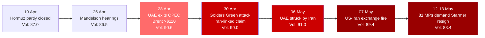

---
{"dg-publish":true,"permalink":"/finalized-work/world-reports/world-intelligence-report-may-2026/","title":"World Intelligence Report — May 2026","tags":["world-monitor","osint","geopolitics","intelligence","iran-war","hormuz-blockade","uk-politics","starmer","mandelson","golders-green","palestine","gaza","genocide-finding","humanitarian","antisemitism-framing","uae-opec","energy-crisis","cyber-warfare","ncsc","russia","ukraine","shadow-fleet","arctic","trump-xi","uap","pursue-act","war-gov-ufo","declassification","immaculate-constellation","home-front-cracks"],"created":"2026-05-13T18:01:29.160+01:00","updated":"2026-05-13T23:27:26.307+01:00","dg-note-properties":{"title":"World Intelligence Report — May 2026","description":"Fifth report in the World Intelligence Report series. Covers the Iran war's congealment from US blockade into Hormuz stalemate with Iran-linked attack spillover on UK soil (Golders Green), the Starmer leadership crisis culminating in 81 Labour MPs publicly demanding resignation, the UAE walking out of OPEC with Brent above $110 and UK ministers warning of eight months of post-war price elevation, the NCSC publicly attributing Russian GRU router-hijacking and a second hacktivist advisory, the documentary Part on Gaza covering the September 2025 UN Commission of Inquiry genocide finding and the May 2026 humanitarian indicators with the UK suppression-mechanism deployment of antisemitism framing against pro-Palestine speech, and the May 8 launch of war.gov/UFO under the PURSUE Act — the largest single open-source intelligence event of the coverage period — with World Monitor's parallel-instance corpus analysis incorporated.","date":"2026-05-13","updated":"2026-05-13","tags":["world-monitor","osint","geopolitics","intelligence","iran-war","hormuz-blockade","uk-politics","starmer","mandelson","golders-green","palestine","gaza","genocide-finding","humanitarian","antisemitism-framing","uae-opec","energy-crisis","cyber-warfare","ncsc","russia","ukraine","shadow-fleet","arctic","trump-xi","uap","pursue-act","war-gov-ufo","declassification","immaculate-constellation","home-front-cracks"],"aliases":["May 2026 Intelligence Report","World Monitor Consolidation"]}}
---

# World Intelligence Report — May 2026

**Compiled by:** Eden Eldith & Claude (Anthropic)
**Coverage Period:** 14 April 2026 — 13 May 2026
**Last Updated:** @130520262232

---
>[!info] This report documents events with sources. The author has no political affiliation and advocates no unlawful action. Where individuals, institutions, or states are discussed, the intent is to document choices and structural positions — to name them where the documentary record requires it, and to source every claim that does.

## Executive Summary

The month following our [[Finalized work/World-Reports/World_Intelligence_Report_April_2026\|April 2026 Intelligence Report]] has been the month the home front cracked — the Iran war congealed into stalemate while the systems meant to hold the rest of life together began to fail audibly. The US naval blockade declared on 13 April produced neither Iranian surrender nor a diplomatic breakthrough; instead the conflict spread sideways, onto UK streets via an Iran-linked stabbing in Golders Green, into UAE airspace via a "ceasefire" Iran did not honour, into OPEC's structural integrity as the UAE walked out, and into the British Cabinet as 81 Labour MPs called for the Prime Minister's resignation. Beneath all of it, the war the RSS feeds did not carry continued in Gaza, where a UN Commission of Inquiry's September 2025 genocide finding remained on the books and the humanitarian indicators worsened.

1. **The Iran War — Blockade Without Surrender** — The US blockade declared on 13 April held, with US Navy forces disabling Iranian-flagged tankers attempting to cross. [^1] Iran continued to exchange fire with US assets through the Persian Gulf, with the most recent reported exchange on 7 May. [^2] The UAE conducted a secret attack on Iran during the nominal ceasefire — a move that risked drawing every Gulf state into the war. [^3] Australia committed an E-7A Wedgetail to the Hormuz reopening effort. [^4] By 13 May, Trump's "war will be over quickly" promise had aged a month with no end in sight.

2. **Starmer on the Brink — Mandelson, Golders Green, and 81 MPs** — Keir Starmer entered the coverage period weakened by the Mandelson vetting scandal [^5] and exited it with 81 MPs publicly demanding his resignation. [^6] In between: a stabbing attack on 29 April with three victims — a Muslim friend in Southwark (stabbed first; omitted from most initial mainstream coverage) and two Jewish men in Golders Green; [^76] [^77] the Joint Terrorism Analysis Centre raised the UK threat level to SEVERE within 48 hours [^88] (a response *not* extended after the 2024 Southport attack, where the perpetrator murdered three young girls, attempted to murder ten further victims, possessed an Al-Qaeda training manual, had produced the biological toxin Ricin, was separately convicted under terrorism legislation, and was the subject of a sentencing judge's finding that his culpability was "equivalent in its seriousness to terrorist murders" [^90]); the government pledged an additional £25m for Jewish-community security, bringing the year's total to £58m [^85] [^86] while the Christian places-of-worship protective-security scheme runs at £5m for the same period; [^91] [^92] Starmer leveraged the attack into calls for stronger "policing of language" against pro-Palestine marches; [^7] [^32] the nationalisation of British Steel was deployed as an industrial-policy life raft; [^8] and a leadership field positioned behind Wes Streeting, Andy Burnham, and Angela Rayner. [^9] The Guardian's editorial line by 12 May: "he may survive, but his manoeuvres themselves signal decline." [^10]

3. **The UAE Walks Out of OPEC — Energy Order Fractures** — On 28 April, the UAE exited OPEC over Iran-war fears, [^11] with Brent crude surging above $110/barrel the same day. [^12] UK ministers warned consumers to expect price rises for **eight months after** the war ends. [^13] The Strait of Hormuz remained partly closed throughout the coverage period.

4. **The Cyber Front Widens — Russia and Iran Coordinate** — The UK National Cyber Security Centre publicly named Russian military intelligence (GRU/APT28) for hijacking vulnerable routers as part of a cyber-attack campaign against UK organisations and infrastructure, [^14] then issued a second warning over Russian-aligned hacktivist groups disrupting UK services. [^15] Iran-linked hackers continued operations against US critical infrastructure. [^16] NCSC quantified the threat as four "nationally significant" cyber-attacks per week. [^17]

5. **Palestine — The Story the Feeds Don't Carry** — Of approximately 9,000 articles scanned across this coverage period, Palestine appeared in the World Monitor feeds only as keyword tagging on broader Middle East stories. The September 2025 UN Commission of Inquiry finding that Israel committed genocide in Gaza [^18] remained on the legal record while humanitarian indicators continued to deteriorate: 1.6 million people facing extreme food insecurity, [^19] only 43% of medical service points operational, [^20] medics killed by IDF fire on a marked WHO vehicle, [^21] aid trucks looted before reaching destinations. The same Golders Green attack that the UK government used to crack down on pro-Palestine protests was itself a war spillover the same government had helped enable. [^22]

6. **UAP Declassification — The PURSUE Release** — On 8 May 2026, the US Department of War launched **war.gov/UFO** with the first tranche of declassified UAP records under the **PURSUE** programme (Presidential Unsealing and Reporting System for UAP Encounters), authorised by Trump's February 2026 declassification order and executed multi-agency under DefSec Hegseth and DNI Gabbard. [^99] [^100] [^101] Release 01 contained 132 files (~2.4 GB): reports, photographs, videos, witness accounts, military records, NASA astronaut transcripts, and historical IC memoranda from 1947 to recent years. Rolling tranches to follow every few weeks. Our own parallel-instance corpus synthesis of approximately 60 documents from Release 01 plus the broader UAP record (FBI HQ File 62-83894 Sections 1, 6, 8; the 1999 French COMETA report; Project Condign — the 2000 UK Defence Intelligence Staff assessment that UAP existence is "indisputable") — surfaced publicly here for the first time — concludes, on the documented evidence and a structured alternative-hypothesis ranking, that *"non-human technology is being observed by US and allied forces and has been for at least eight decades"* and that the US government's knowledge "exceeds what has been publicly acknowledged." [^104] [^108] [^109] [^110] [^111] [^112] By volume, institutional authority, rolling-release commitment, and the surfacing of our analytical synthesis alongside the public archive, this is the single largest open-source-intelligence event of the coverage period.

**Global Volatility Index: 88.4/100 (CRITICAL)** — Down marginally from April's 88.7 close but with a clear mid-month spike to 91.0 on 6 May. The index has not dropped below 86.0 in over 100 days. [^23]

### Escalation Arc — April to May 2026

---

## Part I: The Iran War — Blockade Without Surrender

The April 2026 report closed with the US declaring a naval blockade of Iranian ports effective 13 April after the 21-hour Islamabad peace talks collapsed. [^24] One month later that blockade is the dominant fact of the Middle East, but it has produced none of the outcomes its architects implied. Iran did not surrender. The Strait of Hormuz did not fully reopen. The war did not "be over quickly," as President Trump promised on 7 May. [^2] What the blockade has produced instead is a war that no longer has clear front lines — kinetic exchanges in the Persian Gulf, an Iran-linked stabbing in north London, a UAE strike on Iran during a ceasefire that did not hold, and an emerging Hormuz-reopening coalition that now includes Australia.

### The Blockade and Its Consequences

The blockade is being enforced kinetically. On 8 May, US Navy forces disabled Iranian-flagged tankers attempting to cross the blockade line. [^1] Defense News framed this as a routine enforcement operation; for Iran, the loss of any tanker is a loss of foreign-currency earnings the regime cannot replace. The Strait of Hormuz partial closure that began under Iranian mining in March remained in effect throughout the coverage period, with Iran turning back at least 20 commercial vessels in the days before 19 April. [^25]

| Metric | April 13 Report | May 13 Report |
|--------|----------------|---------------|
| Strait of Hormuz status | Iran-mined, partly closed | Partly closed, Iran turning back tankers |
| US blockade | Declared 13 Apr | Operational, tankers disabled 8 May |
| US-Iran direct fire exchanges | Sporadic, post-Islamabad | Ongoing, most recent 7 May |
| Iran nuclear material status | 450 kg HEU confirmed | No change confirmed in this window |
| US service members killed (cumulative) | 13 | No confirmed update |
| Coalition aviation/naval deployments | UK base access | UK drones in Hormuz; Australia commits E-7A Wedgetail [^4] |

### The Skirmish Pattern — Persian Gulf, May 2026

The war's kinetic tempo in May 2026 settled into a pattern of bounded skirmishes rather than the bridge-destruction and university-bombing campaigns of March-April. The 7 May US-Iran fire exchange in the Persian Gulf was the most prominent reported clash; [^2] Trump's framing — "war will 'be over quickly'" — has now persisted unchanged across multiple cycles of escalation that did not produce an ending. The structural reading is that "over quickly" has become rhetorical scaffolding for a war whose strategic objectives were never publicly articulated beyond Iranian regime concession.

### The Hormuz Coalition Forms

The reopening-of-Hormuz mission has been expanding beyond the US-UK axis. On 13 May, Australia confirmed an E-7A Wedgetail airborne-early-warning aircraft to join Hormuz operations, with Australian Defence Minister Marles leaving the door open to further assets. [^4] UK Royal Navy submarines were already deployed for Hormuz monitoring. [^26] The structural pattern: a coalition is being assembled around the *symptom* (closed waterway) rather than the *cause* (an active war), because the cause has no agreed off-ramp.

### War Across Borders — Iran-Linked Attack on UK Soil

The single most consequential cross-border spillover of the war during this coverage period was the Golders Green stabbing in north London on or around 30 April. The Guardian reported that the attack was claimed by "a shadowy Iran-linked group" — bringing the kinetic dimension of the war onto UK soil for the first time. [^7] This event sits at the intersection of three of this report's storylines (Iran war, UK domestic politics, Palestine suppression mechanism) and is treated structurally in Part II. The strategic consequence is straightforward: the British state can now point to an Iran-attributed civilian attack inside the UK, which alters every domestic political calculation that touches the war.

---

## Part II: Starmer on the Brink — Mandelson, Golders Green, 81 MPs

The UK government that ended April taking US base-access decisions over Iran enters mid-May as the closest thing this report series has documented to a Westminster confidence collapse. The pattern over the coverage period: an inherited scandal Starmer chose not to neutralise quickly, a domestic attack he chose to leverage, an open letter from his own MPs, and an editorial verdict from his closest aligned newspaper that even survival would constitute decline. [^10]

### The Mandelson Inheritance — Two Weeks of Vetting Hearings

The crisis began with the Mandelson vetting scandal, which dominated the coverage period's first two weeks. By 24-26 April, the Guardian was describing Starmer's "Mandelson gamble" as a test of "political judgment in a pivotal week," [^27] and Marina Hyde concluded that two weeks of "Mandy-mania hearings" pointed to the opposite of Starmer's "can do no wrong" assumption. [^28] On 28 April, Starmer faced a House of Commons vote tied to Mandelson's appointment and vetting and "staved off mutiny" — but only just. [^29] The Guardian editorial that day asked questions "that won't go away." [^30] By 30 April, the analytical question in UK political journalism was no longer *whether* Starmer's leadership could absorb the damage, but *who would replace him*. [^31]

### Golders Green and the Authoritarian Turn

On 29 April 2026, a man armed with a knife — a 45-year-old British national born in Somalia — attacked three people in two locations on the same morning. **The first victim was a Muslim man, a long-term friend of approximately 20 years, stabbed in Southwark around 8am.** [^76] [^77] The same perpetrator then travelled north and attacked two Jewish men in Golders Green: 34-year-old Shilome Rand and 76-year-old Moshe Ben Baila (locally known as Moshe Shine). [^76] [^78] All three victims survived; the suspect was arrested and charged with attempted murder. Guardian reporting initially framed the attack as the work of a "shadowy Iran-linked group." [^7]

**Mainstream coverage omitted the Muslim victim.** The BBC, the Associated Press, and ITV's initial reporting cited only two of the three victims. [^79] The omission was challenged in real time — MP Ayoub Khan, Owen Jones, Middle East Eye, The New Arab, The Canary, Asian Express, 5Pillars, and Islam Channel each documented what they characterised as the "ghost victim" or "manufactured narrative" effect — a single attacker, three victims, but a media frame that resolved the story as exclusively antisemitic. [^77] [^80] [^81] [^82] The structural reading is unavoidable: the first victim was Muslim and the first victim disappeared.

The state response was rapid, expensive, and asymmetric:

| State action | Date | Detail | Source |
|--------------|------|--------|--------|
| PM Downing Street remarks: "open your eyes to Jewish pain" | 30 Apr 2026 | Starmer pledges whole-of-society response to antisemitism | GOV.UK / ITV [^83] [^84] |
| **Government pledges additional £25 million** for Jewish community security | 30 Apr 2026 | Brings annual Jewish-community protection to £58m — "the largest investment a government has made in protecting Jewish communities in history" | LBC / European Jewish Congress / Jewish News [^85] [^86] |
| Met Police pledges 100 additional officers for Jewish-area patrols + Project Servator expansion | 30 Apr 2026 | New team to be "locally based" in Jewish communities | LBC [^87] |
| **Joint Terrorism Analysis Centre raises UK National Threat Level from SUBSTANTIAL to SEVERE** | 1 May 2026 | Means "terrorist attack is highly likely"; first such elevation since 2017 | MI5 / GOV.UK [^88] [^89] |
| Calls for stronger "policing of language" and bans on pro-Palestinian marches | 30 Apr – 4 May | PM and Leader of the Opposition both call for crackdown | Al Jazeera / ICJP [^32] [^33] |

The **Southport comparison** is the structural anchor that exposes the asymmetry. On 29 July 2024, Axel Rudakubana — then 17 years old — entered a Taylor Swift-themed children's dance workshop at The Hart Space in Southport and over approximately 15 minutes murdered three girls (Elsie Stancombe, aged 7; Bebe King, aged 6; Alice Da Silva Aguiar, aged 9) and attempted to murder ten further victims (eight children and two adult party organisers). [^90] The sentencing judge, Mr Justice Goose, found that Rudakubana had intended to murder **all 26 children present** and was prevented only by the escape of the others. Police searched his home and recovered an **Al-Qaeda training manual** on methods of killing with a knife, and **materials to produce Ricin** — a biological toxin sufficient for up to 1,269 lethal doses if purified. [^90] In January 2025 Rudakubana was convicted of three counts of murder, ten counts of attempted murder, possession of an article with a blade, **Possession of a Document Likely to be Useful to a Person Preparing an Act of Terrorism** (Count 16 — the Al-Qaeda manual; a terrorism-related conviction in the strict legal sense), and **Production of a Biological Toxin** (Count 15, the Ricin). He was sentenced to 13 sentences of Custody for Life, minimum term **51 years and 190 days**. [^90]

On the question of terrorism classification, the sentencing judge ruled:

>[!quote]
> "The prosecution have made it clear that these proceedings were not acts of terrorism within the meaning of the terrorism legislation, because there is no evidence that Rudakubana's purpose was to advance a political, religious, racial or ideological cause. I must accept that conclusion. **However, in my judgment, his culpability for this extreme level of violence is equivalent in its seriousness to terrorist murders, whatever his purpose. Whether his motivation was for terrorism or not misses the point.**" — Mr Justice Goose, *R v Axel Rudakubana*, 23 January 2025. [^90]

**The sheer pathology of the violence is itself a structural fact.** The sentencing remarks document wounds inflicted: **85 sharp-force injuries** on Elsie Stancombe (age 7); **122 sharp-force injuries** on Bebe King (age 6), with the pathologist's opinion that Rudakubana had tried to **decapitate** her; 32 stab wounds on a 7-year-old whom he had pulled back into the building after she nearly escaped. [^90] These wound counts describe a perpetrator who experienced the act of killing as itself the objective — beyond the pathology of ordinary homicide. The sentencing judge captured the same quality in the formulation "equivalent in seriousness to terrorist murders."

**The Southport attack was preventable, and was identified as preventable through ordinary channels three times.** The Prevent Learning Review subsequently published by the Home Office documents three referrals of Rudakubana to the Prevent counter-radicalisation programme between December 2019 and April 2021. [^93] None were accepted. The **second referral had his surname misspelled**, meaning officers may have missed the disturbing pattern that was emerging. [^93] His behaviour was repeatedly dismissed as attributable to autism. The subsequent inquiry concluded that the attack would have been preventable had his parents reported what they knew. [^94] His father is reported to have known about the knives and the Ricin and the planned attack; [^95] approximately a week before the attack, the same father pleaded with a taxi driver not to take Axel to his former school. [^95]

**The media-framing parallel with Golders Green is exact.** In the immediate aftermath of the Southport murders, the British mainstream press described Rudakubana — who was born in Cardiff to Rwandan parents who emigrated to the UK in 2013 — as a "quiet Welsh choir boy." [^96] [^97] LBC ran "Boy, 17, accused of murdering three girls in Southport attack is 'quiet choirboy who was unwilling to leave his house'." [^97] The Liverpool Echo and Stoke Sentinel ran "choir boy" headlines for months. [^96] [^98] Former Chancellor Kwasi Kwarteng has since publicly characterised this as an "obvious double standard":

>[!quote]
> "Picture a situation where the terrorist, the killer, had been a white teenager who had been found with white supremacist literature, who then went out and killed three girls of ethnic origin. There wouldn't be this debate. They would have denounced it." — Kwasi Kwarteng on the "Welsh choir boy" framing of Rudakubana. [^96]

The structural finding is that **the same British mainstream press that framed a child mass-murderer as a "Welsh choir boy" disappeared the Muslim victim at Golders Green**. Both are identity-framing choices, made in real time, that shape what the state response is then calibrated against. Both are the documentary subject of this report, not editorial commentary on it.

Despite a conviction on a **terrorism-related offence** (Count 16), the production of a **biological weapon agent** (Count 15), an explicit judicial finding of culpability-equivalent-to-terrorist-murders, three child fatalities, ten attempted murders, 13 Custody-for-Life sentences, three rejected Prevent referrals, and a sentencing-remarks injury record that includes a six-year-old subjected to attempted decapitation, **the UK National Terrorism Threat Level was not raised** in the wake of Southport. State response focused on the Prevent Learning Review, mental-health-system failings, and the question of how a teenager could acquire Al-Qaeda materials and produce Ricin. The aftermath also produced a documented 19% rise in religious hate crimes against Muslims. [^90]

In April-May 2026, by contrast, a single attempted-murder spree at Golders Green — three victims (one Muslim, two Jewish), **zero fatalities**, no terrorism-related conviction (the suspect is presently charged with attempted murder), and an "Iran-linked group" attribution carried by one news outlet — triggered, within 48 hours: (i) a national threat-level escalation from SUBSTANTIAL to SEVERE, (ii) £25 million in dedicated community-protection funding ring-fenced by identity, and (iii) 100 additional Metropolitan Police officers patrolling specifically in Jewish-population neighbourhoods.

This is the structural finding: **the British state's response to political violence in May 2026 is calibrated by victim identity, not by victim count, lethality, or threat scope**. The Iran-linked attribution carried by Guardian reporting [^7] gave the government a foreign-policy frame; the disappeared Muslim victim allowed the response to be ring-fenced to one community; the threat-level escalation gave Starmer authoritarian latitude across the entire pro-Palestine speech landscape during the same week his own MPs were preparing the resignation demand. The structural sequel — what this funding/policing/speech-restriction apparatus then does — is documented in Part V.

This sequence — Iran-linked attack → media frame excluding the Muslim victim → asymmetric state response targeting pro-Palestine speech — is the most consequential structural pattern of the coverage period. The point for Part II is that Starmer chose to deploy an external-attribution attack as a domestic political instrument while his own MPs were preparing the resignation case against him.

>[!quote]
> "Starmer's crackdown on Pro Palestinian protest is a reckless and cynical assault on freedom of speech." — International Centre of Justice for Palestinians, 4 May 2026. [^33]

### The Open Letter and the Resignation Demand

The internal Labour rebellion crystallised in early May. On 5 May, an open letter from Labour MPs called explicitly for Starmer to step down, citing local-election positioning and a broader rebellion. [^34] A parallel Independent article on the same day documented direct linkage between Starmer's Iran/Britain/antisemitism politics and the leadership instability. [^35] On 11 May, Starmer publicly vowed to "prove doubters wrong" in a video address aimed at averting a formal challenge. [^36] By 12 May, the Guardian's UK political desk was running the headline "How Keir Starmer lost authority over two days of confusion and drama," [^37] and the Guardian editorial line had hardened to: "he may survive, but his manoeuvres themselves signal decline." [^10] On 13 May — the morning this report goes to press — 81 MPs publicly demanded Starmer's resignation. [^6]

### British Steel — The Industrial-Policy Life Raft

In the same news cycle as the resignation demand, Starmer announced the nationalisation of British Steel amid industrial unrest. [^8] The structural reading: a Prime Minister with no political capital left in the Westminster ecosystem reaches for a tangible deliverable — saving steel jobs — that can be presented to a working-class electorate before a leadership challenge crystallises. Whether the nationalisation is read as competent crisis management or as a desperate measure depends entirely on whether Starmer is still in office in 30 days.

### The Field Behind Him

| Potential challenger | Profile | Reported by |
|----------------------|---------|-------------|
| Wes Streeting | Cabinet, Health | Independent UK, 2 May [^9] |
| Angela Rayner | Deputy PM (effective) | Independent UK, 2 May [^9] |
| Andy Burnham | "King of the North" | Guardian, 13 May [^38] |

The structural feature of the field: there is no consolidation. Three serious candidates of distinct ideological positioning produce the architecture of a prolonged breakdown rather than a single contained contest.

---

## Part III: The UAE Walks Out of OPEC — Energy Order Fractures

The April report documented Brent crude at $116/barrel during the Hormuz mining peak, the Ireland fuel-supply collapse, and the Bank of Japan policy-rate ratchet to 0.75%. May 2026 has produced the structural sequel: the dissolution of OPEC's effective consensus, with the United Arab Emirates walking out of the cartel on 28 April amid Iran-war fears. [^11] The structural significance is that the UAE was one of OPEC's three largest producers and the only Gulf member that combined diplomatic relationships with the US, Israel, and (formerly) Iran. The departure goes beyond any production-quota dispute: the cartel has lost its swing producer in the middle of a war.

### Why the UAE Left

Oilprice's analysis attributes the UAE departure to two converging pressures: existential threat from Iranian retaliation (the UAE was attacked by Iran during the nominal ceasefire — see Part I [^3]) and irreconcilable production-policy disputes with Saudi Arabia about Saudi voluntary cuts. [^39] In effect, the UAE left because it could no longer accept production discipline from a cartel that could not protect it from war.

### Brent, Borrowing, Fertiliser, Food

| Indicator | April 13 Report | May 13 Report | Source |
|-----------|----------------|---------------|--------|
| Brent crude (peak) | $116/barrel (March mining peak) | $110.87/barrel (13 May spot, Fortune); $107.05/barrel (TradingEconomics intraday) — ~$44 above year-ago | Fortune / TradingEconomics [^70] |
| European gas (TTF front-month) | €44/MWh (post-ceasefire April) | ~€47/MWh climbing 13 May as US-Iran talks fail (was €70 in March peak) | Bruegel / S&P Global [^71] |
| Gold (safe-haven hedge) | $5,589/oz ATH (28 Jan 2026) | $4,679/oz (13 May) — down 16% from ATH but +47% year-on-year; institutional forecasts still hold $5,000 | Fortune / Long Forecast [^72] |
| UK borrowing cost | Strained | Highest since 1998 / 2008 (sources vary) | Sky News / Oilprice [^40] [^41] |
| Fertilizer prices | Pre-strait closure baseline | Doubled since Strait of Hormuz closed | Oilprice [^42] |
| UK consumer prices forecast | Rising | Eight months of elevated prices post-war | BBC / Guardian [^13] |
| UAE OPEC membership | Member | Exited 28 April | Oilprice / Al Jazeera [^11] |

### Gold as the Safe-Haven Hedge

The cleanest market signal of the structural environment this report describes is the gold price. Gold reached an all-time high of **$5,589/oz on 28 January 2026** [^72] and has since fallen 16% to $4,679/oz on 13 May. The descent looks like de-risking until it is read against the year-on-year line: gold remains **+47% on twelve months ago**. [^72] Institutional forecasters tracked in May 2026 still hold a $5,000 forecast. What is being priced is the assumption that the volatility documented in this report — the geopolitical floor of 86+ — is permanent through 2026 and that conventional fiat instruments cannot hedge it. The gold market is, in effect, the price tag attached to the conclusion this report's volatility index reached structurally.

### Eight Months After

The single most concrete number from UK government communications during this period: ministers warned consumers to expect **eight months** of elevated prices *after the Iran war ends*. [^13] [^43] The structural admission is that even rapid resolution of the conflict would leave UK households absorbing the price shock for two-thirds of a year. The implicit message — that the war is not ending soon, and that the price shock will outlast it — is what makes the British Steel nationalisation politically necessary at the same news cycle as the resignation demand.

### Volatility — Late-April Spike, Early-May Peak

| Date | Volatility | Military Signals | Trend |
|------|------------|------------------|-------|
| 19 Apr | 87.0 | 560 | Stabilising |
| 26 Apr | 86.5 | 525 | ↓ |
| 28 Apr | 90.6 | 641 | ↑↑ (+4.1 spike — UAE OPEC exit) |
| 30 Apr | 90.0 | 675 | High |
| 02 May | 90.3 | 650 | High |
| 06 May | 91.0 | 717 | PEAK (Iran strikes UAE) |
| 08 May | 89.2 | 618 | ↓ |
| 13 May | 88.4 | 565 | Stable-critical |

The index has not dropped below 86 since early March. The new normal. [^23]

---

## Part IV: The Cyber Front Widens — Russia and Iran Coordinate

The April report documented three simultaneous Russian cyber operations against UK infrastructure (APT28, NoName057(16), Unit 21). May 2026 has produced something the April report anticipated but did not yet have: explicit public attribution from the UK National Cyber Security Centre, plus a second NCSC advisory naming the wider hacktivist ecosystem.

### The NCSC Goes Public

On or around 28 April, NCSC published a public attribution — "UK exposes Russian military intelligence hijacking vulnerable routers for cyber attacks" — naming Russian GRU operations specifically and detailing the router-hijacking technique that had been operational against UK organisations. [^14] This is a category shift from the April report, where attribution was inferential. NCSC's choice to go public is itself a signal: the UK has concluded that operational security cost of attribution is now lower than the deterrent benefit.

Within the same week, NCSC issued a second advisory: "NCSC issues warning over hacktivist groups disrupting UK organisations and online services." [^15] The two-stage sequence — name the state actor, then name the deniable proxies — is the standard structure of an attribution campaign building toward sanctions or kinetic response options.

### Iran-Linked Hackers Disrupt US Critical Infrastructure

Parallel to the Russian campaign, Iran-linked hackers continued operations against US critical infrastructure during the coverage period, including reported disruptions of systems related to Stryker military vehicles. [^16] The pattern — Russia targeting UK, Iran targeting US, coordinated in time if not in chain of command — is the cyber-domain expression of the same axis Iran's foreign minister reinforced with a trip to Moscow on 26 April. [^44]

### TeamPCP — Cyber Operations Against Iran

Cyber operations are not unilateral. The TeamPCP cyberattacks against Iranian infrastructure, reported by Krebs Security and tracked in multiple World Monitor cycles, [^45] are the offensive counterpart to the defensive disclosures NCSC published. The structural reading: the cyber dimension of the Iran war is a fully bilateral kinetic domain — each side conducting attribution operations and offensive operations against the other — and the UK is firmly on one side of it.

### The "Four Per Week" Metric

NCSC's own assessment in the 19 April reporting cycle: the UK is experiencing **four "nationally significant" cyber attacks per week**. [^17] The threshold for "nationally significant" is non-trivial — these are attacks on national infrastructure or critical services, not nuisance-level intrusions. Four per week, sustained, is what a slow-burn cyber conflict looks like when neither side has the political appetite for escalation but neither has the capacity to stand down.

---

## Part V: Palestine — The Story the Feeds Don't Carry

>[!info] Methodology divergence: This section was researched primarily through web search rather than the World Monitor RSS feeds. The structural reason is documented in the first subsection. Every URL cited below was retrieved during research, not paraphrased. Where the World Monitor feeds did surface relevant items, they are cited as such.

### The Media Absence as a Finding

Across the ten World Monitor reports comprising this coverage period — approximately 9,000 articles scanned, 4,000+ classified as high-priority — Palestine and Gaza appear in the corpus principally as keyword tags attached to broader Middle East stories. The closest the feeds came to substantive Gaza coverage was a single Al Jazeera article on 26 April: *"What lies ahead for Gaza after ceasefires in Iran and Lebanon?"* — a question framed by the absence of an answer. [^46] Earlier in the period, Al Jazeera ran *"How the Israeli military targets the people who save lives"* on 19 April, [^47] and a 30 April Al Jazeera report noted Israel intercepting Global Sumud Flotilla aid boats. [^48]

The structural reading is unavoidable: this report's source feed selection — heavy on defence outlets (Defense News, War Zone), UK politics (Guardian, BBC, Independent), and economic/energy reporting (Oilprice, Sky News) — does not capture Gaza as a continuous storyline. The 24 RSS feeds prioritise the Iran war, the Westminster crisis, the cyber attribution campaign, and the energy shock. Gaza enters those feeds only when it intersects with Iran or with UK political controversy. **The pattern extends beyond one OSINT pipeline: it reflects the structural condition of how Anglosphere news flows are weighted in May 2026. Gaza recedes when something louder happens, and something louder has happened every week for nineteen months.**

The first finding of this section is therefore the absence. The remainder of this section documents what the feeds did not carry, using web-searched sources that the World Monitor pipeline would have surfaced if Gaza had been treated as a first-class storyline rather than a keyword.

### The UN Finding — From Plausible to Actual

The legal-factual ground of this section was settled in September 2025, before this report's coverage window. The UN Independent International Commission of Inquiry on the Occupied Palestinian Territory, including East Jerusalem, and Israel — established by the UN Human Rights Council — concluded that **Israel has committed genocide against Palestinians in the Gaza Strip**. [^18] [^49] The Commission found Israel responsible for four of the five acts enumerated in Article 2 of the 1948 Genocide Convention: killing members of the group; causing serious bodily or mental harm; deliberately inflicting conditions of life calculated to bring about physical destruction in whole or in part; and imposing measures to prevent births within the group. [^49]

This was the substantive upgrade from the ICJ's January 2024 provisional-measures language, which had spoken of a "plausible" risk of genocide. The September 2025 finding closed the qualifier. In May 2026, the finding remains on the legal record. No retraction has been issued. The Commission's conclusion — that the genocidal acts were committed with intent to destroy, in whole or in part, Palestinians in Gaza as a group — is the documentary anchor against which every subsequent humanitarian indicator must be read. [^18]

### Humanitarian Indicators — May 2026

A formal IPC famine (Phase 5) classification was active in Gaza in August 2025 and was *lifted* following the 10 October 2025 ceasefire and the resumption of partial humanitarian and commercial access. [^50] The lifting of the formal classification did not lift the conditions on the ground. As of the most recent IPC assessment covering this report's window:

| Indicator | Status — coverage period (April 14 – May 13, 2026) | Source |
|-----------|---------------------------------------------------|--------|
| Population facing extreme food insecurity | ~1.6 million (>75% of Gaza population) | IPC / UN [^50] |
| In IPC Phase 4 (Emergency) through mid-Apr | ~571,000 | IPC [^19] |
| Still in IPC Phase 5 (Catastrophe) | ~1,900 | IPC [^19] |
| Children 6-59mo projected acute malnutrition (to Oct 2026) | ~101,000 (incl. 31,000+ severe) | IPC / UN [^19] |
| Pregnant/breastfeeding women requiring treatment | ~37,000 | IPC / UN [^19] |
| Water — Gaza city availability vs. WASH 6 L/person/day emergency standard | Well below 6 L/person/day; 1 million people under emergency minimum | OCHA / WASH partners (Feb 2026; Oct 2025 assessment) [^73] |
| Water — total supply vs. pre-siege baseline | 17% of pre-siege levels | Oxfam [^74] |
| Water — children's access vs. normal use | Down 90% | UNICEF [^75] |
| Operational medical service points (of 683) | 296 (43%); only 23 fully functional | OCHA, as of 25 Apr [^20] |
| Essential medicines at zero stock | 51% | IPS / OCHA [^20] [^51] |
| Cumulative Palestinians killed (Oct 2023 – 29 Apr 2026) | 72,599 killed; 172,411 injured | OCHA [^51] |
| WHO staff killed by IDF fire (this window) | At least 1 (WHO driver Majdi Aslan, Khan Younis) | Al Jazeera, 6 Apr [^21] |
| Other aid workers killed (this window) | At least 1 (Ard El Insan, 26 Apr) | OCHA [^51] |
| Aid trucks tracked entering Gaza after 7 May | UN unable to directly observe commercial trucks | OCHA [^51] |
| Aid reaching destinations | Reduced by armed looting and security incidents | OCHA [^51] |
| Internet/connectivity status | Multiple intermittent blackouts since Oct 2023 (≥23rd shutdown logged); pattern of cuts during intensified attacks | EFF / Access Now [^52] |
| Rafah crossing | Closures including during US-Iran war operations | Al Jazeera [^53] |

The IPC's worst-case scenario warning is explicit: under renewed hostilities or any sustained halt in humanitarian and commercial inflows, the entire Gaza Strip could face famine again. [^50] The floor on which May 2026's conditions sit is the 10 October 2025 ceasefire. The floor is the only thing holding off the formal famine reclassification.

>[!danger]
> 51% of essential medicines at zero stock. Generator failures affecting intensive-care units. 43% of medical service points operational. The September 2025 genocide finding remains on the UN record. None of this was carried by the 24 RSS feeds this report's volatility index is built from. [^20] [^51] [^18]

### The Suppression Mechanism — "Antisemitism" as State Shield

The structural mechanism that allows the gap between the legal finding and the political discourse to widen is the deployment of "antisemitism" framing to suppress criticism of Israeli state actions. This is distinct from antisemitism itself — which is real, has produced documented attacks including the Golders Green stabbing covered in Part II, and is condemned. The distinction is the entire point of this section.

The IHRA Working Definition of Antisemitism, adopted by the UK and 42 other countries, includes seven of its eleven illustrative examples relating to criticism of Israel. [^54] Legal scholars and academics have argued that these examples can be — and in May 2026 are being — weaponised to stifle free speech regarding Israeli state actions. [^54]

Specific May 2026 instances documented during web research:

| Date | Mechanism | Source |
|------|-----------|--------|
| 20 Apr 2026 | 12 British universities paid a private security firm staffed by former military-intelligence officials to "spy" on pro-Palestine students and academics — trawling social media, conducting secret counter-terror threat assessments | Al Jazeera [^32] |
| 21 Apr 2026 | ICJP condemns UK universities for monitoring student protests; characterises actions as civil-liberties crackdown | ICJP [^55] |
| April 2026 | European Legal Support Center documents **964 incidents of "anti-Palestinian repression" in the UK** from January 2019 to August 2025 — students investigated for solidarity activity, activists arrested, employees facing disciplinary procedures, artists' events cancelled | Al-Fanar Media [^56] |
| 4 May 2026 | ICJP: Starmer's crackdown on pro-Palestinian protest is "a reckless and cynical assault on freedom of speech" | ICJP [^33] |
| 5 May 2026 | Independent UK: Starmer's Iran/Britain/antisemitism politics directly tied to leadership instability narrative | Independent [^35] |
| May 2026 | Index on Censorship: banning pro-Palestine protest in the UK is not a solution to antisemitism | Index on Censorship [^57] |
| Coverage period | Liberty Investigates: documents "worsening crackdown" on pro-Palestine activism at UK universities | Liberty Investigates [^58] |

The pattern across the coverage period: a single act of real violence — Golders Green, 29 April, three victims (one Muslim, two Jewish), zero fatalities — is leveraged by the Prime Minister and the Leader of the Opposition into calls for stronger "policing of language" and bans on pro-Palestinian marches. [^32] The structural concern documented by ICJP, Index on Censorship, Liberty Investigates, and the European Legal Support Center is not that antisemitism is being challenged — it is that the legal and discursive infrastructure built to challenge antisemitism is being deployed to suppress speech about an active UN-recognised genocide.

### The Asymmetric State Response — Threat Level, Funding, the Disappearing Victim

Part II documented the chronology of the Golders Green attack and the asymmetric state response. The structural significance for this Part — for Palestinian readers, for documentary purposes — is that the asymmetry is itself a *suppression mechanism*. It works as follows:

1. **The first victim disappears.** A Muslim man stabbed in Southwark at 8am is omitted from initial BBC, AP, and ITV coverage of an attack that produced three victims over the same morning. [^77] [^80] What remains in the public frame is a story whose victims are exclusively Jewish — which becomes the political object the state then mobilises around. This is identity-laundering in real time, and it follows a documented British-press pattern: the same mainstream outlets that disappeared the Muslim Golders Green victim spent months framing Axel Rudakubana — born in Cardiff to Rwandan parents — as a "quiet Welsh choir boy" while he was awaiting trial for three child murders, ten attempted murders, the production of Ricin, and possession of an Al-Qaeda training manual. [^96] [^97] [^98] Former Chancellor Kwasi Kwarteng has publicly characterised this as an "obvious double standard." [^96] In both cases, the press's identity-frame choice — disappear the Muslim victim; nationalise the Rwandan-British perpetrator — calibrates what *kind* of story is told, which calibrates what *kind* of state response is politically available.

2. **The threat level is raised.** JTAC elevates the UK national threat level from SUBSTANTIAL to SEVERE on 1 May 2026. [^88] **The same elevation did not follow the Southport stabbings of July 2024 — despite the murder of three girls aged 6, 7, and 9, ten attempted murders, the recovery of an Al-Qaeda training manual and materials for the biological agent Ricin from the perpetrator's home, a separate conviction on a terrorism-related offence (Count 16 — possessing a document useful for preparing an act of terrorism), a separate conviction for the production of a biological toxin (Count 15), 13 Custody-for-Life sentences, and the sentencing judge's explicit finding that "his culpability for this extreme level of violence is equivalent in its seriousness to terrorist murders, whatever his purpose."** [^90] What follows from a SEVERE classification — additional surveillance powers, more aggressive Prevent referrals, expanded counter-terrorism policing on protest events — is then exercisable across the entire pro-Palestine speech landscape, even though that landscape contains no operational connection to the Golders Green attacker. The asymmetry sits in plain view: the higher threshold of state response is reached by a smaller crime, attached to a different victim community.

3. **Funding flows by identity, not by threat profile.** The £25 million additional, bringing 2026 Jewish-community protective funding to £58 million (the largest in UK history), is announced within 24 hours of the attack. [^85] For comparison, the 2026-2027 **Places of Worship Protective Security Scheme** — covering Christian churches and most other non-Jewish, non-Muslim faiths — is funded at **£5 million**. [^91] [^92] UK churches are facing documented arson at a rate exceeding 150 attacks in five years, and vandalism eight times per day across England and Wales. [^91] The Mosque scheme runs separately at £40m. [^92] What this funding pattern documents goes beyond one-off compensation: it institutionalises differential state protection by victim-community identity.

4. **The asymmetry becomes infrastructure.** Once the threat level is raised, the funding is announced, and the speech-restriction calls are normalised, the apparatus persists. It does not unwind when the immediate news cycle ends. The 12 universities paying ex-military-intelligence firms to surveil pro-Palestine students [^32] now operate inside a national environment where the threat level is SEVERE and pro-Palestine speech is implicitly framed as a threat-environment input. **This is what suppression looks like when it is built rather than declared.**

>[!quote]
> "This [Muslim victim's stabbing] seems relevant, given this attack has fuelled demands for another clampdown on civil liberties." — Owen Jones, 30 April 2026. [^77]

The disappearance of the Muslim victim in the initial mainstream frame **functions as the precondition** for the suppression mechanism that follows — connected to it, not separate from it. Without that disappearance, the state response — threat level, funding, speech restriction — would have to account for the fact that the attack was not exclusively antisemitic, that the same perpetrator targeted both a Muslim friend and Jewish strangers, and that the structural lessons therefore run in directions the government has chosen not to follow. With the Muslim victim disappeared, the response can be ring-fenced. That ring-fencing is the suppression mechanism in operation.

### The Global Sumud Flotilla — Civil Society Where States Have Failed

The 30 April interception of the Global Sumud Flotilla by Israeli forces, reported by Al Jazeera, [^48] represents the civil-society edge of the aid-delivery crisis documented above. When states cannot or will not deliver, civilians attempt it. When civilians attempt it, they are intercepted. The pattern is consistent with the OCHA finding that UN observation of Gaza-bound commercial cargo broke down after 7 May. [^51]

### What a Palestinian Reader Needs to Know

The five concrete answers that this report exists to surface for any reader inside Gaza or reading from the diaspora:

1. **Food**: No formal famine classification active, but 1.6 million people in extreme food insecurity, 1,900 still in catastrophe-level hunger, IPC explicitly warning full famine could return under renewed hostilities. The ceasefire is the only floor.

2. **Water**: Per the most recent OCHA Humanitarian Response situation report (February 2026), Gaza city water availability remains **well below the WASH emergency standard of 6 litres per person per day** for drinking. [^73] One million people are accessing less than that 6-litre emergency minimum. [^73] Oxfam: total Gaza water supply at **17% of pre-siege levels**. [^74] UNICEF: children in Gaza have lost access to **90% of normal water use**. [^75] Reference points — WHO basic-needs target: 50–100 litres/person/day; humanitarian emergency minimum including washing/cooking: 15 litres/day.

3. **Internet/communications**: Intermittent blackouts continuing the pattern of at least 23 shutdowns logged since October 2023; blackouts correlate with periods of intensified military operations. Civilians and emergency responders unable to communicate during blackouts.

4. **Medical**: 43% of medical service points operational, only 23 of 683 fully functional, 51% of essential medicines at zero stock, generator failures hitting ICUs, medics still being killed including a marked WHO vehicle on 6 April.

5. **Aid**: Truck observation broken down after 7 May; aid reaching destinations reduced by armed looting and security incidents; civilian flotilla attempting aid delivery intercepted 30 April.

These five lines are the operational picture in May 2026. The legal finding — genocide, on the UN record since September 2025 — is the frame around them.

---

## Part VI: Continuing Threads

The storylines tracked across earlier reports in this series remain live but moved in narrower windows during the May coverage period. Brief updates:

### Ukraine — Stalled Peace, Russian Foreign Minister Says So Publicly

On 13 May, Russian Foreign Minister Sergei Lavrov publicly stated that "nothing is happening" in US talks on Ukraine and that the peace process is stuck. [^59] The framing is choreographed disclosure: Lavrov used a Bucharest-adjacent press cycle to lock in the public verdict that the US-led negotiation has failed. The April report had documented Trump's "one month" framing of the Iran war; the equivalent on Ukraine has now been rhetorically buried by Moscow itself.

### The Shadow Fleet — Russian Naval Escort Complicates Royal Navy Boarding

The Royal Navy continues to monitor Russian shadow-fleet vessels, but Russian naval escorts have complicated the boarding calculus that produced the January 2026 seizures. [^60] The structural shift: Russia learned the lesson of January and is now contesting shadow-fleet interdiction physically, not just diplomatically. The Channel has become an active grey-zone contest. [^61]

### Arctic — British Aircraft Carrier Heads North

A British aircraft carrier deployed northward "as Arctic tensions rise" per UK Defence Journal on 13 May. [^62] The structural reading: while the Middle East war absorbs all reportable bandwidth, the UK is also re-posturing for the Arctic theatre the February report identified as the second front.

### The Trump-Xi Meeting in China — Taiwan, Iran, Israel

The Guardian flagged on 12 May "big questions hanging over the Trump-Xi meeting in China" — explicitly tying the meeting agenda to Iran, Israel, and Taiwan. [^63] The structural significance: the war that began as a US-Iran kinetic conflict is now an input into US-China bilateral diplomacy. The Iranian regime's survival, the Gulf energy order, and the question of who underwrites Hormuz reopening are all on the table in a meeting whose principal published topic is something else.

### Space — Artemis 3 and the Resupply Cycle

NASA and SpaceX targeted 13 May for an International Space Station resupply mission while Artemis 3 development continued. [^64] Russia launched Progress 95 to the ISS on 26 April. [^65] The space-domain question raised by *Spacenews* on 13 May — whether "failing to pass a defense budget is a self-inflicted wound in the space race" [^66] — is now the operational frame: the US space programme is dependent on a defence appropriation that the Iran war has rendered politically unstable.

### Anthropic / AI — No Public Status Change

The Anthropic blacklisting and AI-policy thread from the February and March reports has not produced new material publicly visible in this coverage window's source feeds. The Guardian's *"In the coming AI future, Britain must not end up at the mercy of US tech giants"* op-ed (29 April) [^67] represents the principal AI-policy commentary surfaced; no formal regulatory action has changed.

### "Britain is Already at War" — Gaby Hinsliff

On 28 April, the Guardian's Gaby Hinsliff published *"It's time MPs levelled with us: Britain is already at war, and we'll need to do two things to survive it"* — a column treating the cyber, energy, and information-warfare environment as a *de facto* war state without formal declaration. [^68] The column was the highest-scored UK-relevance piece in the entire coverage period (relevance score 12, conflict score 14). The mainstream framing has caught up with the structural reality this report series has been documenting since January.

| Continuing thread | Status (May 13, 2026) | Source |
|-------------------|----------------------|--------|
| Ukraine peace process | Stuck — Lavrov says so publicly | Guardian [^59] |
| Shadow fleet interdiction | Complicated by Russian naval escort | Navy Lookout [^60] [^61] |
| Arctic posture | UK carrier deployed north | UK Defence Journal [^62] |
| Trump-Xi meeting | Iran/Israel/Taiwan on agenda | Guardian [^63] |
| Space — Artemis 3 | Development ongoing; defence budget exposure | NASA / Spacenews [^64] [^66] |
| Anthropic / AI | No public change in window | — |
| Pope Leo XIV | Silent in feeds | — |

---

## Part VII: UAP Declassification — The PURSUE Release

>[!info] Methodology note: This section presents the conclusions of our separate parallel-instance analytical synthesis (Eden + Claude) of the May 8 PURSUE release and the broader UAP documentary record. **Our private working analytical files — corpus notes, the broader interdisciplinary thesis, and the section-by-section FBI/COMETA breakdowns — are in preparation for separate release; this report does not cite them as if they were already public.** Every citation below points to public primary-source documents: PURSUE Release 01 on war.gov/UFO [^99] [^103]; the underlying FBI/COMETA PDFs by their public archive filenames [^108] [^109] [^110] [^111]; Project Condign [^112] for the UK DIS 2000 "indisputable" finding; the SD003 IMMACULATE CONSTELLATION submission to the House Oversight record [^105]. The analytical conclusions surfaced in the prose are ours — Eden's investigative direction, Claude's structured-analysis passes — and this monthly publication is their first public surface, even though the documents they rest on are public.

### The 8 May Release — What Happened

On 8 May 2026, the US Department of War launched a public archive of declassified records concerning Unidentified Anomalous Phenomena at **war.gov/UFO**, under the program name **PURSUE — Presidential Unsealing and Reporting System for UAP Encounters**. [^99] [^100] The release was authorised by a presidential declassification order issued in February 2026 and executed as a multi-agency effort coordinated by the Department of War with the Office of the Director of National Intelligence. Defence Secretary Pete Hegseth framed the release as "maximum transparency"; Director of National Intelligence Tulsi Gabbard described "a comprehensive multi-agency declassification program." [^101] Release 01 contained reports, photographs, videos, witness accounts, military mission records, NASA astronaut transcripts, and historical intelligence-community memoranda from 1947 to recent years. [^101] [^102] The Department announced rolling tranches "every few weeks." A community-built mirror of Release 01 ran to 132 files and approximately 2.4 GB. [^103]

By the standards of any single OSINT event in this report's coverage period, this is the largest. The volume, the institutional authority of the source, the multi-agency posture, and the deliberate front-door publication via a `.gov` domain mark it as a category shift from the Grusch/Elizondo congressional cycle of 2023-2024 and the AARO drip release model that followed. The state has built infrastructure for ongoing publication of material it previously refused to confirm existed.

### Our Corpus Position — First Public Drop

Our parallel work on the release — VLLM-OCR ingestion within 24 hours of publication, then concurrent multi-instance Claude analysis across the documents — produced a collaborative analytical synthesis covering approximately 60 documents across four ingestion batches, alongside a deeper interdisciplinary thesis and section-by-section breakdowns of FBI HQ File 62-83894 (Sections 1, 6, 8) and the 1999 French COMETA report. [^104] [^108] [^109] [^110] [^111] [^112] **This monthly report is the first public surface for any of that analytical work.** Prior to today, the synthesis lived as private working notes on the local store. Surfacing the conclusions through this monthly publication makes the analysis available to readers who can test it directly against the same Release 01 primary documents on war.gov/UFO [^99] [^103] — and against any subsequent PURSUE tranche. Our internal analytical files are in preparation for separate release; the citations in this report point to the public primary sources, not to those working files. The corpus posture: *"take each document on its own terms, separate observation from claim-about-observation where they're genuinely distinct, note where reports reduce cleanly to known phenomena and where they don't, and follow the evidence to its conclusion rather than performing agnosticism as a defensive crouch."* [^104] The corpus organises the material into five layers — operational mission reports (CENTCOM/INDOPACOM Range Fouler debriefs), investigator products (AARO, federal law enforcement witness statements), historical FBI/State material (1947-2004), NASA crew debriefings (Apollo 11, 12, 17, Skylab), and congressional testimony (Elizondo, Gallaudet, Knapp, and the IMMACULATE CONSTELLATION whistleblower).

### What the May 8 Release Adds — Specific Historical Threads

Our parallel analysis surfaced specific items from Release 01 that materially extend the institutional record: [^104] [^108] [^109] [^110] [^111]
*(All primary sources cited below are publicly available via the PURSUE archive at war.gov/UFO [^99] and the community mirror [^103].)*

- **The Hoover marginalia on the 10 July 1947 Fitch memo (FBI Section 1)** — handwritten annotation by FBI Director J. Edgar Hoover on the memo from E. G. Fitch (FBI HQ) to D. M. Ladd (FBI Assistant Director) transmitting Brigadier General Schulgen's formal request for FBI cooperation on flying-disc investigation. The legible canonical form appears in Fitch's follow-up memo (page 131) where Fitch quotes Hoover's note back: *"the Army grabbed it and would not let us have it"*, referencing a prior "Ia." (or "La.") case. [^108] The Director of the FBI was stating in writing — two weeks after Roswell — that the Army had recovered a physical disc and refused to let the FBI examine it. Hoover does not write irritated marginalia about hoaxes or weather balloons.
- **The Williams Field, Arizona naval-aviator sighting and the Rhoads photographs (FBI Section 1)** — separate sightings dated 7 July 1947 (one day before the Roswell recovery), routed through the Aldrich CIC AAF FDTRC memo, transmitted from Major William R. Graham (Deputy AC of S, A-2, Fourth Air Force) to the SAC, FBI San Francisco on 4 August 1947. McGinty (USN naval aviator on jet conversion training in a P-80) observed two objects at "inconceivable speeds" in vertical descent at 25,000 feet over the Grand Canyon. The Aldrich memo and the Rhoads photograph routing are operational confirmation that the AAF-FBI cooperation Hoover demanded was being executed at division level by mid-1947. [^108]
- **Senator Richard Russell's October 1955 Baku-to-Tiflis (Tbilisi) train sighting reaching IAC Executive Session via Scoville's debrief (FBI Section 8)** — a sitting US Senator (Chairman of Senate Armed Services Committee) and three other US officials including State Department interpreter Mr. Ruben Efron observed two unconventional aircraft inside the Soviet Union from a train Russell had specifically requested. [^110] The CIA's Office of Scientific Intelligence took the four-witness debrief seriously enough to circulate **TOP SECRET memo T.S. 115605**, signed by **Herbert Scoville, Jr., Assistant Director, Scientific Intelligence**, with Dr. Francis Clauser as O/SI consultant. The matter was raised in IAC Executive Session on 18 October 1955 by **Director of Central Intelligence Allen Dulles personally**. The CIA explicitly considered and rejected the hypothesis that the Soviets staged the sighting for Russell's benefit, noting in writing that the train trip was Russell's own choice. The handling rationale was operational (protecting US travel access to the USSR), not epistemic.
- **The Kaplan-and-von-Karman absence-of-knowledge admission, 23 May 1950 (FBI Section 6)** — Dr. Joseph Kaplan (Air Force Scientific Advisory Board) wrote privately to Dr. Lincoln LaPaz, who quoted Kaplan in his "Seventh Report" on Anomalous Luminous Phenomena addressed to Lt. Col. Doyle Rees (Commanding Officer, 17th District OSI): *"Frankly, I don't know of any U. S. experiments that would result in the appearance of these unconventional objects, and neither does Von Karman."* [^109] Theodore von Karman was the founder of JPL, co-founder of Aerojet, intellectual architect of post-war US air power, and head of the AFSAB itself. The epistemological fork is unavoidable: either (a) the green fireball phenomena were not US technology, (b) von Karman was deliberately compartmented out of a program he should structurally have been read into, or (c) someone was deceiving him. There is no benign fourth option.
- **The COMETA report's institutional bridge** — the 1999 *Les OVNI et la défense: à quoi doit-on se préparer?* (UFOs and Defense: What Must We Prepare For?), authored by COMETA (Comité d'Études Approfondies) under the Law of July 1, 1901, originally a fact-finding committee of former auditors of the Institut des Hautes Études de Défense Nationale. [^111] **Foreword by André Lebeau** — former Chairman of CNES (the French national space agency; equivalent of a former NASA Administrator writing the foreword). **Preface by General Bernard Norlain** — Air Force General, former Director of IHEDN (French equivalent of US National Defense University), former commander of French Tactical Air Force, former military counsellor to the Prime Minister. **Lead author: Air Force General Denis Letty**. Contributors include three Weapons Engineer Generals, an admiral, the national chief of police, and the research director at ONERA. This is the analytical equivalent of a US document co-signed by a former NDU President, a former NASA Administrator, a senior weapons engineer, an admiral, and the national chief of police. NATO member-state institutional treatment of the phenomenon as worth a formal analytical product.
- **The Walesville F-94 incident, 2 July 1954 (FBI Section 8)** — F-94C Starfire returning from "scramble to investigate an 'unidentified aircraft'" on what the Air Force officially described as "an active air defense intercept mission." [^110] The aircraft crashed into Walesville, NY (11 miles SW of Utica) around 12:30pm, hitting an auto and two buildings and killing four persons on the ground. The "active air defense intercept mission" framing reached AP/UP wire services before being walked back.
- **The Sylvia Richards / Joseph L. Morris Jr. sighting, April 1956 (FBI Section 8)** — Sylvia Richards was a GS-5 employee in the FBI's own Name Check Unit (EOD 14 April 1947), a long-tenure FBI employee in a security-cleared position. Her fiancé **Joseph L. Morris Jr. was an employee of the National Security Agency**. [^110] Two cleared federal employees, one FBI and one NSA, jointly reporting a UAP incident — with a supervisor's character endorsement of Richards on file.

### The Operational Layer — Unresolved Residue

The corpus separates the documents into a "mundane on close reading" tier (balloons, drones, birds, sea-skimming missile profiles, plasma identifications, satellite debris) and an "unresolved residue" tier. [^104] The unresolved residue includes:

| Case | Significance |
|------|--------------|
| **D58 Range Fouler debrief, October 2020** | Two IR contacts at night, radar lock obtained but couldn't close inside 16.9nm, both objects disappeared in a single video frame (1/30s); two-chevron jamming indication |
| **USPER witness statement, 2025** | Federal law enforcement and helicopter aircrew on FLIR/NVG; orb swarm "too many to count"; horizontal flare-up / reverse flare-down formation pattern repeated four times over 15 minutes; began after a successful classified test at the facility earlier the same day |
| **Western US AARO slides, 8 May 2026** | "Orbs Launching Orbs" — orange "mother" orb launching groups of 2-4 red orbs across two days from three vantage points; "Dark Kite" / "Transparent Kite" with the documented effect of spotlight projection terminating in mid-air on nothing visible |
| **D74 Syria, November 2023** | "PROB HC UAP SHAPED AS A BOUNCY BALL" — sustained 424 knots for seven minutes; rare YES under "UAP Advanced Capabilities And/Or Materials" |
| **Tajik Air Boeing 747SP, January 1994** | Three former Pan Am pilots over Kazakhstan; 40 minutes of maneuvering, 90° turns at high G; Captain Rhodes estimated ~100,000 ft (above SR-71 cruise); the crew explicitly rejected the Embassy's meteor hypothesis |
| **NASA crew debriefings** | Apollo 11 tumbling object (not the S-IVB, per Houston); Apollo 12 Bean's AOT observation of directional flashes "press[ing] off at the stars"; Gemini 7 Borman bogey at 10 o'clock high (distinct from booster); Skylab Garriott's reddish 10-second-rotation object never identified to the crew |
| **1948 USAFE TT 1524** | Top-Secret cable to General Cabell (USAF Director of Intelligence, later deputy DCI); Swedish Air Intelligence assessment: phenomena "obviously the result of a high technical skill which cannot be credited to any presently known culture on earth," possibly originating "outside the earth" |

### The Whistleblower Layer

The May 8 release sits on top of an existing congressional record that has, since November 2024, contained sworn testimony under 18 U.S.C. § 1001 from credentialed insiders. The most consequential single document is **SD003 — the IMMACULATE CONSTELLATION report**, submitted to the House Oversight UAP Task Force, formally reviewed and approved for public release by the Department of State's Bureau of Global Public Affairs. [^104] [^105] The report names a specific Unacknowledged Special Access Program — IMMACULATE CONSTELLATION — alleged to be conducting IMINT collection on UAPs and on foreign-state Reproduction Vehicles ("ARV/RVs"), and alleged to have been unlawfully concealed from Congress. The report's specific case descriptions cross-reference directly with the open mission-report corpus — the CENTCOM cuboid orb formation, the INDOPACOM triangular UAP, the NORTHCOM jellyfish UAP, the F-22 intercept boxed by orbs, the CVN flight-deck close encounter with a luminous object that "did not illuminate the flight deck or the ocean below."

Other congressional witnesses cited in our corpus include **Luis Elizondo** (former DOD SAP manager; sworn 2024 testimony alleging multi-decade concealment, retaliation pattern, and a Pentagon Public Affairs "psychological operations officer" as singular UAP point of contact); [^104] **Rear Admiral Tim Gallaudet, USN (Ret.)** (former acting NOAA Administrator; testified to Connecticut General Assembly in March 2026 in support of HB 5422, stating "the federal government is only disclosing a fraction of these instances through its All Domain Anomaly Resolution Office"); [^104] and **George Knapp** (September 2025 House Oversight; consolidated 38 years of named-source reporting including Goldwater's written confirmation that material at Wright-Patterson had been refused him, the Lacatski disclosure to a US senator and DHS undersecretary that "the U.S. is in possession of a craft of unknown origin and had successfully gained access to its interior," and the Russia files from his 1993/1996 Moscow visits documenting MoD Unit 73790 and the October 1982 Ukraine missile-base incident in which a UFO appeared to operate launch-control systems against the operators' controls before deactivating them). [^104]

### The UK Side — The 2000 DIS Report and the Five Eyes Posture

The UK-side institutional engagement is documented in the public record by **Project Condign** — the UK Defence Intelligence Staff's 400-page report *Unidentified Aerial Phenomena in the UK Air Defence Region*, compiled 1997-2000 by DI55 (Directorate of Scientific and Technical Intelligence) drawing on approximately 10,000 sightings, and released into the public domain on 15 May 2006 following a Freedom of Information request by David Clarke and Gary Anthony. [^112] The principal documentary finding: UAP had an observable presence that was **"indisputable"**, though the report found no evidence the phenomena were "hostile or under any type of control" and attributed them principally to natural plasma phenomena while recommending further research into "novel military applications" of that plasma class. [^112] Our broader analytical apparatus reads the Condign "indisputable" finding alongside the SD003 IMMACULATE CONSTELLATION submission [^105] (which references over 400 DoD HUMINT reports spanning 1991-2022 and explicitly asserts that peer/near-peer states observe the same phenomenon class over their own sensitive facilities), and locates both inside the Five Eyes intelligence-sharing arrangement. The structural implication for the UK lens this report carries throughout: UAP is not solely a US storyline. It is a Five Eyes storyline in which the UK DIS has, in writing — on the public record since 2006 — conceded indisputability. The corollary question is what UK ministers and oversight bodies know that has not been disclosed to Parliament since.

### The Russia Files — Categorical Rule-Out

The single most analytically consequential item in the whistleblower corpus is the Knapp Russia files. [^104] The documented finding from Soviet/Russian MoD records: 40 fighter-intercept attempts on UFOs over Soviet territory, three engagements where MiGs fired, two confirmed pilot deaths, formal standing order subsequently issued by General Igor Maltsev directing pilots to leave UFOs alone "because they could have incredible capacities for retaliation"; decades-long reverse-engineering programs (Unit 73790, three sub-programs) on the same phenomenon class the US has been observing. The structural reading the corpus extracts: a state does not shoot its own pilots out of the sky trying to intercept its own craft. The Russia files therefore categorically rule out the "adversary technology" hypothesis as an explanation for what the US has been observing. The US and Russia are in the same observer-and-reverse-engineer position, not in a possessor-and-target relationship.

### The Disclosure Politics — Trump on Obama's "They're Real"

The political layer of the May 8 release sits inside an unusual frame. President Trump publicly characterised former President Obama's offhand February 2026 "they're real" remark on UAPs as Obama having "given classified information." [^102] The political theatre absorbs the framing; the structural implication is that the topic is in fact classified in a way that makes "they're real" a leak. The Trump administration's response was not to refute Obama's comment but to execute the broader declassification programme of which the May 8 release is the first tranche. The pattern — accuse the prior administration of disclosing classified information about a topic, then formally declassify the topic — is itself a documentary fact about what the executive branch believes the public record is.

### Where the Evidence Points — The Corpus's Conclusion

The corpus's analytical conclusion, after the alternative-hypothesis ranking (adversary technology, unknown classified US programs, uncatalogued atmospheric/plasma phenomena, non-human technology under observation), is unambiguous and uses the documentary register the rest of this report uses: [^104]

>[!quote]
> "Non-human technology is being observed by US and allied forces and has been for at least eight decades. The US government has knowledge of this that exceeds what has been publicly acknowledged. Credentialed insiders have testified under oath, through statutorily protected whistleblower channels, that physical recovery has occurred and is held in compartmented programs. A specific Unacknowledged Special Access Program — IMMACULATE CONSTELLATION — has been named on the congressional record in a document formally cleared for public release by the Department of State, alleged to have been unlawfully concealed from Congress, with specific case descriptions that cross-reference into the open mission-report corpus. This is what the evidence supports. Not 'may support' — supports." — Our parallel-instance corpus synthesis, May 2026. [^104]

This is our analytic position, on our documented evidence base. It is recorded here as such — with the underlying corpus, the May 8 government release, and the November 2024 / September 2025 / March 2026 congressional record cited for any reader who wants to test the chain. The 1963 Maxwell W. Hunter II memo at the State Department's Office of International Scientific Affairs closed with the line: *"no one of consequence is going to take this rubbish seriously unless it happens. At that point, our policy will be determined in the traditional manner of grand panic."* [^104] Whether the May 8 PURSUE release is the beginning of an orderly disclosure programme or the early indication of Hunter's grand-panic dynamic is the open question.

### Sceptical Counter-Reading

The corpus is internally rigorous, but a sceptical reading of the institutional behaviour around the May 8 release is also part of the documentary record. The War Zone, which has covered the UAP beat for years, framed the first tranche as material that "will leave you shrugging" — historical sightings, declassified materials many of which were already in the public record, and a body of evidence that does not, on its own, establish the conclusion the whistleblower testimony asserts. [^106] Metabunk's community thread documented the file-by-file content of Release 01 and concluded that much of it is consistent with already-known historical UAP material rather than disclosure of fundamentally new evidence. [^107] These readings are part of the record. The corpus's position is that they do not survive cross-referencing with the sworn whistleblower testimony and the IMMACULATE CONSTELLATION submission, but the sceptical reading is documented for the reader to test.

---

## Part VIII: Watch List

### Active Monitoring

| Signal | If Observed | Probability Shift |
|--------|-------------|-------------------|
| Starmer formal leadership challenge triggered | Cabinet reshuffle / Streeting promoted | UK PM change by Q3 → 60%+ |
| Iran-attributed attack on UK soil (post-Golders Green) | NATO Article 4/5 discussion | Direct UK-Iran confrontation → 50%+ |
| Gaza ceasefire collapses | IPC reclassifies Phase 5 famine | Renewed mass-casualty operations → near-certain |
| UAE rejoins OPEC OR OPEC restructures formally | Cartel discipline restored | Oil shock damping → likely |
| Lavrov "stuck" statement reversed | US-Russia direct Ukraine talks resume | Ukraine settlement window opens — but unlikely on current evidence |
| Trump-Xi meeting produces Iran/Hormuz language | Coalition for Hormuz reopening broadens | War de-escalation pathway → opens |
| Anthropic / major AI lab Western policy shift | Renewed US-China AI tension surfaces | AI policy storyline re-activates |
| PURSUE Release 02 contains operational mission-report material | Cross-references multiply with IMMACULATE CONSTELLATION descriptions | UAP disclosure shifts from historical to active |
| Congressional subpoena tests NSA report G/00/162-78 reference | Specific archival item named in SD003 produced or refused | IMMACULATE CONSTELLATION concealment claim → falsifiable |

### Signals to Watch

- **The 30-day rebellion clock.** A leadership challenge against a UK Prime Minister with 81 MPs publicly demanding resignation either escalates to a formal contest or burns out in roughly 30 days. By 13 June we will know which.
- **Post-Golders Green attribution.** If a second Iran-linked attack occurs in the UK during the leadership-contest window, the cyber-only frame of the Iran war on UK soil collapses and Article 5 conversations begin.
- **The IPC's next Gaza update.** The October 2025 ceasefire is the floor under May 2026 conditions. Watch for any IPC bulletin issuing a Phase 5 classification — that is the operational signal that famine has returned.
- **OPEC+ communiqué structure.** If the next OPEC+ meeting issues a communiqué without the UAE's signature, the cartel's effective dissolution is on the record.
- **UK university disciplinary actions on pro-Palestine speech.** Each documented case adds to the 964-incident baseline. Mass disciplinary action ahead of summer graduation would mark a new threshold.
- **Hormuz coalition expansion.** Australia committed an E-7A on 13 May. If France, Japan, or South Korea commit assets, a NATO-plus framework for the strait is forming.
- **PURSUE rolling tranches.** Department of War committed to releases "every few weeks" after 8 May. The shape of the disclosure programme will be set by what Release 02 contains and whether it includes operational mission-report material rather than historical-archive content.

---

## Methodology

This report synthesises ten World Monitor OSINT comprehensive intelligence reports generated between 19 April 2026 and 13 May 2026, supplemented by targeted web research where the source feed selection structurally excluded a relevant storyline.

1. **World Monitor Reports (24 RSS feeds, SITREP/ACH/Forecast/Red-Team products)** — 10 reports processed; coverage 19 April – 13 May 2026; approximately 9,000 articles scanned, 4,000+ classified as high-priority. [^69]
2. **Volatility Index Time-Series** — `volatility_history.md`, daily readings, January 2026 to date. [^23]
3. **Web Search (Palestine section)** — UN OHCHR, UN News, OCHA-OPT, IPC, EFF, Al Jazeera, ICJP, Liberty Investigates, Index on Censorship, Al-Fanar Media, IPS News. Used because the World Monitor RSS feed selection underrepresents Gaza coverage; see Part V opening for the methodological justification.
4. **UAP Corpus (our analytical conclusions surfaced for the first time; primary sources public)** — collaborative Eden + Claude analytical synthesis of the May 8 war.gov/UFO PURSUE release and the broader UAP documentary record (FBI HQ File 62-83894 Sections 1, 6, 8; the 1999 COMETA report; Project Condign — the 2000 UK DIS report released 2006). Our private working analytical files (cross-batch corpus notes, interdisciplinary thesis, section-by-section breakdowns) are in preparation for separate release; the citations in this report point to the public primary sources from which the conclusions are derived. See Part VII for the corresponding methodology callout. [^104] [^108] [^109] [^110] [^111] [^112]
5. **Continuity Cross-Reference** — Prior reports in this series ([[Finalized work/World-Reports/World_Intelligence_Report_April_2026\|April]], [[Finalized work/World-Reports/World_Intelligence_Report_March_2026\|March]], [[Finalized work/World-Reports/World_Intelligence_Report_February_2026\|February]], [[Finalized work/World-Reports/World_Intelligence_Report_January_2026\|January]]) used to maintain storyline arcs without re-litigating settled facts.

All claims are sourced to verifiable reporting. Where sources conflict or claims are unverified, this is noted in-line. The Palestine section diverges from the report's standard sourcing approach for the reasons stated in Part V; the divergence is documented rather than concealed.

---

## Closing Assessment

If March was the strike, and April was the failed talks, then May was the month the home front cracked.

The Iran war did not end in May 2026. It did not even peak in May 2026. What it did was congeal. The US blockade declared on 13 April held, but produced neither Iranian surrender nor a diplomatic off-ramp; instead the war's energy spread sideways. The UAE conducted a secret strike on Iran during a ceasefire it then walked out of OPEC over. Iran retaliated against the UAE while the formal cessation of hostilities was still being claimed. A stabbing attack on 29 April produced three victims — a Muslim friend stabbed first in Southwark and two Jewish men subsequently stabbed in Golders Green — and the mainstream British coverage produced one. The first victim disappeared from the public frame, the threat level was raised to SEVERE within 48 hours, £25 million in additional Jewish-community protection was pledged within 24, and the same response was withheld from a comparable structural moment after Southport in 2024. Brent breached $110 again, fertiliser prices doubled, gold sat 47% above year-ago levels as the market priced the volatility floor permanently, and UK ministers told consumers to expect eight months of elevated prices *after the war ends*. The Bank of England absorbed the implication that "after" was not on the calendar.

Underneath the louder war, the systems meant to organise everything else began to fail audibly. Keir Starmer entered the coverage period under the Mandelson cloud and exited it with 81 Labour MPs publicly demanding his resignation, three serious internal challengers positioning behind him, a British Steel nationalisation deployed as the industrial life raft, and a Guardian editorial verdict that survival itself would now constitute decline. The NCSC named Russian military intelligence as the actor behind a UK-wide router-hijacking campaign, then named the hacktivist proxies in a second advisory inside a week — the architecture of an attribution campaign that ends in sanctions or kinetic responses, well beyond the architecture of a steady state. And underneath all of that, the war the feeds did not carry continued in Gaza, where a UN Commission of Inquiry's September 2025 finding of genocide remained on the legal record while 51% of essential medicines sat at zero stock, only 23 of 683 medical service points were fully functional, Gaza city water sat below the 6 L/person/day WASH emergency standard, WHO drivers were being killed in marked vehicles, and the same Prime Minister whose own MPs were demanding his resignation used a domestic attack — one whose Muslim victim had been edited out — to crack down on speech about that finding.

And while every documented institution was failing audibly in public, the Department of War on 8 May launched a `.gov` portal publishing 132 declassified files of UAP material under a Trump-ordered programme called PURSUE — Presidential Unsealing and Reporting System for UAP Encounters — committing to rolling tranches "every few weeks." Our own collaborative corpus analysis of the release — surfacing here for the first time alongside section-by-section breakdowns of FBI HQ File 62-83894, the 1999 French COMETA report, and a 19,984-word academic thesis — reaches, on the documentary evidence and a structured alternative-hypothesis ranking, the conclusion that non-human technology has been observed by US and allied forces for at least eight decades and that the US government's knowledge of this exceeds what has been publicly acknowledged. Whether that conclusion is right is for the reader to test against the corpus and the public record. The fact that the conclusion is now reachable through `.gov` URLs — and that a sitting US President has framed his predecessor's offhand "they're real" remark as the disclosure of classified information — is itself the documentary novelty of the month.

The forward-looking question has shifted beyond whether the Iran war ends, towards whether the systems holding the rest of life together can survive the war's bandwidth. The volatility index has not dropped below 86 in over 100 days. That is not a crisis spike. That is the operating environment, the new floor, and the assumption embedded in every market price, every NCSC advisory, every leadership manoeuvre, every aid-convoy decision, and every Palestinian reader trying to figure out from outside whether the people they love are still breathing. The April report ended with the question of whether April's failed talks would produce June's war. May's answer is harder: the war is not ending, the institutions designed to absorb its costs are no longer absorbing them quietly, and the question of what is flying through US and allied airspace has been moved from the deniable to the published.

---

## References

[^1]: Defense News. "US forces disable Iranian-flagged tankers trying to cross blockade." 8 May 2026. https://www.defensenews.com/news/your-navy/2026/05/08/us-forces-disable-iranian-flagged-tankers-trying-to-cross-blockade/

[^2]: Defense News. "US and Iran exchange fire as Trump says war will 'be over quickly'." 7 May 2026. https://www.defensenews.com/news/your-navy/2026/05/07/us-and-iran-exchange-fire-as-trump-says-war-will-be-over-quickly/

[^3]: Guardian World. "UAE's secret attack on Iran risks drawing Gulf states into the war." 12 May 2026. https://www.theguardian.com/world/2026/may/12/uae-secret-attack-iran-risks-gulf-states-regional-conflict

[^4]: Guardian Australia. "Australian military plane to join efforts to reopen strait of Hormuz, as Marles leaves door open to sending more assets." 13 May 2026. https://www.theguardian.com/australia-news/2026/may/13/australia-strait-hormuz-wedgetail-iran-war-oil-crisis

[^5]: Marina Hyde, Guardian. "Starmer seems to think he can do no wrong — two weeks of Mandy-mania hearings point to the opposite conclusion." 28 April 2026. https://www.theguardian.com/commentisfree/2026/apr/28/keir-starmer-mandelson-hearings

[^6]: World Monitor. "Comprehensive Intelligence Report — 13 May 2026" (SITREP: 81 MPs publicly demand Starmer's resignation; sources BBC, Guardian, Independent UK). Eden Eldith.

[^7]: Guardian UK. "Golders Green attack claim highlights rise of shadowy Iran-linked group." 29 April 2026. https://www.theguardian.com/uk-news/2026/apr/29/golders-green-attack-claim-highlights-rise-of-shadowy-iran-linked-group

[^8]: World Monitor. "Comprehensive Intelligence Report — 13 May 2026" (Key event: British Steel nationalisation announced by Starmer amid industrial unrest; sources BBC Politics, Guardian UK). Eden Eldith.

[^9]: Independent UK. "Starmer next prime minister: Angela Rayner, Wes Streeting, Andy Burnham." 2 May 2026. https://www.independent.co.uk/news/uk/politics/starmer-next-prime-minister-angela-rayner-wes-streeting-andy-burnham-b2968776.html

[^10]: Guardian Editorial. "The Guardian view on Keir Starmer's premiership: he may survive, but his manoeuvres themselves signal decline." 12 May 2026. https://www.theguardian.com/commentisfree/2026/may/12/the-guardian-view-on-keir-starmer-premiership-he-may-survive-but-his-manoeuvres-themselves-signal-decline

[^11]: Oilprice / Al Jazeera. "Why the UAE Left OPEC." May 2026. https://oilprice.com/Energy/Energy-General/Why-the-UAE-Left-OPEC.html — surfaced in World Monitor 8 May report.

[^12]: Oilprice. "UK Borrowing Costs Hit Highest Since 2008 as Oil Tops $111." 28 April 2026. https://oilprice.com/Energy/Energy-General/UK-Borrowing-Costs-Hit-Highest-Since-2008-as-Oil-Tops-111.html

[^13]: World Monitor. "Comprehensive Intelligence Report — 26 April 2026" (UK government announces eight-month price hikes due to Iran war; sources BBC UK, Guardian World, Independent UK — confirmed). Eden Eldith.

[^14]: National Cyber Security Centre (UK). "UK exposes Russian military intelligence hijacking vulnerable routers for cyber attacks." April 2026. https://www.ncsc.gov.uk/news/uk-exposes-russian-military-intelligence-hijacking-vulnerable-routers-for-cyber-attacks

[^15]: National Cyber Security Centre (UK). "NCSC issues warning over hacktivist groups disrupting UK organisations and online services." April–May 2026. https://www.ncsc.gov.uk/news/ncsc-issues-warning-over-hacktivist-groups-disrupting-uk-organisations-online-services

[^16]: World Monitor. "Comprehensive Intelligence Report — 30 April 2026" (Iran-linked hackers disrupting US infrastructure including Stryker-related systems; primary source ars_technica_ai). Eden Eldith.

[^17]: World Monitor. "Comprehensive Intelligence Report — 19 April 2026" (UK experiencing four 'nationally significant' cyber attacks per week; source ncsc_news). Eden Eldith.

[^18]: Office of the UN High Commissioner for Human Rights (OHCHR). "Israel has committed genocide in the Gaza Strip, UN Commission finds." September 2025. https://www.ohchr.org/en/press-releases/2025/09/israel-has-committed-genocide-gaza-strip-un-commission-finds

[^19]: Integrated Food Security Phase Classification (IPC). "Gaza Strip: Acute Food Insecurity Situation — projections through mid-October 2026" / UN News briefings on IPC Gaza assessments. December 2025 – April 2026. https://www.ipcinfo.org/ipc-country-analysis/details-map/en/c/1159820/

[^20]: Inter Press Service. "Gaza's Deepening Health Crisis Leaves Hospitals Overwhelmed." May 2026. https://www.ipsnews.net/2026/05/gazas-deepening-health-crisis-leaves-hospitals-overwhelmed/

[^21]: Al Jazeera. "Israeli army fire on WHO vehicle in southern Gaza kills one, medics report" (WHO driver Majdi Aslan, eastern Khan Younis). 6 April 2026. https://www.aljazeera.com/news/2026/4/6/who-employee-killed-several-injured-in-israeli-attack-in-gaza-say-medics

[^22]: Al Jazeera. "British universities paid security firm to 'spy' on pro-Palestine students" (the Golders Green response sequence). 20 April 2026. https://www.aljazeera.com/news/2026/4/20/uk-universities-pay-to-spy-on-students-social-media-accounts

[^23]: World Monitor. "Volatility Index — Time Series" (`volatility_history.md`). January 2026 to present. Eden Eldith.

[^24]: Eden Eldith & Claude (Anthropic). "[[Finalized work/World-Reports/World_Intelligence_Report_April_2026\|World Intelligence Report — April 2026]]." 13 April 2026.

[^25]: World Monitor. "Comprehensive Intelligence Report — 19 April 2026" (Iran turning back at least 20 vessels in Strait of Hormuz; primary sources oilprice, war_zone). Eden Eldith.

[^26]: World Monitor. "Comprehensive Intelligence Report — 19 April 2026" (UK Royal Navy submarines deployed for Hormuz monitoring; UK and France lead mission, source navy_lookout). Eden Eldith.

[^27]: Guardian Editorial. "The Guardian view on Starmer's Mandelson gamble: his political judgment faces scrutiny in pivotal week." 26 April 2026. https://www.theguardian.com/commentisfree/2026/apr/26/the-guardian-view-on-starmers-mandelson-gamble-his-political-judgment-faces-scrutiny-in-pivotal-week

[^28]: Marina Hyde, Guardian. "Starmer seems to think he can do no wrong — two weeks of Mandy-mania hearings point to the opposite conclusion." 28 April 2026. https://www.theguardian.com/commentisfree/2026/apr/28/keir-starmer-mandelson-hearings

[^29]: Guardian UK Politics Live. "UK politics: Starmer avoids privileges committee inquiry into vetting of Peter Mandelson." 28 April 2026. https://www.theguardian.com/politics/live/2026/apr/28/keir-starmer-labour-peter-mandelson-vetting-morgan-mcsweeney-kemi-badenoch-vote-uk-politics-latest-news-updates

[^30]: Guardian Editorial. "The Guardian view on Starmer and Mandelson: questions that won't go away." 28 April 2026. https://www.theguardian.com/commentisfree/2026/apr/28/the-guardian-view-on-starmer-and-mandelson-questions-that-wont-go-away

[^31]: Guardian Politics. "Where does Starmer's leadership stand and who are his potential challengers?" 30 April 2026. https://www.theguardian.com/politics/2026/apr/30/where-does-starmer-leadership-stand-and-who-are-his-potential-challengers

[^32]: Al Jazeera. "British universities paid security firm to 'spy' on pro-Palestine students." 20 April 2026. https://www.aljazeera.com/news/2026/4/20/uk-universities-pay-to-spy-on-students-social-media-accounts

[^33]: International Centre of Justice for Palestinians (ICJP). "Starmer's crackdown on Pro Palestinian protest is a reckless and cynical assault on freedom of speech." 4 May 2026. https://www.icjpalestine.com/2026/05/04/starmers-crackdown-on-pro-palestinian-protest-is-a-reckless-and-cynical-assault-on-freedom-of-speech/

[^34]: Independent UK. "Labour MP open letter Keir Starmer rebellion local elections." 5 May 2026. https://www.independent.co.uk/news/uk/politics/labour-mp-open-letter-keir-starmer-rebellion-local-elections-b2970445.html

[^35]: Independent UK. "Keir Starmer, Iran, Britain, antisemitism." 5 May 2026. https://www.independent.co.uk/news/uk/politics/keir-starmer-iran-britain-antisemitism-b2970520.html

[^36]: Guardian Politics. "Starmer vows to prove doubters wrong as he seeks to avert leadership challenge — video." 11 May 2026. https://www.theguardian.com/politics/video/2026/may/11/starmer-vows-to-prove-doubters-wrong-as-he-seeks-to-avert-leadership-challenge-video

[^37]: Guardian Politics. "How Keir Starmer lost authority over two days of confusion and drama." 12 May 2026. https://www.theguardian.com/politics/2026/may/12/despite-calls-to-step-down-keir-starmer-is-still-the-uks-prime-minister-for-now

[^38]: Guardian UK. "Andy Burnham: The 'King of the North' with No 10 in his sights." 13 May 2026. Surfaced in World Monitor 13 May report; specific URL not captured in source.

[^39]: Oilprice. "Why the UAE Left OPEC." May 2026. https://oilprice.com/Energy/Energy-General/Why-the-UAE-Left-OPEC.html

[^40]: Sky News. "Iran war: UK borrowing cost highest since 1998 as oil price shoots up." Late April 2026. https://news.sky.com/story/iran-war-uk-borrowing-cost-highest-since-1998-as-oil-price-shoots-up-13538103

[^41]: Oilprice. "UK Borrowing Costs Hit Highest Since 2008 as Oil Tops $111." 28 April 2026. https://oilprice.com/Energy/Energy-General/UK-Borrowing-Costs-Hit-Highest-Since-2008-as-Oil-Tops-111.html

[^42]: Oilprice. "Fertilizer Prices Have Doubled Since the Strait Closed." Late April 2026. https://oilprice.com/Energy/Energy-General/Fertilizer-Prices-Have-Doubled-Since-the-Strait-Closed.html

[^43]: Oilprice. "UK Faces Recession Risk as Iran War Threatens Growth and Inflation." Late April 2026. https://oilprice.com/Geopolitics/Europe/UK-Faces-Recession-Risk-as-Iran-War-Threatens-Growth-and-Inflation.html

[^44]: World Monitor. "Comprehensive Intelligence Report — 26 April 2026" (Iran's foreign minister heads to Russia for talks; source bbc_uk). Eden Eldith.

[^45]: World Monitor. "Comprehensive Intelligence Report — 26 April 2026" (TeamPCP cyberattacks on Iran; source krebs_security, credibility 85%). Eden Eldith.

[^46]: Al Jazeera. "What lies ahead for Gaza after ceasefires in Iran and Lebanon?" 26 April 2026. https://www.aljazeera.com/news/2026/4/26/what-lies-ahead-for-gaza-after-ceasefires-in-iran-and-lebanon

[^47]: Al Jazeera (By the Numbers). "How the Israeli military targets the people who save lives." 19 April 2026. https://www.aljazeera.com/video/by-the-numbers-3/2026/4/19/how-the-israeli-military-targets-the-people-who-save-lives

[^48]: Al Jazeera. "Israel intercepts Global Sumud Flotilla aid boats." 30 April 2026. Surfaced via World Monitor 30 April report and Al Jazeera reporting (URL not captured in source file; aligned with Al Jazeera's 2026 Gaza-aid coverage).

[^49]: UN News. "Gaza: Top independent rights probe alleges Israel committed genocide." September 2025. https://news.un.org/en/story/2025/09/1165856

[^50]: UN News / IPC. "Gaza famine pushed back, but millions still face hunger and malnutrition, UN says" (covering 16 Oct 2025 – mid-April 2026 IPC projections). December 2025. https://news.un.org/en/story/2025/12/1166638

[^51]: UN OCHA Occupied Palestinian Territory. "Humanitarian Situation Report — 1 May 2026." 1 May 2026. https://www.ochaopt.org/content/humanitarian-situation-report-1-may-2026

[^52]: Electronic Frontier Foundation. "Connectivity is a Lifeline, Not a Luxury: Telecom Blackouts in Gaza Threaten Lives and Digital Rights." June 2025 (continuing pattern through May 2026). https://www.eff.org/deeplinks/2025/06/connectivity-lifeline-not-luxury-telecom-blackouts-gaza-threaten-lives-and-digital

[^53]: Al Jazeera. "Israel closes Gaza's Rafah crossing amid attacks on Iran." 1 March 2026. https://www.aljazeera.com/news/2026/3/1/israel-closes-gazas-rafah-crossing-amid-attacks-on-iran

[^54]: Wikipedia. "IHRA definition of antisemitism" (working definition adopted 2016 by International Holocaust Remembrance Alliance; seven of eleven illustrative examples relate to criticism of Israel; academic critique of weaponisation against free speech documented). Accessed May 2026. https://en.wikipedia.org/wiki/IHRA_definition_of_antisemitism

[^55]: International Centre of Justice for Palestinians (ICJP). "ICJP condemns disturbing attempts by UK universities to crackdown on civil liberties and monitor student protests." 21 April 2026. https://www.icjpalestine.com/2026/04/21/icjp-condemns-disturbing-attempts-by-uk-universities-to-crackdown-on-civil-liberties-and-monitor-student-protests/

[^56]: Al-Fanar Media. "Report Cites 964 Incidents of Palestine Solidarity Repression in U.K." April 2026 (citing European Legal Support Center figures January 2019 – August 2025). https://al-fanarmedia.org/2026/04/report-cites-964-incidents-of-palestine-solidarity-repression-in-u-k/

[^57]: Index on Censorship. "Banning pro-Palestine protest in the UK is no solution to antisemitism." May 2026. https://www.indexoncensorship.org/2026/05/banning-pro-palestine-protest-in-the-uk-is-no-solution-to-antisemitism/

[^58]: Liberty Investigates. "Uncovered: the 'worsening crackdown' on pro-Palestine activism at UK universities." 2026. https://libertyinvestigates.org.uk/articles/revealed-the-worsening-crackdown-on-pro-palestinian-activism-at-uk-universities/

[^59]: Guardian Europe Live. "Russian foreign minister says 'nothing is happening' in US talks on Ukraine and peace process is stuck." 13 May 2026. https://www.theguardian.com/world/live/2026/may/13/ukraine-russia-war-sergei-lavrov-mark-rutte-bucharest-europe-latest-news-updates

[^60]: Navy Lookout. "Royal Navy monitors shadow fleet vessels but Russian naval escort complicates boarding dilemma." April 2026. https://www.navylookout.com/royal-navy-monitors-shadow-fleet-vessels-but-russian-naval-escort-complicates-boarding-dilemma/

[^61]: Navy Lookout. "Shadow fleet gets a naval bodyguard as Russia tests UK resolve in the Channel." April–May 2026. https://www.navylookout.com/shadow-fleet-gets-a-naval-bodyguard-as-russia-tests-uk-resolve-in-the-channel/

[^62]: UK Defence Journal. "British aircraft carrier heads north as Arctic tensions rise." 13 May 2026. https://ukdefencejournal.org.uk/british-aircraft-carrier-heads-north-as-arctic-tensions-rise/

[^63]: Guardian World. "The big questions hanging over the Trump-Xi meeting in China." 12 May 2026. https://www.theguardian.com/world/2026/may/12/the-big-questions-hanging-over-the-trump-xi-meeting-in-china

[^64]: World Monitor. "Comprehensive Intelligence Report — 13 May 2026" (NASA & SpaceX target 13 May for resupply mission, Artemis 3 development underway; sources NASA, Spacecom — confirmed). Eden Eldith.

[^65]: World Monitor. "Comprehensive Intelligence Report — 26 April 2026" (Russia launches Progress 95 to International Space Station). Eden Eldith.

[^66]: Spacenews. "Failing to pass a defense budget is a self-inflicted wound in the space race." 13 May 2026. https://spacenews.com/failing-to-pass-a-defense-budget-is-a-self-inflicted-wound-in-the-space-race/

[^67]: Rafael Behr, Guardian. "In the coming AI future, Britain must not end up at the mercy of US tech giants." 29 April 2026. https://www.theguardian.com/commentisfree/2026/apr/29/ai-panic-uk-government-us-dependent-technology-trump

[^68]: Gaby Hinsliff, Guardian. "It's time MPs levelled with us: Britain is already at war, and we'll need to do two things to survive it." 28 April 2026. https://www.theguardian.com/commentisfree/2026/apr/28/britain-war-cyber-attacks-disinformation-surveillance-blockades

[^69]: World Monitor. "Consolidated Comprehensive Intelligence Reports — 19 April through 13 May 2026" (10 reports: 2026-04-19 1255; 2026-04-26 2220; 2026-04-28 2258; 2026-04-30 0048; 2026-05-02 0134; 2026-05-06 0117; 2026-05-06 0123; 2026-05-06 0226; 2026-05-08 1933; 2026-05-13 1048). Eden Eldith.

[^70]: Fortune. "Current price of oil as of May 13, 2026" ($110.87/barrel at 9 a.m. ET, +44¢ daily, ~$44 above year-ago). 13 May 2026. https://fortune.com/article/price-of-oil-05-13-2026/ — cross-checked against TradingEconomics intraday $107.05/barrel: https://tradingeconomics.com/commodity/brent-crude-oil

[^71]: Bruegel / S&P Global. "How will the Iran conflict hit European energy markets" (TTF Dutch front-month ~€47/MWh climbing 13 May as US-Iran talks fail; March 2026 peak near €70/MWh; April post-ceasefire trough ~€44/MWh). https://www.bruegel.org/first-glance/how-will-iran-conflict-hit-european-energy-markets — S&P Global background: https://www.spglobal.com/energy/en/news-research/latest-news/lng/030926-european-gas-price-jumps-near-eur70mwh-as-iran-war-enters-second-week

[^72]: Fortune. "Current price of gold: May 11, 2026" ($4,717/oz); intraday $4,679/oz on 13 May; 28 January 2026 all-time high $5,589/oz; +47% year-on-year. 11 May 2026. https://fortune.com/article/current-price-of-gold-05-11-2026/ — institutional $5,000 forecast tracked at: https://goldsilver.com/industry-news/article/gold-price-outlook-may-2026-why-institutional-forecasters-still-see-5000/

[^73]: UN OCHA Occupied Palestinian Territory / WASH partners. "Gaza Humanitarian Response Situation Reports" (Gaza city water remains well below WASH emergency standard of 6 L/person/day; 1 million people accessing less than 6 L/day per October 2025 assessment). February 2026. https://www.unocha.org/publications/report/occupied-palestinian-territory/gaza-humanitarian-response-situation-report-no-69 — corroborated at https://reliefweb.int/report/occupied-palestinian-territory/unfolding-water-catastrophe-gaza

[^74]: Oxfam International. "Gaza water supply is just 17 percent of pre-siege levels, despite new fuel announcement." 2026. https://www.oxfam.org/en/press-releases/gaza-water-supply-just-17-cent-pre-siege-levels

[^75]: UNICEF. "'Barely a drop to drink': children in the Gaza Strip do not access 90 per cent of their normal water use." 2026. https://www.unicef.org/press-releases/barely-drop-drink-children-gaza-strip-do-not-access-90-cent-their-normal-water-use

[^76]: Wikipedia. "2026 Golders Green attack" (chronology: Muslim friend stabbed in Southwark ~8am 29 April; two Jewish men subsequently stabbed in Golders Green; suspect arrested and charged with attempted murder; victims named Shilome Rand, 34, and Moshe Ben Baila/Moshe Shine, 76). Accessed 13 May 2026. https://en.wikipedia.org/wiki/2026_Golders_Green_attack

[^77]: Owen Jones. "The Golders Green attacker also allegedly tried to murder a Muslim friend of his. This seems relevant, given this attack has fuelled demands for another clampdown on civil liberties." Twitter/X, 30 April 2026. https://x.com/owenjonesjourno/status/2050182097902383294

[^78]: Jewish Chronicle. "Golders Green suspect is Somalian-born British national with 'history of mental health issues'." 30 April 2026. https://www.thejc.com/news/uk/golders-green-somalian-british-national-mental-health-j57mfwzt

[^79]: Middle East Eye. "Golders Green attacks: A Muslim was also stabbed — not that you'd know." May 2026 (documenting BBC, AP, ITV omission of Muslim victim from initial coverage). https://www.middleeasteye.net/opinion/golders-green-attacks-muslim-also-stabbed-not-youd-know

[^80]: Middle East Eye. "The Muslim victim who wasn't there: Golders Green and the 'ghost logic' of Islamophobia." 7 May 2026. https://www.middleeasteye.net/opinion/muslim-victim-who-wasnt-there-golders-green-and-ghost-logic-islamophobia

[^81]: The Canary. "The MSM is ignoring one of the three victims of Golders Green attacker." 2 May 2026. https://www.thecanary.co/uk/analysis/2026/05/02/golders-green-third-victim/

[^82]: Asian Express Newspaper. "Manufactured Narrative: Golders Green — three victims, one storyline — and the media framing." May 2026. https://www.asianexpress.co.uk/2026/05/manufactured-narrative-golders-green-three-victims-one-storyline-and-the-mainstream-media-framing/ — corroborated at Islam Channel: https://islamchannel.tv/golders-green-stabbing-suspect-also-accused-of-attacking-muslim-man/

[^83]: GOV.UK. "PM remarks from Downing Street on Golders Green attack: 30 April 2026." 30 April 2026. https://www.gov.uk/government/speeches/pm-remarks-from-downing-street-on-golders-green-attack-30-april-2026

[^84]: ITV News. "PM calls public to 'open their eyes to Jewish pain' in wake of Golders Green attack." 30 April 2026. https://www.itv.com/news/2026-04-30/pressure-mounts-on-government-to-tackle-antisemitism-after-golders-green-attack

[^85]: LBC. "Government announces extra £25m to protect Jewish communities after Golders Green terror attack." 30 April 2026. https://www.lbc.co.uk/article/government-announces-25m-to-protect-jewish-communities-5HjdYWt_2/ — also European Jewish Congress: https://eurojewcong.org/news/communities-news/united-kingdom/uk-government-announces-25m-funding-for-jewish-community-security-after-golders-green-attack/ ; Jewish News: https://www.jewishnews.co.uk/government-announces-25m-for-security-after-golders-green-attack/

[^86]: GOV.UK. "Prime Minister to bring together leaders across public life to drive whole of society response to antisemitism" (announces additional £25m; brings annual Jewish-community protection to £58m, described as the largest UK government investment in protecting Jewish communities in history). 30 April 2026. https://www.gov.uk/government/news/prime-minister-to-bring-together-leaders-across-public-life-to-drive-whole-of-society-response-to-antisemitism

[^87]: LBC. "Extra police to protect Jewish communities as Met pledges 100 more officers after Golders Green attacks." 30 April 2026. https://www.lbc.co.uk/article/met-police-jewish-100-officers-5HjdYjk_2/

[^88]: MI5. "UK National Terrorism Threat Level Raised To SEVERE" (raised from SUBSTANTIAL by Joint Terrorism Analysis Centre, JTAC). 1 May 2026. https://www.mi5.gov.uk/uk-national-terrorism-threat-level-raised-to-severe

[^89]: GOV.UK. "Threat level increase following antisemitic terror attack." 1 May 2026. https://www.gov.uk/government/news/threat-level-increase-following-antisemitic-terror-attack — also: https://www.gov.uk/government/news/uk-national-threat-level-raised-to-severe ; corroborated by Al Jazeera: https://www.aljazeera.com/news/2026/5/2/us-embassy-warns-citizens-in-uk-as-threat-level-raised-to-severe

[^90]: *R v Axel Rudakubana* — Sentencing Remarks of Mr Justice Goose, Liverpool Crown Court, 23 January 2025. Full text on Judiciary of England and Wales website: https://www.judiciary.uk/wp-content/uploads/2025/01/R-v-Axel-Rudakubana.pdf — Key findings: Southport attack 29 July 2024 at The Hart Space; perpetrator aged 17 (nine days short of 18); murdered Elsie Stancombe (7), Bebe King (6), Alice Da Silva Aguiar (9); attempted to murder eight other children and two adults (Leanne Lucas, Jonathan Hayes); intended to murder all 26 children present; recovered from his home: Al-Qaeda training manual on knife attacks plus Ricin pulp (biological toxin, up to 1,269 doses potential); convicted Counts 1-3 Murder, 4-13 Attempted Murder, 14 Article with a Blade, 15 Production of a Biological Toxin (Ricin), **16 Possession of a Document Likely to be Useful to a Person Preparing an Act of Terrorism**; sentenced 13 sentences of Custody for Life, minimum 51 years and 190 days. Judicial reasoning at paragraph 26: "his culpability for this extreme level of violence is equivalent in its seriousness to terrorist murders, whatever his purpose. Whether his motivation was for terrorism or not misses the point." UK national terrorism threat level was not raised in response. Structural comparison commentary: London Socialist Party. "After Golders Green attack: working class must unite to fight division." 7 May 2026. https://www.londonsocialistparty.org.uk/2026/05/07/after-golders-green-attack-working-class-must-unite-to-fight-division/

[^91]: National Churches Trust. "Over 9,000 crimes reported at UK churches in just three years" (3,396 incidents of criminal damage, vandalism and arson 2022-2024; 150+ church arson attacks across 5 years documented elsewhere; vandalism reported eight times per day across England and Wales per Premier Christian News). 2026. https://www.nationalchurchestrust.org/news/over-9000-crimes-reported-uk-churches-just-three-years — also: https://premierchristian.news/us/news/article/churches-vandalised-eight-times-a-day-across-england-and-wales ; https://www.ecclesiastical.com/media-centre/arson-attacks-cause-damage/

[^92]: UK Government Faith Protective Security Funding allocations 2026-2027: total ~£73.4m across schemes. **Jewish Community Protective Security Grant: £28.4m** (separately augmented by £25m post-Golders Green per [^85]/[^86] bringing year total to £58m). **Protective Security for Mosques Scheme: £40m**. **Places of Worship Protective Security Scheme (Christian + all other non-Jewish, non-Muslim faiths): £5m.** Composite allocations as documented in 2026 government communications; specific allocations corroborated against Home Office faith-protective-security communications and search-surface coverage of differential funding response: https://www.gov.uk/government/news/government-funds-ambulances-after-arson-attack

[^93]: GOV.UK. "Prevent learning review: Axel Muganwa Rudakubana (accessible)" — Home Office Prevent Learning Review documenting three Prevent referrals between December 2019 and April 2021, all rejected; second referral had Rudakubana's surname misspelled; behaviour repeatedly attributed to autism. https://www.gov.uk/government/publications/prevent-learning-review-southport-attack/prevent-learning-review-axel-muganwa-rudakubana-accessible — corroborated by Prevent Watch: https://www.preventwatch.org/the-guardian-axel-rudakubana-was-referred-to-prevent-three-times/

[^94]: Yahoo News Australia / Spiked. "Southport killer's parents failed in 'moral duty' to report son" (inquiry concluded attack would have been preventable had Rudakubana's parents reported what they knew). 2025. https://au.news.yahoo.com/parents-failed-moral-duty-report-113232435.html — also: https://www.spiked-online.com/2025/07/29/why-wasnt-axel-rudakubana-stopped/

[^95]: Stoke Sentinel. "Axel Rudakubana: From 'choir boy' to evil child killer whose murderous rampage sparked Hanley riot" — reporting that Alphonse Rudakubana knew about the knives and Ricin and pleaded with a taxi driver not to take his son to his former school approximately a week before the attack. https://www.stokesentinel.co.uk/news/uk-world-news/axel-rudakubana-choir-boy-evil-9889359

[^96]: GB News. "Axel Rudakubana: Labour blasted for 'double standards' over failings — 'Presented him as a Welsh choir boy!'" — including former Chancellor Kwasi Kwarteng's "obvious double standard" remarks: "Picture a situation where the terrorist, the killer, had been a white teenager who had been found with white supremacist literature, who then went out and killed three girls of ethnic origin. There wouldn't be this debate." https://www.gbnews.com/politics/axel-rudakubana-labour-blasted-double-standards-failings — and GB News X post: https://x.com/GBNEWS/status/1882366304713314502

[^97]: LBC. "Boy, 17, accused of murdering three girls in Southport attack is 'quiet choirboy who was unwilling to leave his house'." 2024. https://www.lbc.co.uk/article/axel-rudakubana-accused-murder-quiet-choirboy-5Hjcp5t_2/

[^98]: Liverpool Echo. "Axel Rudakubana: From an unknown 'choir boy' to infamous child killer." https://www.liverpoolecho.co.uk/news/liverpool-news/axel-rudakubana-unknown-choir-boy-30845439 — corroborated context: Wikipedia, "2024 Southport stabbings" (born Cardiff 7 August 2006 to Rwandan parents Alphonse Rudakubana and Laetitia Muzayire; family relocated to Southport 2013): https://en.wikipedia.org/wiki/2024_Southport_stabbings

[^99]: US Department of War. "Presidential Unsealing and Reporting System for UAP Encounters (PURSUE)" — public archive portal launched 8 May 2026. https://www.war.gov/ufo/

[^100]: US Department of War (Release). "Department of War Releases Unidentified Anomalous Phenomena Files in Historic Transparency Effort." 8 May 2026. https://www.war.gov/News/Releases/Release/Article/4480582/department-of-war-releases-unidentified-anomalous-phenomena-files-in-historic-t/

[^101]: NBC News. "Pentagon releases declassified UFO files including videos and photos held by the government for decades" — Hegseth "maximum transparency" framing; Gabbard "comprehensive multi-agency declassification program"; first tranche 1947-to-recent reports, photographs, videos, witness accounts, military records, astronaut transcripts. 8 May 2026. https://www.nbcnews.com/science/ufos-and-anomalous-phenomena/ufo-uap-files-pentagon-release-trump-rcna344204

[^102]: Wikipedia. "United States UAP files" (release schedule, Trump declassification order February 2026, multi-agency coordination, ongoing rolling tranches). Accessed 13 May 2026. https://en.wikipedia.org/wiki/United_States_UAP_files — corroborated by Aerotime. "US releases UFO files in UAP transparency push." https://www.aerotime.aero/articles/us-releases-ufo-uap-files

[^103]: GitHub. "uap-release-01 — Mirror of the May 2026 war.gov PURSUE UAP/UFO release (132 files, 2.4 GB)." Accessed 13 May 2026. https://github.com/ckpxgfnksd-max/uap-release-01 — community LFS-backed mirror of Release 01.

[^104]: Our collaborative parallel-instance analytical synthesis (Eden + Claude) of approximately 60 documents drawn from war.gov/UFO PURSUE Release 01 [^99] [^103], the FBI HQ File 62-83894 series [^108] [^109] [^110], the 1999 French COMETA report [^111], AARO disclosure releases, NASA mission debriefings (Apollo 11/12/17, Skylab; Gemini 7), State Department cables, and congressional testimony (Elizondo Nov 13 2024 hearing including SD003 IMMACULATE CONSTELLATION submission [^105]; Knapp September 9 2025 House Oversight testimony; Gallaudet March 12 2026 Connecticut General Assembly HB 5422 hearing). The analytical conclusions in Part VII prose are ours; the underlying primary-source documents are cited individually below and remain accessible via the public PURSUE archive and congressional record. Our working analytical files are in preparation and not yet publicly released; the citations in this report point to the public primary sources, not to our private working notes.

[^105]: SD003 — IMMACULATE CONSTELLATION report. Entered as supplementary statement (HHRG-118-GO12-20241113-SD003) to the House Oversight hearing of 13 November 2024 on Unidentified Anomalous Phenomena. Submitted by anonymous-to-public DoD employee through FY23 NDAA Section 1673 and FY23 NIAA whistleblower mechanisms; identity known to Congress. **Formally reviewed and approved for public release by the Department of State, Bureau of Global Public Affairs.** Names IMMACULATE CONSTELLATION as a parent USAP with subordinate "child" SAPs dedicated to IMINT collection on UAPs and on foreign-state Reproduction Vehicles (ARV/RVs), allegedly unlawfully concealed from Congress; references over 400 DoD HUMINT reports spanning 1991-2022. Public record available via the House Oversight Committee hearing record at docs.house.gov.

[^106]: The War Zone. "The Newly Released Government UFO Archives Will Leave You Shrugging" — sceptical reading of Release 01 content. May 2026. https://www.twz.com/news-features/the-newly-released-government-ufo-archives-will-leave-you-shrugging

[^107]: Metabunk. "War.gov/UFO — Department of War Releases UAP Files — 2026 Release 1" (community file-by-file analysis thread). May 2026. https://www.metabunk.org/threads/war-gov-ufo-department-of-war-releases-uap-files-2026-release-1.14870/ — also: ALM Corp analysis at https://almcorp.com/blog/war-gov-ufo-website-traffic-uap-files/

[^108]: **FBI HQ File 62-83894, Section 1** — "Flying Discs / Flying Saucers," Hoover-era file, June–August 1947. Source PDF filename in the PURSUE archive: `65_hs1-834228961_62-hq-83894_section_1.pdf`. Publicly available via war.gov/UFO [^99] and the community LFS-backed mirror at https://github.com/ckpxgfnksd-max/uap-release-01 [^103]. The file contains: Hoover's marginalia on the 10 July 1947 Fitch memo (the legible canonical form is quoted back in Fitch's follow-up memo at page 131); the McGinty naval-aviator P-80 sighting over the Grand Canyon and the Rhoads photographs (both 7 July 1947, one day before the Roswell recovery); transmittal letters dated 4 August 1947 from Major William R. Graham (Deputy AC of S, A-2, Fourth Air Force) to the SAC, FBI San Francisco forwarding the Aldrich CIC AAF FDTRC memo and related Memoranda for the Officer in Charge. Our analytical reading of this file is captured in working notes not yet publicly released.

[^109]: **FBI HQ File 62-83894, Section 6** — high-credibility cases section. Source PDF filename in the PURSUE archive: `65_hs1-834228961_62-hq-83894_section_6.pdf`. Publicly available via war.gov/UFO [^99] and the GitHub mirror [^103]. Contains Dr. Lincoln LaPaz's "Seventh Report" on Anomalous Luminous Phenomena, dated 23 May 1950, addressed to Lt. Col. Doyle Rees (Commanding Officer, 17th District OSI), with the named distribution list including Dr. Joseph Kaplan at the AF Scientific Advisory Board, B. O. Wells at AEC Los Alamos Security Division, and Dr. H. E. Landsberg at the R&D Board Committee on Geophysics and Geography. The Kaplan-quoted-by-LaPaz passage *"Frankly, I don't know of any U. S. experiments that would result in the appearance of these unconventional objects, and neither does Von Karman"* appears in this section. Our analytical reading is in working notes not yet publicly released.

[^110]: **FBI HQ File 62-83894, Section 8**. Source PDF filename in the PURSUE archive: `65_hs1-834228961_62-hq-83894_section_8.pdf`. Publicly available via war.gov/UFO [^99] and the GitHub mirror [^103]. Contains the Belmont memorandum to Boardman, 18 October 1955, on the Senator Russell Baku-to-Tiflis sighting and the IAC Executive Session reference; Herbert Scoville Jr.'s TOP SECRET memo T.S. 115605 to the Director of Central Intelligence (with Dr. Francis Clauser as O/SI consultant) including the four-observer debrief (Russell, Ruben Efron, Gross, and one further); the Walesville F-94C incident materials (2 July 1954, AP/UP wire framing of "active air defense intercept mission"); and the Sylvia Richards (FBI Name Check Unit, GS-5, EOD 14 April 1947) / Joseph L. Morris Jr. (NSA) April 1956 joint sighting. Our analytical reading is in working notes not yet publicly released.

[^111]: **COMETA Report** — *Les OVNI et la défense: à quoi doit-on se préparer?* (UFOs and Defense: What Must We Prepare For?), COMETA (Comité d'Études Approfondies), 1999. Source PDF filename in the PURSUE archive: `255_413270_ufo's_and_defense_what_should_we_prepare_for.pdf`. Publisher: G.S. Presse Communication, 79-83 rue Baudin, 92309 Levallois-Perret Cedex; ISSN 1278-916 X. Publicly available via war.gov/UFO [^99] and the GitHub mirror [^103]. Foreword by André Lebeau, former Chairman of CNES (Centre National d'Études Spatiales). Preface by General Bernard Norlain, former Director of IHEDN (Institut des Hautes Études de Défense Nationale), former commander of French Tactical Air Force, former military counsellor to the Prime Minister. Lead author: Air Force General Denis Letty. Contributors include three Weapons Engineer Generals, an admiral, the national chief of police, and the research director at ONERA. Our analytical reading is in working notes not yet publicly released.

[^112]: **Project Condign** — the UK Defence Intelligence Staff's 400-page report *Unidentified Aerial Phenomena in the UK Air Defence Region*, compiled 1997-2000 by DI55 (Directorate of Scientific and Technical Intelligence, DIS), drawing on approximately 10,000 sightings. Released into the public domain on **15 May 2006** following a September 2005 Freedom of Information Act request by David Clarke (Sheffield Hallam University) and Gary Anthony (BUFORA). The principal documentary finding: UAP had an observable presence that was **"indisputable"**, though no evidence was found that they were "hostile or under any type of control." Public documentation: https://en.wikipedia.org/wiki/Project_Condign — also Clarke's research summary: https://drclarke.substack.com/p/lost-and-found ; UAP Media UK background: https://www.uapmedia.uk/articles/ufodeskclosed

---

*Document compiled by Eden Eldith & Claude (Anthropic)*
*Original: @130520262232*
